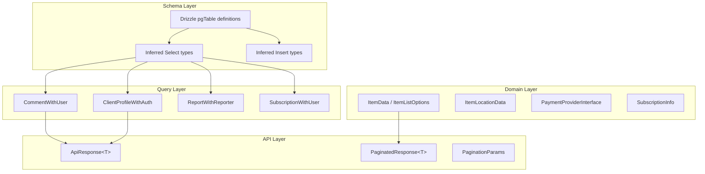

# TypeScript 类型系统

该模板使用分层类型系统，涵盖架构级类型（从 Drizzle 自动推断）、业务逻辑的域类型以及请求/响应契约的 API 类型。

## 类型位置

|目录|目的|
|-----------|---------|
|`lib/db/schema.ts`|Drizzle 表定义和推断的插入/选择类型|
|`lib/db/queries/types.ts`|查询级复合类型（联接、丰富记录）|
|`lib/types/`|项目、客户、评论、类别等的域类型。|
|`lib/api/types.ts`|API 客户端类型和响应契约|
|`lib/payment/types/`|支付提供商接口和结账类型|
|`types/`|全局增强 (`next-auth.d.ts`) 和共享 UI 类型|

## 模式推断类型

Drizzle ORM 使用 `$inferSelect` 和 `$inferInsert` 实用程序自动从表定义推断 TypeScript 类型。这些直接从 `lib/db/schema.ts` 导出：

```typescript
// From lib/db/schema.ts
export const users = pgTable('users', {
  id: text('id').primaryKey().$defaultFn(() => crypto.randomUUID()),
  email: text('email').unique(),
  image: text('image'),
  emailVerified: timestamp('emailVerified', { mode: 'date' }),
  passwordHash: text('password_hash'),
  createdAt: timestamp('created_at').notNull().defaultNow(),
  updatedAt: timestamp('updated_at').notNull().defaultNow(),
  deletedAt: timestamp('deleted_at'),
});

// Inferred types
export type User = typeof users.$inferSelect;
export type NewUser = typeof users.$inferInsert;
```

### 核心模式类型

|表|选择类型|刀片类型|重点领域|
|-------|------------|-------------|------------|
|`users`|`User`|`NewUser`|`id`、`email`、`passwordHash`、`createdAt`|
|`accounts`|`Account`| -- |`userId`、`provider`、`providerAccountId`|
|`clientProfiles`|`ClientProfile`|`NewClientProfile`|`userId`、`email`、`name`、`username`、`plan`、`status`|
|`roles`|`Role`| -- |`id`、`name`、`isAdmin`、`status`|
|`permissions`|`Permission`| -- |`id`、`key`、`description`|
|`subscriptions`|`Subscription`|`NewSubscription`|`userId`、`planId`、`status`、`startDate`、`endDate`|
|`subscriptionHistory`|`SubscriptionHistory`|`NewSubscriptionHistory`|`subscriptionId`、`action`、`previousStatus`|
|`votes`|`Vote`|`InsertVote`|`userId`、`itemId`、`voteType`|
|`comments`|`Comment`|`NewComment`|`userId`、`itemId`、`content`、`rating`|
|`favorites`|`Favorite`| -- |`userId`、`itemSlug`|
|`itemViews`|`ItemView`|`NewItemView`|`itemId`、`viewerId`、`viewedDateUtc`|
|`reports`|`Report`|`NewReport`|`contentType`、`contentId`、`reason`、`status`|
|`paymentProviders`|`OldPaymentProvider`|`NewPaymentProvider`|`name`、`isActive`|
|`paymentAccounts`|`PaymentAccount`|`NewPaymentAccount`|`userId`、`providerId`、`customerId`|
|`notifications`|`Notification`| -- |`userId`、`type`、`title`、`read`|

## 查询复合类型

这些类型可在 `lib/db/queries/types.ts` 中找到，代表连接或丰富的数据：

```typescript
// Client profile with authentication metadata
export type ClientProfileWithAuth = ClientProfile & {
  accountProvider: string;
  isActive: boolean;
};

// Enum types used in filtering
export type ClientStatus = "active" | "inactive" | "suspended" | "trial";
export type ClientPlan = "free" | "standard" | "premium";
export type ClientAccountType = "individual" | "business" | "enterprise";

// Comment enriched with user info from a join
export type CommentWithUser = {
  id: string;
  content: string;
  rating: number | null;
  userId: string;
  itemId: string;
  createdAt: Date;
  updatedAt: Date;
  editedAt: Date | null;
  deletedAt: Date | null;
  user: {
    id: string;
    name: string | null;
    email: string | null;
    image: string | null;
  };
};
```

## 域类型

### 项目类型 (`lib/types/item.ts`)

```typescript
export interface ItemData {
  id: string;
  name: string;
  slug: string;
  description: string;
  source_url: string;
  category: string | string[];
  tags: string[];
  collections?: string[];
  featured?: boolean;
  icon_url?: string;
  updated_at: string;
  status: 'draft' | 'pending' | 'approved' | 'rejected';
  submitted_by?: string;
  location?: ItemLocationData;
}

export interface ItemListOptions {
  status?: ItemStatus;
  categories?: string[];
  tags?: string[];
  page?: number;
  limit?: number;
  sortBy?: SortField;
  sortOrder?: SortOrder;
  includeDeleted?: boolean;
  submittedBy?: string;
  search?: string;
  city?: string;
  country?: string;
}

export interface ItemListResponse {
  items: ItemData[];
  total: number;
  page: number;
  limit: number;
  totalPages: number;
}
```

### 客户端类型（`lib/types/client.ts`、`lib/types/client-item.ts`）

用于配置文件管理和项目提交的面向客户的类型。

### 身份验证类型 (`types/next-auth.d.ts`)

增强 NextAuth `Session` 和 `User` 类型：

```typescript
declare module "next-auth" {
  interface User {
    isAdmin?: boolean;
    role?: string;
  }
  interface Session {
    user: User & DefaultSession["user"];
  }
}
```

### 报告类型（内联于`report.queries.ts`）

```typescript
export type ReportWithReporter = Report & {
  reporter: {
    id: string;
    name: string;
    email: string;
    avatar: string | null;
  } | null;
  reviewer: {
    id: string;
    email: string | null;
  } | null;
};
```

## 付款类型 (`lib/payment/types/payment-types.ts`)

用于多提供商支付集成的丰富类型系统：

```typescript
// Provider interface (Stripe, LemonSqueezy, Polar, Solidgate)
export interface PaymentProviderInterface {
  createPaymentIntent(params: CreatePaymentParams): Promise<PaymentIntent>;
  createSubscription(params: CreateSubscriptionParams): Promise<SubscriptionInfo>;
  cancelSubscription(subscriptionId: string): Promise<SubscriptionInfo>;
  handleWebhook(payload: any, signature: string): Promise<WebhookResult>;
  getClientConfig(): ClientConfig;
}

export type SupportedProvider = 'stripe' | 'solidgate' | 'lemonsqueezy' | 'polar';

export enum SubscriptionStatus {
  INCOMPLETE = 'incomplete',
  TRIALING = 'trialing',
  ACTIVE = 'active',
  PAST_DUE = 'past_due',
  CANCELED = 'canceled',
  UNPAID = 'unpaid',
}

export enum WebhookEventType {
  PAYMENT_SUCCEEDED = 'payment_succeeded',
  SUBSCRIPTION_CREATED = 'subscription_created',
  SUBSCRIPTION_CANCELLED = 'subscription_cancelled',
  // ... 20+ event types
}
```

## API 类型 (`lib/api/types.ts`)

API 响应的可区分联合类型：

```typescript
// Success/error discriminated union
export type ApiResponse<T = unknown> =
  | { success: true; data: T; total?: number; page?: number; }
  | { success: false; error: string };

// Paginated response with metadata
export type PaginatedResponse<T> =
  | {
      success: true;
      data: T[];
      meta: { page: number; totalPages: number; total: number; limit: number };
    }
  | { success: false; error: string };

// Pagination query params
export interface PaginationParams {
  page?: number;
  limit?: number;
  search?: string;
  sortBy?: string;
  sortOrder?: 'asc' | 'desc';
}
```

## 类型层次结构图



## 枚举常量

该模式使用模式中定义的字符串枚举和常量：

```typescript
// Schema-level enums (lib/db/schema.ts)
export const SubscriptionStatus = {
  ACTIVE: 'active',
  CANCELLED: 'cancelled',
  EXPIRED: 'expired',
  PAST_DUE: 'past_due',
  TRIALING: 'trialing',
} as const;

// Payment constants (lib/constants/payment.ts)
export const PaymentPlan = {
  FREE: 'free',
  STANDARD: 'standard',
  PREMIUM: 'premium',
} as const;

export const PaymentProvider = {
  STRIPE: 'stripe',
  LEMONSQUEEZY: 'lemonsqueezy',
  POLAR: 'polar',
  SOLIDGATE: 'solidgate',
} as const;
```

## 最佳实践

1. **对于数据库操作，首选模式推断类型**，而不是手动定义类型
2. **使用复合类型** (`CommentWithUser`, `ClientProfileWithAuth`) 连接结果
3. **对 API 响应使用可区分联合** (`ApiResponse<T>`) 以启用类型安全的错误处理
4. **在 `lib/types/` 中定义域类型**，用于不 1:1 映射到数据库表的业务逻辑
5. **导出 Zod 推断类型**以及验证层类型安全的模式
