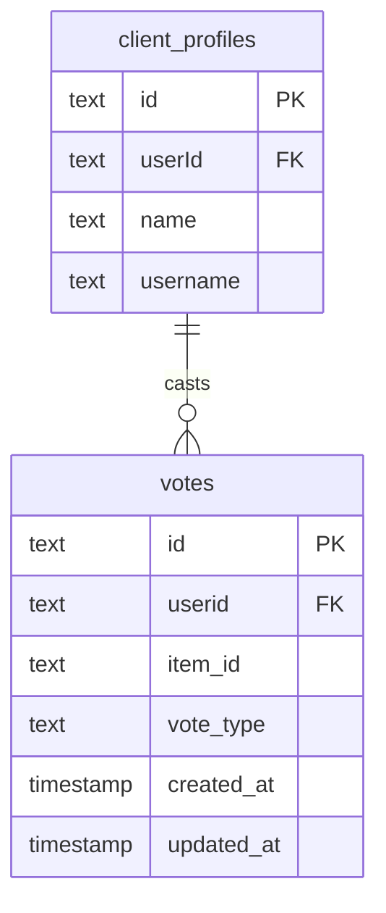
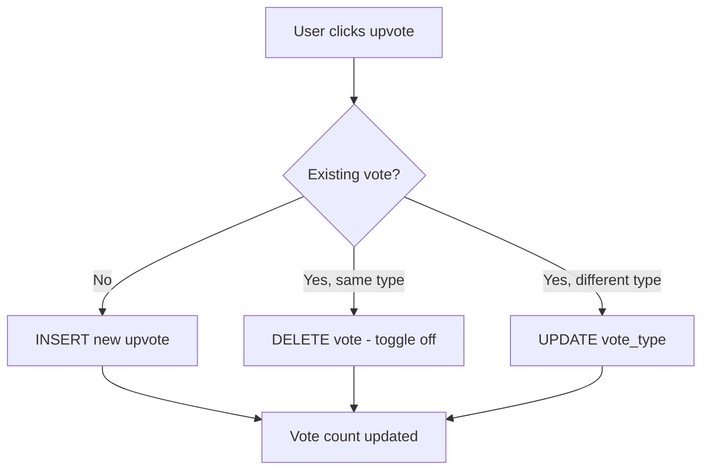

# 投票模式深入探讨

## 概述

投票系统对项目实施赞成/反对机制。每个用户（由他们的 `client_profiles` 记录标识）只能为每个项目投一票，由唯一的复合索引强制执行。投票可以在赞成票和反对票之间切换。

**源文件：** `template/lib/db/schema.ts`
**关系文件：** `template/lib/db/migrations/relations.ts`

---

## Table: `votes`

### Columns

| Column | DB Name | Type | Nullable | Default | Constraints |
|---|---|---|---|---|---|
| `id` | `id` | `text` | No | `crypto.randomUUID()` | Primary Key |
| `userId` | `userid` | `text` | No | - | FK -> `client_profiles.id` (CASCADE) |
| `itemId` | `item_id` | `text` | No | - | Item slug |
| `voteType` | `vote_type` | `text (enum)` | No | `'upvote'` | `upvote`, `downvote` |
| `createdAt` | `created_at` | `timestamp` | No | `now()` | - |
| `updatedAt` | `updated_at` | `timestamp` | No | `now()` | - |

:::caution Column Name Note
The `userId` property maps to the database column `userid` (lowercase, no underscore). This is intentional -- it matches the migration schema. Do not confuse this with other tables where the column is `userId` or `user_id`.
:::

### Foreign Keys

| Column | References | On Delete |
|---|---|---|
| `userid` | `client_profiles.id` | CASCADE |

### Indexes

| Name | Columns | Type |
|---|---|---|
| `unique_user_item_vote_idx` | `(userid, item_id)` | Unique |
| `item_votes_idx` | `item_id` | B-tree |
| `votes_created_at_idx` | `created_at` | B-tree |

### Key Constraints

- **One vote per user per item:** The `unique_user_item_vote_idx` unique index on `(userid, item_id)` ensures each client profile can only have one vote record per item.
- **Vote type is exclusive:** A user either has an upvote or a downvote, never both.

---

## 投票类型枚举

```typescript
export const VoteType = {
    UPVOTE: 'upvote',
    DOWNVOTE: 'downvote'
} as const;

export type VoteTypeValues = (typeof VoteType)[keyof typeof VoteType];
```

---

## TypeScript Types

```typescript
export type Vote = typeof votes.$inferSelect;
export type InsertVote = typeof votes.$inferInsert;
```

---

## 关系

```typescript
// From relations.ts
export const votesRelations = relations(votes, ({ one }) => ({
    clientProfile: one(clientProfiles, {
        fields: [votes.userid],
        references: [clientProfiles.id]
    }),
}));
```

---

## Relations Diagram



---

## 投票流程



---

## Query Examples

### Cast a vote (upsert pattern)

```typescript
import { db } from '@/lib/db/drizzle';
import { votes, VoteType } from '@/lib/db/schema';
import { eq, and } from 'drizzle-orm';

// Insert or update vote using onConflict
await db
    .insert(votes)
    .values({
        userId: clientProfileId,
        itemId: 'my-item-slug',
        voteType: VoteType.UPVOTE,
    })
    .onConflictDoUpdate({
        target: [votes.userId, votes.itemId],
        set: {
            voteType: VoteType.UPVOTE,
            updatedAt: new Date(),
        },
    });
```

### Remove a vote

```typescript
await db
    .delete(votes)
    .where(
        and(
            eq(votes.userId, clientProfileId),
            eq(votes.itemId, 'my-item-slug')
        )
    );
```

### Count votes for an item

```typescript
import { sql } from 'drizzle-orm';

const voteCounts = await db
    .select({
        upvotes: sql<number>`count(*) filter (where ${votes.voteType} = 'upvote')`,
        downvotes: sql<number>`count(*) filter (where ${votes.voteType} = 'downvote')`,
    })
    .from(votes)
    .where(eq(votes.itemId, 'my-item-slug'));
```

### Get user's vote on an item

```typescript
const userVote = await db
    .select()
    .from(votes)
    .where(
        and(
            eq(votes.userId, clientProfileId),
            eq(votes.itemId, 'my-item-slug')
        )
    )
    .limit(1);
```

### Get all votes by a user

```typescript
const userVotes = await db
    .select()
    .from(votes)
    .where(eq(votes.userId, clientProfileId))
    .orderBy(desc(votes.createdAt));
```

### Get most upvoted items

```typescript
const topItems = await db
    .select({
        itemId: votes.itemId,
        upvotes: sql<number>`count(*)`,
    })
    .from(votes)
    .where(eq(votes.voteType, 'upvote'))
    .groupBy(votes.itemId)
    .orderBy(sql`count(*) desc`)
    .limit(10);
```

---

## 设计笔记

- **投票参考的是客户资料，而不是用户。** 这与评论表一致。用户必须拥有 `client_profiles` 记录才能投票。
- **项目由 slug 标识。** `item_id` 列存储来自 Git CMS 的项目 slug，而不是数据库外键。
- **没有单独的投票计数表。** 投票计数在查询时使用 `count()` 进行聚合。这会以查询成本换取一致性（没有陈旧的计数器）。
- **`updatedAt` 字段跟踪投票更改。** 当用户从赞成票切换到反对票时，`updatedAt` 会更新，而 `createdAt` 会保留原始投票时间。
