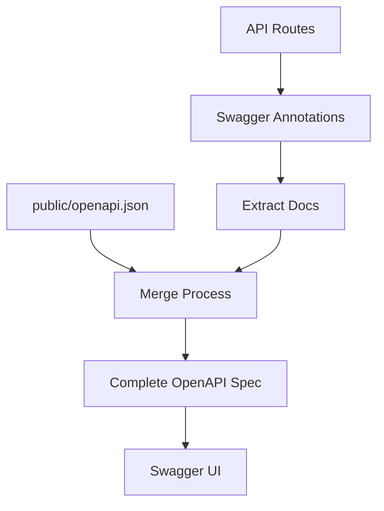

# 自动化 API 文档系统

Ever Works 包含一个自动化 OpenAPI 文档系统，可从代码生成全面的 API 文档。

## 概述

该系统提供：
- 📝 **自动生成** - 从代码注释到 OpenAPI 规范
- 🔄 **混合方式** - 保留手动文档，添加自动化文档
- 🎯 **类型安全** - TypeScript 集成
- 📊 **Swagger UI** - 交互式 API 浏览器
- 🔧 **热重载** - 开发期间自动重新生成

## 架构



### 混合方式

- ✅ **保留**现有的 `public/openapi.json` 文件
- ✅ **添加**路由代码中的 `@swagger` 注释
- ✅ **自动合并**两个来源
- ✅ **生成**完整且一致的 OpenAPI 文件

## 安装

### 1. 安装依赖

```bash
# Run the installation script
./scripts/install-swagger-deps.sh

# Or manually with npm
npm install -D swagger-jsdoc @types/swagger-jsdoc tsx nodemon
```

### 2. 可用脚本

```bash
# Generate documentation once
npm run generate-docs

# Watch mode for development (auto-regenerates)
npm run docs:watch

# Development with automatic generation
npm run dev
```

## 使用方法

### 向路由添加注释

```typescript
// app/api/example/route.ts
import { NextRequest, NextResponse } from 'next/server';

/**
 * @swagger
 * /api/example:
 *   get:
 *     tags: ["Example"]
 *     summary: "Get example data"
 *     description: "Returns example data from the API"
 *     responses:
 *       200:
 *         description: "Success"
 *         content:
 *           application/json:
 *             schema:
 *               type: object
 *               properties:
 *                 success:
 *                   type: boolean
 *                   example: true
 *                 data:
 *                   type: array
 *                   items:
 *                     type: string
 */
export async function GET() {
  return NextResponse.json({ success: true, data: ["example"] });
}
```

### 使用注释工具

```typescript
import { createAdminRouteAnnotation, CommonAnnotations } from '@/lib/swagger/annotations';

/**
 * @swagger
 * /api/admin/users:
 *   get:
 *     tags: ["Admin"]
 *     summary: "Get all users"
 *     security:
 *       - bearerAuth: []
 *     responses:
 *       200:
 *         description: "Success"
 *       401:
 *         $ref: '#/components/responses/Unauthorized'
 *       500:
 *         $ref: '#/components/responses/ServerError'
 */
export async function GET() {
  // Implementation
}
```

### 通用注释

该系统提供可重用的注释组件：

```typescript
// lib/swagger/annotations.ts

export const CommonAnnotations = {
  responses: {
    unauthorized: {
      description: "Unauthorized - Invalid or missing authentication",
      content: {
        "application/json": {
          schema: {
            type: "object",
            properties: {
              error: { type: "string", example: "Unauthorized" }
            }
          }
        }
      }
    },
    serverError: {
      description: "Internal Server Error",
      content: {
        "application/json": {
          schema: {
            type: "object",
            properties: {
              error: { type: "string", example: "Internal server error" }
            }
          }
        }
      }
    }
  },
  
  security: {
    bearerAuth: {
      type: "http",
      scheme: "bearer",
      bearerFormat: "JWT"
    }
  }
};
```

## 文件结构

```
scripts/
├── generate-openapi.ts     # 主要生成脚本
├── tsconfig.json          # 脚本的 TypeScript 配置
└── install-swagger-deps.sh # 依赖安装程序

lib/swagger/
└── annotations.ts         # 可重用注释工具

templates/
└── route-template.ts      # 新路由模板

public/
└── openapi.json          # 生成的 OpenAPI 规范
```

## 配置

### OpenAPI 基本配置

```typescript
// scripts/generate-openapi.ts
const swaggerDefinition = {
  openapi: '3.0.0',
  info: {
    title: 'Ever Works API',
    version: '1.0.0',
    description: 'API documentation for Ever Works directory platform',
  },
  servers: [
    {
      url: 'http://localhost:3000',
      description: 'Development server',
    },
    {
      url: 'https://yourdomain.com',
      description: 'Production server',
    },
  ],
  components: {
    securitySchemes: {
      bearerAuth: {
        type: 'http',
        scheme: 'bearer',
        bearerFormat: 'JWT',
      },
    },
  },
};
```

### Swagger UI 配置

访问交互式 API 文档：
- 开发环境：`http://localhost:3000/api-docs`
- 生产环境：`https://yourdomain.com/api-docs`

## 最佳实践

### 1. 一致的标签

使用标签对相关端点进行分组：

```typescript
/**
 * @swagger
 * /api/items:
 *   get:
 *     tags: ["Items"]  // Use consistent tag names
 */
```

### 2. 详细描述

提供清晰的描述和示例：

```typescript
/**
 * @swagger
 * /api/items/{id}:
 *   get:
 *     summary: "Get item by ID"
 *     description: "Retrieves a single item from the directory by its unique identifier"
 *     parameters:
 *       - name: id
 *         in: path
 *         required: true
 *         description: "Unique item identifier"
 *         schema:
 *           type: string
 *           example: "item-123"
 */
```

### 3. 模式定义

在组件中定义可重用的模式：

```typescript
/**
 * @swagger
 * components:
 *   schemas:
 *     Item:
 *       type: object
 *       required:
 *         - id
 *         - name
 *       properties:
 *         id:
 *           type: string
 *           example: "item-123"
 *         name:
 *           type: string
 *           example: "Example Item"
 *         description:
 *           type: string
 *           example: "Item description"
 */
```

### 4. 错误响应

记录所有可能的错误响应：

```typescript
/**
 * @swagger
 * /api/items:
 *   post:
 *     responses:
 *       201:
 *         description: "Item created successfully"
 *       400:
 *         description: "Invalid request data"
 *       401:
 *         description: "Unauthorized"
 *       500:
 *         description: "Server error"
 */
```

## 故障排除

### 文档未生成

**问题**：OpenAPI 文件未更新

**解决方案**：检查生成脚本

```bash
# Run manually to see errors
npm run generate-docs

# Check for syntax errors in annotations
```

### Swagger UI 无法加载

**问题**：API 文档页面显示错误

**解决方案**：验证 OpenAPI 文件是否有效

```bash
# Validate OpenAPI spec
npx swagger-cli validate public/openapi.json
```

### 注释未被检测到

**问题**：路由注释未出现在文档中

**解决方案**：确保格式正确

```typescript
// ✅ Correct
/**
 * @swagger
 * /api/route:
 *   get:
 *     ...
 */

// ❌ Incorrect (missing @swagger tag)
/**
 * /api/route:
 *   get:
 *     ...
 */
```

## 高级功能

### 请求体模式

```typescript
/**
 * @swagger
 * /api/items:
 *   post:
 *     requestBody:
 *       required: true
 *       content:
 *         application/json:
 *           schema:
 *             type: object
 *             required:
 *               - name
 *             properties:
 *               name:
 *                 type: string
 *               description:
 *                 type: string
 */
```

### 身份验证

```typescript
/**
 * @swagger
 * /api/admin/settings:
 *   get:
 *     security:
 *       - bearerAuth: []
```
