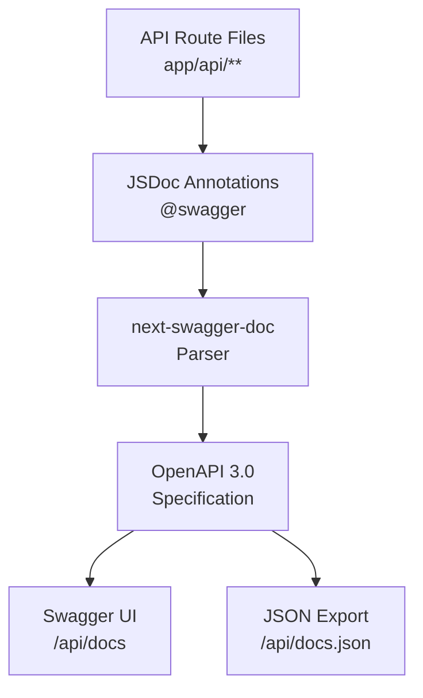

# OpenAPI 生成

该模板包含一个自动化的 OpenAPI 文档生成系统，可从 API 路由中提取 JSDoc 注解并生成交互式 Swagger 文档。

## 概述



## 运行方式

```bash
# 生成 OpenAPI 规范
pnpm run generate:openapi

# 或直接从 apps/web/ 运行
cd apps/web
pnpm run generate:openapi
```

## 配置

配置定义在 `apps/web/lib/swagger/swagger-options.ts`：

```typescript
export const swaggerOptions = {
  definition: {
    openapi: '3.0.0',
    info: {
      title: 'Ever Works API',
      version: '1.0.0',
      description: 'API documentation for Ever Works Directory Template',
    },
    servers: [
      {
        url: process.env.NEXT_PUBLIC_APP_URL || 'http://localhost:3000',
        description: 'Development server',
      },
    ],
    components: {
      securitySchemes: {
        sessionAuth: {
          type: 'apiKey',
          in: 'cookie',
          name: 'session',
          description: 'Session-based authentication via NextAuth',
        },
        cronSecret: {
          type: 'apiKey',
          in: 'header',
          name: 'x-cron-secret',
          description: 'Secret key for cron job endpoints',
        },
      },
    },
  },
  apiFolder: './app/api',
};
```

## 安全方案

| 方案名         | 类型   | 位置   | 描述                          |
|----------------|--------|--------|-------------------------------|
| `sessionAuth`  | apiKey | cookie | 基于会话的认证（NextAuth）     |
| `session`      | apiKey | cookie | 备用 Cookie 认证              |
| `cronSecret`   | apiKey | header | Cron 任务的密钥               |

## JSON 模式

以下模式在各端点之间共享：

### ErrorResponse

```json
{
  "ErrorResponse": {
    "type": "object",
    "properties": {
      "error": {
        "type": "string",
        "description": "Error message"
      }
    }
  }
}
```

### PaginationMeta

```json
{
  "PaginationMeta": {
    "type": "object",
    "properties": {
      "total": { "type": "integer" },
      "page": { "type": "integer" },
      "limit": { "type": "integer" },
      "totalPages": { "type": "integer" }
    }
  }
}
```

## 添加 Swagger 注解

### 基本示例

```typescript
/**
 * @swagger
 * /api/admin/companies:
 *   get:
 *     summary: List all companies
 *     tags: [Admin - Companies]
 *     security:
 *       - sessionAuth: []
 *     parameters:
 *       - in: query
 *         name: page
 *         schema:
 *           type: integer
 *         description: Page number
 *     responses:
 *       200:
 *         description: List of companies
 *       401:
 *         description: Unauthorized
 */
export async function GET(request: NextRequest) {
  // implementation
}
```

## 访问文档

生成后，文档可在以下地址访问：

- **Swagger UI**：`http://localhost:3000/api/docs`
- **JSON 规范**：`http://localhost:3000/api/docs.json`
