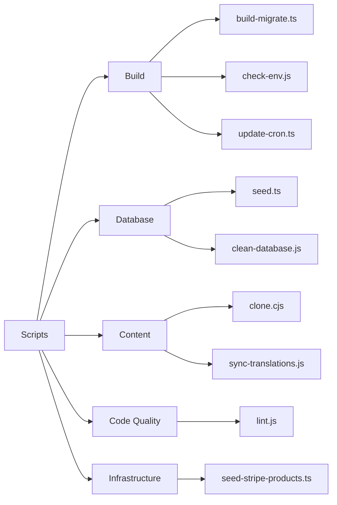
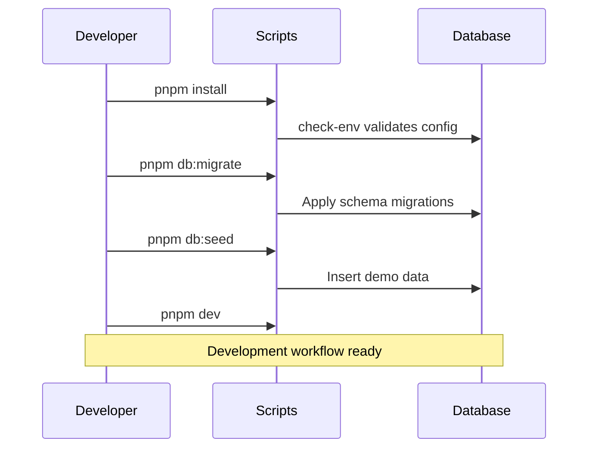

# 脚本概述

`apps/web/scripts/` 目录包含用于构建、数据库管理、内容管理和代码质量维护的辅助脚本。

## 脚本分类



## 构建脚本

### `build-migrate.ts`

在构建期间运行数据库迁移。

```bash
pnpm run build:migrate
```

在生产构建之前自动运行，以确保数据库模式是最新的。

### `check-env.js`

验证是否设置了所有必需的环境变量。

```bash
node scripts/check-env.js
```

若缺少关键环境变量则中止构建。许多其他脚本会提前自动调用此脚本。

### `update-cron.ts`

更新 Vercel 或 Trigger.dev 中的 Cron 任务配置。

```bash
pnpm run update:cron
```

## 数据库脚本

### `seed.ts`

使用演示数据填充数据库，用于开发和测试。

```bash
cd apps/web
pnpm run db:seed
```

#### 种子数据创建内容

| 类型     | 数量 | 描述                   |
|----------|------|------------------------|
| 用户     | 50   | 混合客户端和管理员账户 |
| 公司     | 20   | 带有完整资料的示例公司 |
| 分类     | 10   | 目录分类               |
| 条目     | 100  | 示例目录列表           |
| 评论     | 200  | 示例评价和反馈         |

#### Stripe 产品种子数据

| 产品         | 价格      | 周期 |
|--------------|-----------|------|
| Basic Plan   | $9/月     | 月度 |
| Pro Plan     | $29/月    | 月度 |
| Business     | $99/月    | 月度 |

### `clean-database.js`

**⚠️ 危险操作** — 删除数据库中的所有数据，仅限开发使用。

```bash
node scripts/clean-database.js
```

## 内容脚本

### `clone.cjs`

将 Git 内容管理仓库克隆到 `.content/` 目录。

```bash
node scripts/clone.cjs
```

使用环境变量中的 `DATA_REPOSITORY` 确定要克隆的仓库。

### `sync-translations.js`

将所有翻译文件与英语参考文件同步。

```bash
node scripts/sync-translations.js
```

详情请参阅[翻译工作流](./translation-workflow.md)。

## 代码质量脚本

### `lint.js`

使用项目配置运行 ESLint。

```bash
node scripts/lint.js
# 或从 Monorepo 根目录运行：
pnpm lint
```

## `package.json` 对应关系

| npm 脚本           | 脚本文件                        | 描述                         |
|--------------------|---------------------------------|------------------------------|
| `db:seed`          | `scripts/seed.ts`               | 填充演示数据                 |
| `db:migrate`       | `drizzle-kit migrate`           | 运行迁移脚本                 |
| `generate:openapi` | `scripts/generate-openapi.ts`   | 生成 OpenAPI 文档            |
| `sync:translations`| `scripts/sync-translations.js`  | 同步翻译文件                 |

## 典型开发工作流



## 添加新脚本

添加新脚本时：

1. 在 `apps/web/scripts/` 中创建文件
2. TypeScript 使用 `.ts`，CommonJS 使用 `.js`/`.cjs`
3. 在 `apps/web/package.json` 的 `scripts` 部分添加相应条目
4. 在脚本中记录其用途和使用方法
5. 如果脚本依赖环境变量，请添加 `check-env` 检查
