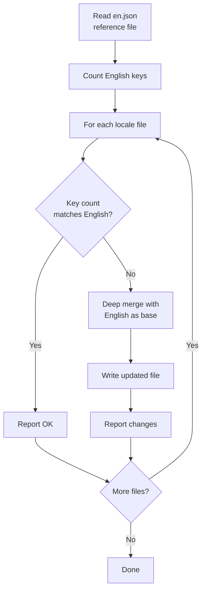
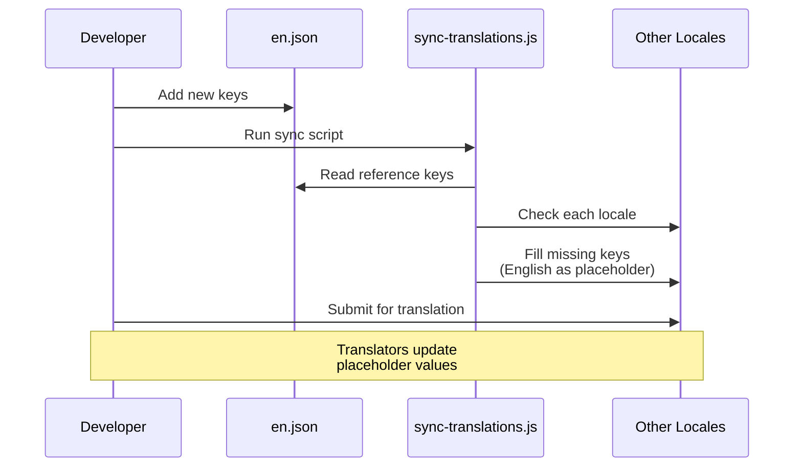

# 翻译工作流

该模板使用 `next-intl` 进行国际化（i18n），采用基于 JSON 的消息文件。翻译工作流通过自动化同步脚本确保所有受支持的语言与英语参考文件保持同步。

## 支持的语言

该模板内置支持 20 种语言：

| 代码 | 语言             | 代码 | 语言     |
|------|------------------|------|----------|
| `en` | 英语（参考）     | `ko` | 韩语     |
| `ar` | 阿拉伯语         | `nl` | 荷兰语   |
| `bg` | 保加利亚语       | `pl` | 波兰语   |
| `de` | 德语             | `pt` | 葡萄牙语 |
| `es` | 西班牙语         | `ru` | 俄语     |
| `fr` | 法语             | `th` | 泰语     |
| `he` | 希伯来语         | `tr` | 土耳其语 |
| `hi` | 印地语           | `uk` | 乌克兰语 |
| `id` | 印度尼西亚语     | `vi` | 越南语   |
| `it` | 意大利语         | `ja` | 日语     |

## 文件结构

```
messages/
├── en.json          # 英语（参考 - 唯一的真实来源）
├── ar.json          # 阿拉伯语
├── bg.json          # 保加利亚语
├── de.json          # 德语
├── es.json          # 西班牙语
├── fr.json          # 法语
├── he.json          # 希伯来语
├── hi.json          # 印地语
├── id.json          # 印度尼西亚语
├── it.json          # 意大利语
├── ja.json          # 日语
├── ko.json          # 韩语
├── nl.json          # 荷兰语
├── pl.json          # 波兰语
├── pt.json          # 葡萄牙语
├── ru.json          # 俄语
├── th.json          # 泰语
├── tr.json          # 土耳其语
├── uk.json          # 乌克兰语
└── vi.json          # 越南语
```

## 翻译同步脚本

`scripts/sync-translations.js` 脚本确保每个语言文件都包含 `en.json` 中定义的所有键。

### 运行同步

```bash
node scripts/sync-translations.js
```

### 工作原理



### 合并策略

同步使用深度合并，已有翻译优先：

```javascript
function deepMerge(target, source) {
  const result = { ...source };  // Start with English (source)
  for (const key in target) {
    if (typeof target[key] === 'object' && !Array.isArray(target[key])) {
      result[key] = deepMerge(target[key], source[key] || {});
    } else {
      result[key] = target[key]; // Existing translation wins
    }
  }
  return result;
}
```

**关键行为：**

- 缺失的键用英语值填充作为占位符
- 现有翻译永远不会被覆盖
- 嵌套结构递归处理
- 数组视为叶子值（不合并）

### 示例输出

```
English file has 342 translation keys

ar.json: 340/342 keys (missing 2)
  -> Updated ar.json with missing keys from English

bg.json: 342/342 keys - OK
de.json: 342/342 keys - OK
es.json: 338/342 keys (missing 4)
  -> Updated es.json with missing keys from English

Done!
```

## 消息文件格式

翻译文件使用嵌套 JSON，通过点符号访问键：

```json
{
  "common": {
    "loading": "Loading...",
    "error": "An error occurred",
    "save": "Save",
    "cancel": "Cancel"
  },
  "auth": {
    "signIn": "Sign In",
    "signOut": "Sign Out",
    "email": "Email Address",
    "password": "Password"
  },
  "navigation": {
    "home": "Home",
    "about": "About",
    "contact": "Contact"
  }
}
```

## 在代码中使用翻译

### 客户端组件

```tsx
'use client';
import { useTranslations } from 'next-intl';

export function LoginButton() {
  const t = useTranslations('auth');
  return <button>{t('signIn')}</button>;
}
```

### 服务端组件

```tsx
import { getTranslations } from 'next-intl/server';

export default async function Page() {
  const t = await getTranslations('common');
  return <h1>{t('loading')}</h1>;
}
```

### 带变量

```json
{
  "greeting": "Hello, {name}!",
  "itemCount": "You have {count, plural, =0 {no items} one {1 item} other {# items}}"
}
```

```tsx
const t = useTranslations('dashboard');
t('greeting', { name: 'John' });     // "Hello, John!"
t('itemCount', { count: 5 });         // "You have 5 items"
```

## 添加新语言

按照以下步骤添加新语言：

### 步骤 1：创建消息文件

```bash
# 以英语文件为起点进行复制
cp messages/en.json messages/NEW_LOCALE.json
```

### 步骤 2：注册语言

将语言添加到 i18n 配置中：

```typescript
// i18n/config.ts（或等效文件）
export const locales = ['en', 'ar', 'de', ..., 'NEW_LOCALE'];
```

### 步骤 3：翻译内容

编辑 `messages/NEW_LOCALE.json`，将英语字符串替换为翻译后的值。

### 步骤 4：运行同步验证

```bash
node scripts/sync-translations.js
```

如果文件包含所有键，将显示"OK"。缺失的键将用英语占位符填充。

## 添加新翻译键

添加需要用户文本的新功能时：

### 步骤 1：添加到英语参考文件

```json
// messages/en.json
{
  "newFeature": {
    "title": "New Feature",
    "description": "This is a new feature"
  }
}
```

### 步骤 2：运行同步

```bash
node scripts/sync-translations.js
```

这将自动把新键添加到所有语言文件中，使用英语文本作为占位符。

### 步骤 3：请求翻译

将新添加的键分享给每种语言的翻译人员，他们只需更新英语占位符值即可。

## 键计数

同步脚本递归统计嵌套对象中的键：

```javascript
function countKeys(obj) {
  let count = 0;
  for (const key in obj) {
    if (typeof obj[key] === 'object' && !Array.isArray(obj[key])) {
      count += countKeys(obj[key]); // Recurse into nested objects
    } else {
      count++;                      // Count leaf values
    }
  }
  return count;
}
```

只统计叶子层级的翻译字符串，不统计中间分组键。

## RTL 语言支持

该模板支持从右到左（RTL）阅读的语言，包括阿拉伯语（`ar`）和希伯来语（`he`）。RTL 布局通过语言配置和 CSS `dir` 属性自动处理。

## 工作流程图



## 最佳实践

1. **始终先修改 `en.json`** — 这是唯一的真实来源
2. **每次修改英语后运行同步** — 保持所有语言文件最新
3. **永远不要手动向非英语文件添加键** — 使用同步脚本
4. **使用嵌套分组** — 按功能或页面组织键，便于管理
5. **避免硬编码字符串** — 始终使用 `useTranslations` 或 `getTranslations`
6. **测试 RTL 布局** — 定期检查阿拉伯语和希伯来语的显示效果
7. **使用描述性键名** — `auth.signInButton` 而不是 `auth.btn1`
