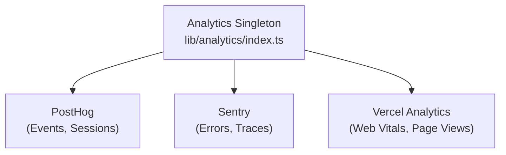

# 分析系统

Ever Works 模板与 **PostHog**、**Sentry** 和 **Vercel Analytics** 集成，可实现全面的事件跟踪、错误监控、会话记录和性能分析。

＃＃ 建筑学



## 分析类

1 中的核心 0 类是一个单例，用于管理跨提供者的初始化和事件分派：

```typescript
class Analytics {
  private static instance: Analytics;
  private initialized: boolean;
  private exceptionTrackingProvider: ExceptionTrackingProvider;

  static getInstance(): Analytics;
  init(): void;
  trackEvent(name: string, properties?: EventProperties): void;
  trackPageView(url: string): void;
  identify(userId: string, properties?: UserProperties): void;
  reset(): void;
}
```

### 异常跟踪提供商解决方案

系统支持灵活的异常跟踪配置：

```typescript
type ExceptionTrackingProvider = 'sentry' | 'posthog' | 'both' | 'none';
```

通过检查可用性来确定提供者：
1.读取0配置值
2. 验证所选提供商是否已启用
3. 如果未配置主数据库，则回退到可用的替代方案

## PostHog 集成

### 配置

```bash
NEXT_PUBLIC_POSTHOG_KEY=phc_xxx
NEXT_PUBLIC_POSTHOG_HOST=https://us.i.posthog.com

# Optional
NEXT_PUBLIC_POSTHOG_DEBUG=false
NEXT_PUBLIC_POSTHOG_SESSION_RECORDING=true
NEXT_PUBLIC_POSTHOG_AUTO_CAPTURE=true
NEXT_PUBLIC_POSTHOG_SAMPLE_RATE=1.0
NEXT_PUBLIC_POSTHOG_SESSION_RECORDING_SAMPLE_RATE=0.1
NEXT_PUBLIC_POSTHOG_EXCEPTION_TRACKING=true
```

### PostHog API 服务

服务器端服务位于0，提供管理分析数据：

```typescript
class PostHogApiService {
  constructor(); // Reads from analyticsConfig

  isConfigured(): boolean;
  async getTotalPageViews(days?: number): Promise<number>;
  async getTopPages(days?: number): Promise<PageData[]>;
  async getEventCounts(eventName: string, days?: number): Promise<number>;
}
```

**服务器端 API 访问所需：**
```bash
POSTHOG_PERSONAL_API_KEY=phx_xxx
POSTHOG_PROJECT_ID=12345
```

### 客户端挂钩

```typescript
import { useAnalytics } from '@/hooks/use-analytics';

const {
  trackEvent,      // (name: string, properties?: object) => void
  trackPageView,   // (url: string) => void
  identify,        // (userId: string, properties?: object) => void
} = useAnalytics();
```

### 地理分析挂钩

```typescript
import { useGeoAnalytics } from '@/hooks/use-geo-analytics';

const {
  geoData,         // Geographic analytics data
  isLoading,
} = useGeoAnalytics();
```

## 哨兵集成

### 配置

```bash
NEXT_PUBLIC_SENTRY_DSN=https://xxx@sentry.io/xxx
SENTRY_AUTH_TOKEN=sntrys_xxx
SENTRY_ORG=your-org
SENTRY_PROJECT=your-project
NEXT_PUBLIC_SENTRY_EXCEPTION_TRACKING=true
```

哨兵提供：
- **错误跟踪** -- 自动捕获未处理的异常
- **性能监控** -- API 路由和页面加载的事务跟踪
- **会话重播** -- 可选会话录制

## Vercel 分析

Vercel Analytics 在部署到 Vercel 上后自动可用：

```bash
# Enabled by default on Vercel deployments
NEXT_PUBLIC_VERCEL_ANALYTICS=true
```

提供：
- **Web Vitals** -- 核心 Web Vitals（LCP、FID、CLS）监控
- **页面浏览量** -- 自动页面浏览量跟踪
- **受众洞察** -- 地理和设备分析

## 管理分析仪表板

管理仪表板通过 0 挂钩提供聚合分析：

```typescript
import { useAdminStats } from '@/hooks/use-admin-stats';

const {
  stats,           // Dashboard statistics
  isLoading,
} = useAdminStats();
```

0 挂钩提供了更详细的指标：

```typescript
import { useDashboardStats } from '@/hooks/use-dashboard-stats';

const {
  stats,           // { items, users, revenue, pageViews, ... }
  isLoading,
  refetch,
} = useDashboardStats();
```

## 禁用分析

当分析提供程序的配置丢失时，分析提供程序将被禁用。如果未设置相应的环境变量，则不会加载跟踪代码。这使得模板无需在开发过程中进行任何分析即可工作。
