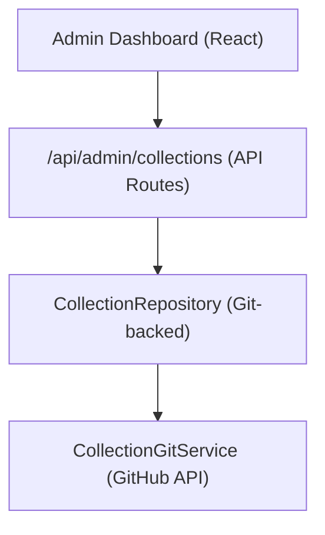

# 收藏系统

集合允许管理员管理在网站上显示的项目组。系统将收集数据存储在基于Git的CMS存储库中，并通过管理仪表板提供CRUD操作。

＃＃ 建筑学



集合作为文件存储在基于 Git 的 CMS 存储库中（通过 0 进行配置），通过 GitHub API 使用 1 进行读/写操作。

## 数据模型

```typescript
interface Collection {
  id: string;
  name: string;
  slug: string;
  description?: string;
  isActive: boolean;
  items: string[];          // Array of item slugs
  item_count: number;       // Computed from items array
  displayOrder?: number;
  created_at: string;
  updated_at: string;
}
```

## 集合存储库

该存储库位于0，提供：

```typescript
class CollectionRepository {
  async findAll(options?: CollectionListOptions): Promise<Collection[]>;
  async findById(id: string): Promise<Collection | null>;
  async findBySlug(slug: string): Promise<Collection | null>;
  async create(data: CreateCollectionRequest): Promise<Collection>;
  async update(id: string, data: UpdateCollectionRequest): Promise<Collection>;
  async delete(id: string): Promise<void>;
  async assignItems(id: string, itemSlugs: string[]): Promise<void>;
}
```

### 列出选项

```typescript
interface CollectionListOptions {
  search?: string;           // Filter by name
  includeInactive?: boolean; // Include inactive collections
  sortBy?: 'name' | 'item_count' | 'created_at';
  sortOrder?: 'asc' | 'desc';
  page?: number;
  limit?: number;
}
```

## 管理挂钩

```typescript
import { useAdminCollections } from '@/hooks/use-admin-collections';

const {
  collections,        // Collection[]
  total, page, totalPages, limit,
  isLoading, isSubmitting,
  createCollection,   // (data: CreateCollectionRequest) => Promise<boolean>
  updateCollection,   // (id: string, data: UpdateCollectionRequest) => Promise<boolean>
  deleteCollection,   // (id: string) => Promise<boolean>
  assignItems,        // (id: string, itemSlugs: string[]) => Promise<boolean>
  fetchAssignedItems, // (id: string) => Promise<Item[]>
  refetch, refreshData,
} = useAdminCollections({ page: 1, limit: 10, search: '' });
```

## API 端点

|方法|端点 |描述 |
|--------|----------|-------------|
|获取 | 0 |列表集合（分页）|
|发布 | 1 |创建新集合 |
|放置| 2 |更新收藏 |
|删除 | 3 |删除集合 |
|获取 | 4 |获取分配的项目 |
|发布 | 5 |将项目分配给集合 |

## 客户端显示

6 钩子检查是否存在任何活动集合，用于条件渲染：

```typescript
import { useCollectionsExists } from '@/hooks/use-collections-exists';
const { exists, isLoading } = useCollectionsExists();
```

## 配置

集合需要以下环境变量：

```bash
DATA_REPOSITORY=https://github.com/owner/repo   # Git CMS repository
GH_TOKEN=ghp_xxx                                  # GitHub API token
GITHUB_BRANCH=main                                # Branch for collection data
```

0 解析 1 URL 以提取 GitHub 所有者和存储库，然后使用令牌进行 API 身份验证。
