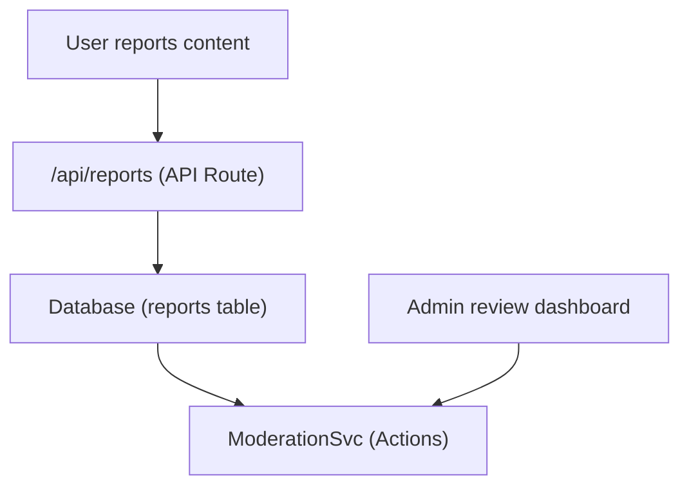

# 报告和内容审核

Ever Works 模板包括一个内容报告和审核系统，使用户能够标记不当内容，管理员能够对报告的项目和评论采取行动。

＃＃ 建筑学



## 内容类型

系统支持报告两种内容类型：

```typescript
enum ReportContentType {
  ITEM = 'item',
  COMMENT = 'comment',
}
```

## 审核服务

该服务位于0，提供审核操作：

### 内容所有者解析

```typescript
async function getContentOwner(
  contentType: ReportContentTypeValues,
  contentId: string
): Promise<ContentOwnerResult>;
// Returns: { success: boolean, userId?: string, error?: string }
```

通过通过 0 查找评论或通过 1 查找项目来确定举报内容的作者。

### 审核操作

|行动|描述 |效果|
|--------|-------------|--------|
| **删除内容** |删除举报的项目或评论 |内容已删除，历史已记录 |
| **警告用户** |增加警告计数 |警告计数器增加 |
| **暂停用户** |暂时冻结账户 |帐户访问受限 |
| **禁止用户** |永久封禁账户 |账户永久受限 |
| **驳回报告** |将报告标记为已解决，无需采取任何行动 |报告已关闭 |

### 行动实施

每个操作都会创建一个审核历史记录条目，并可能触发电子邮件通知：

```typescript
// Example: Remove content
async function removeContent(
  contentType: ReportContentTypeValues,
  contentId: string,
  reportId: string,
  adminId: string
): Promise<ModerationResult>;
```

该服务委托：
- 0 -- 用于删除评论
- 1 -- 用于移除物品
- 2 -- 用于审计追踪
- 3 -- 用于用户警告
- 4 / 5 -- 用于帐户操作
- 6 -- 用于用户通知电子邮件

## 管理挂钩

```typescript
import { useAdminReports } from '@/hooks/use-admin-reports';

const {
  reports,           // Report[]
  total, page, totalPages,
  isLoading, isSubmitting,
  resolveReport,     // (id, action, reason?) => Promise<boolean>
  dismissReport,     // (id, reason?) => Promise<boolean>
  deleteReport,      // (id) => Promise<boolean>
  refetch, refreshData,
} = useAdminReports({ page: 1, limit: 10 });
```

## 审核工作流程

1. **用户举报内容** -- 选择原因并通过举报API提交
2. **管理员通知** -- 0 或 1 提醒管理员
3. **管理员评论** -- 在管理仪表板中查看报告详细信息
4. **管理员采取行动** -- 选择：删除内容、警告用户、暂停、禁止或解雇
5. **记录历史** -- 2 记录带有管理员 ID、时间戳和原因的操作
6. **用户通知** -- 向内容所有者发送有关所采取操作的电子邮件通知

## 审核操作枚举

```typescript
enum ModerationAction {
  REMOVE_CONTENT = 'remove_content',
  WARN_USER = 'warn_user',
  SUSPEND_USER = 'suspend_user',
  BAN_USER = 'ban_user',
  DISMISS = 'dismiss',
}
```

## API 端点

|方法|端点 |描述 |
|--------|----------|-------------|
|发布 | 0 |提交新报告 |
|获取 | 1 |列表报告（管理，分页）|
|发布 | 2 |用行动解决报告 |
|发布 | 3 |驳回举报 |
|删除 | 4 |删除报告 |

## 相关文档

- [通知系统](./notifications.md) -- 报告通知如何发送
- [投票&评论](./voting-comments.md) -- 可举报的评论系统
