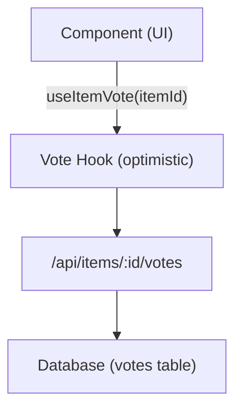

# 投票&评论系统

Ever Works 模板包括完整的投票和评论系统，允许用户对项目投赞成票/反对票、留下星级评论以及参与内容。两个系统都使用乐观更新来实现即时 UI 反馈。

## 投票系统

### 架构

投票系统使用每个项目的投票模型，其中每个经过身份验证的用户可以为每个项目投一票（赞成或反对）。系统跟踪净投票数和个人用户投票。



### useItemVote 挂钩

```typescript
import { useItemVote } from '@/hooks/use-item-vote';

const {
  voteCount,       // number -- net vote count
  userVote,        // 'up' | 'down' | null
  isLoading,       // boolean
  handleVote,      // (type: 'up' | 'down') => void
  refreshVotes,    // () => void
} = useItemVote(itemId);
```

### 投票行为

|当前状态 |行动|结果 |
|--------------|--------|--------|
|没有投票 |点击向上|点赞 (+1) |
|没有投票 |单击向下|否决票 (-1) |
|已投票 |点击向上|删除投票（切换）|
|已投票 |单击向下|切换到否决票（-2 净值）|
|投了反对票 |单击向下|删除投票（切换）|
|投了反对票 |点击向上|切换到点赞（+2 净值）|

### 乐观更新

投票钩子通过回滚实现乐观更新：

1. **onMutate** -- 取消传出查询，快照当前状态，应用乐观更新
2. **onSuccess** -- 用服务器响应替换乐观数据
3. **onError** -- 回滚到快照，显示错误 toast

### 身份验证

尝试投票的未经身份验证的用户会通过 0 看到登录模式：

```typescript
if (!user) {
  loginModal.onOpen('Please sign in to vote on this item');
  throw new Error('Authentication required');
}
```

### 缓存管理

0 实用程序挂钩提供跨组件缓存操作：

```typescript
import { useVoteCache } from '@/hooks/use-item-vote';

const {
  invalidateAllVotes,     // () => void
  invalidateItemVotes,    // (itemId: string) => void
  clearVoteCache,         // () => void
  prefetchItemVotes,      // (itemId: string) => Promise<void>
} = useVoteCache();
```

## 评论系统

### 架构

评论支持完整的 CRUD 操作，包括星级、审核和实时更新。

### useComments 挂钩

```typescript
import { useComments } from '@/hooks/use-comments';

const {
  comments,              // CommentWithUser[]
  isPending,
  createComment,         // ({ content, itemId, rating }) => Promise
  isCreating,
  updateComment,         // ({ commentId, content?, rating? }) => Promise
  isUpdating,
  deleteComment,         // (commentId) => Promise
  isDeleting,
  rateComment,           // ({ commentId, rating }) => void
  isRatingComment,
  updateCommentRating,   // ({ commentId, rating }) => void
  isUpdatingRating,
  commentRating,         // number
  isLoadingRating,
} = useComments(itemId);
```

### 评论数据模型

每条评论包括：
- 0 -- 唯一标识符
- 1 -- 评论文本
- 2 -- 可选星级 (1-5)
- 3 -- 作者参考
- 4 -- 相关项目
- 5 -- 填充的用户数据（姓名、电子邮件、图像）
- 6/7-- 时间戳

### 评级整合

评论和评分紧密结合：
- 创建带有评级的评论会更新项目的总体评级
- 编辑评论的评级会触发重新计算
- 任何评论突变后都会重新获取8查询

### 跨组件事件

评论系统调度自定义 DOM 事件以进行跨组件协调：

```typescript
const COMMENT_MUTATION_EVENT = "comment:mutated";
window.dispatchEvent(new CustomEvent(COMMENT_MUTATION_EVENT, { detail: comment }));
```

其他组件可以监听注释更改，而无需直接与 React Query 耦合。

### 管理员审核

0 挂钩提供管理员级别的评论管理：

```typescript
import { useAdminComments } from '@/hooks/use-admin-comments';

const {
  comments,         // AdminCommentItem[]
  totalComments,
  totalPages,
  isDeleting,       // string | null (ID of comment being deleted)
  deleteComment,    // (id: string) => Promise<boolean>
} = useAdminComments({ page: 1, limit: 10, search: '' });
```

### API 端点

|方法|端点 |描述 |
|--------|----------|-------------|
|获取 | 0 |获取某个项目的评论 |
|发布 | 1 |创建新评论 |
|放置| 2 |更新评论 |
|删除 | 3 |删除评论 |
|发布 | 4 |评价评论 |
|放置| 5 |更新评论评分 |
|获取 | 6 |获取综合评级 |

## 功能标志集成

投票和评论都尊重功能标志：

```typescript
const flags = getFeatureFlags();
// flags.ratings -- Controls star rating display
// flags.comments -- Controls comment section visibility
```

当数据库未配置时（缺少0），这些功能将自动禁用。
