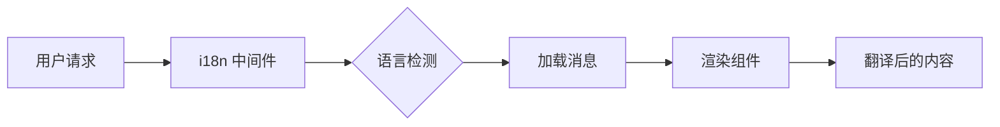

# 国际化概述

Ever Works 在设计时充分考虑了国际化需求，通过 `next-intl` 支持多种语言。

## 🌍 支持的语言

该模板内置支持以下语言：

- 🇬🇧 **英语** (en) – 默认语言
- 🇫🇷 **法语** (fr)
- 🇪🇸 **西班牙语** (es)
- 🇩🇪 **德语** (de)
- 🇨🇳 **中文** (zh)
- 🇸🇦 **阿拉伯语** (ar)
- 🇧🇬 **保加利亚语** (bg)
- 🇳🇱 **荷兰语** (nl)
- 🇮🇱 **希伯来语** (he)
- 🇮🇹 **意大利语** (it)
- 🇵🇱 **波兰语** (pl)
- 🇵🇹 **葡萄牙语** (pt)
- 🇷🇺 **俄语** (ru)

## 工作原理

### 基于 URL 的本地化

Ever Works 使用基于 URL 的语言检测：

```
https://yoursite.com/en/about    → 英语
https://yoursite.com/fr/about    → 法语
https://yoursite.com/es/about    → 西班牙语
```

### 自动语言检测

系统会自动：
1. 检测用户的浏览器语言
2. 重定向到相应的语言环境
3. 记住用户的语言偏好
4. 回退到默认语言（英语）

## 翻译架构



## 翻译文件

翻译存储在 JSON 文件中：

```
messages/
├── en.json    # 英语
├── fr.json    # 法语
├── es.json    # 西班牙语
├── de.json    # 德语
├── zh.json    # 中文
└── ar.json    # 阿拉伯语
```

## 快速示例

```typescript
import { useTranslations } from 'next-intl';

export function MyComponent() {
  const t = useTranslations('common');

  return (
    <div>
      <h1>{t('welcome')}</h1>
      <p>{t('description')}</p>
    </div>
  );
}
```

## 功能特性

### ✅ 完整的翻译覆盖
- UI 组件
- 表单标签和验证消息
- 电子邮件模板
- 错误消息
- SEO 元数据

### ✅ RTL 支持
- 阿拉伯语和希伯来语的自动 RTL 布局
- 镜像 UI 元素
- 正确的文本对齐

### ✅ 日期和数字格式化
- 特定于语言的日期格式
- 货币格式化
- 数字格式化

### ✅ 复数处理
- 自动复数形式
- 特定于语言的规则

## 下一步

- [翻译指南 →](./translation-guide) – 了解如何添加和管理翻译
- [开始使用](/getting-started) – 设置您的项目
- [自定义](/guides/customization) – 个性化您的网站

## 需要帮助？

请访问我们的[支持页面](/advanced-guide/support)获取国际化方面的帮助。
