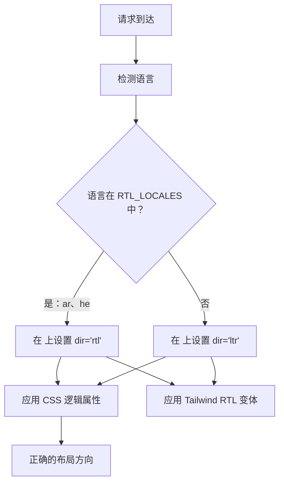

# RTL（从右到左）支持

该模板完全支持从右到左 (RTL) 文字方向的语言，如阿拉伯语和希伯来语。本页记录了 RTL 检测的工作原理、布局方向的应用方式，以及如何将组件适配到 RTL 上下文。

## 架构概述



## 源文件

| 文件 | 用途 |
|------|---------|
| `lib/constants.ts` | 定义 RTL 语言列表 |
| `app/layout.tsx` | 带 `dir` 属性的根布局 |
| `components/language-switcher.tsx` | 带 `isRTL` 元数据的语言映射 |

## RTL 语言配置

```typescript
export const RTL_LOCALES: readonly Locale[] = ['ar', 'he'] as const;
```

## 方向的应用方式

### 根布局中的检测

```typescript
export default async function RootLayout({ children }) {
  const locale = await getLocale();
  const dir = RTL_LOCALES.includes(locale as Locale) ? 'rtl' : 'ltr';

  return (
    <html lang={locale} dir={dir} suppressHydrationWarning>
      <body className={`${getFontClassNames(locale)} antialiased`}>
        {children}
      </body>
    </html>
  );
}
```

## RTL 的 CSS 策略

### 1. CSS 逻辑属性

| 物理属性 | 逻辑属性 | LTR 值 | RTL 值 |
|-------------------|-----------------|-------------|-------------|
| `margin-left` | `margin-inline-start` | 左边距 | 右边距 |
| `margin-right` | `margin-inline-end` | 右边距 | 左边距 |
| `padding-left` | `padding-inline-start` | 左内边距 | 右内边距 |
| `text-align: left` | `text-align: start` | 左对齐 | 右对齐 |
| `left` | `inset-inline-start` | 左侧定位 | 右侧定位 |

### 2. Tailwind CSS RTL 支持

```html
<div class="ml-4 rtl:mr-4 rtl:ml-0">
  带方向感知边距的内容
</div>

<svg class="rtl:rotate-180">
  <path d="M1 9 4-4-4-4" />
</svg>
```

### 3. Tailwind 逻辑工具类

```html
<div class="ps-4">  <!-- padding-inline-start: 1rem -->
<div class="pe-4">  <!-- padding-inline-end: 1rem -->
<div class="ms-4">  <!-- margin-inline-start: 1rem -->
<div class="me-4">  <!-- margin-inline-end: 1rem -->
```

## 常见 RTL 问题

| 问题 | 原因 | 解决方案 |
|-------|-------|-----|
| 文本对齐错误 | 使用了 `text-left` 而非 `text-start` | 使用逻辑属性 |
| 图标未镜像 | 方向性图标缺少 `rtl:rotate-180` | 添加 RTL 变体 |
| 边距在错误的一侧 | 使用了 `ml-*` 而非 `ms-*` | 使用 Tailwind 逻辑工具类 |

## 添加新的 RTL 语言

1. 将语言添加到 `lib/constants.ts` 中的 `LOCALES`
2. **添加到 `RTL_LOCALES`**
3. 创建消息文件 `messages/ur.json`
4. 在 `components/language-switcher.tsx` 的语言映射中添加条目
5. 在 `public/flags/ur.svg` 中添加国旗 SVG
6. 在 RTL 模式下彻底测试布局

## 最佳实践

1. **优先使用 CSS 逻辑属性** 而非物理属性
2. **在 `<html>` 上使用 `dir="rtl"`**（已由根布局处理）
3. **使用真实的阿拉伯语/希伯来语内容测试**，而非在 RTL 模式下使用英语内容
4. **不要镜像装饰性图片**或品牌标志
