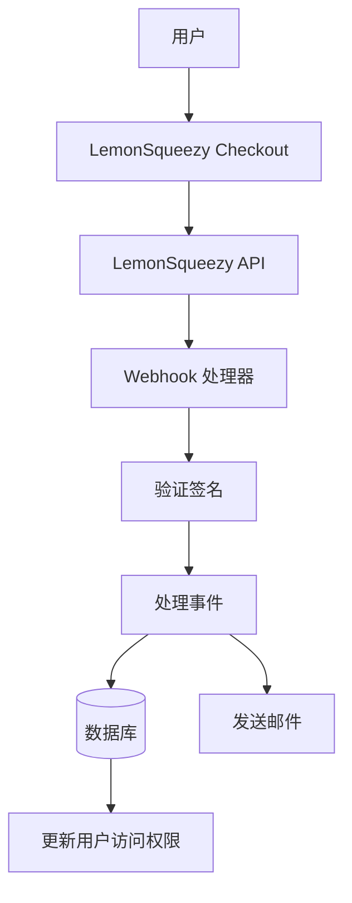

# LemonSqueezy 配置

本指南说明如何在 Ever Works 应用中将 LemonSqueezy 配置为支付提供商。

## 概述

LemonSqueezy 是一个 merchant of record 平台，简化了以下事项：

- 💰 全球支付，自动税务合规
- 🌍 支持 135+ 个国家
- 📊 内置欺诈防护
- 🔄 订阅管理
- 💳 多种支付方式
- 📧 自动电子邮件收据

:::tip 为什么选择 LemonSqueezy？
LemonSqueezy 作为 merchant of record 运作，自动处理所有税务合规、增值税和销售税。这意味着您无需在不同国家注册纳税。
:::

## 必需的环境变量

将这些变量添加到您的 `.env.local` 文件：

```env
# LemonSqueezy 配置
LEMONSQUEEZY_API_KEY=your_api_key_here
LEMONSQUEEZY_WEBHOOK_SECRET=your_webhook_secret_here
LEMONSQUEEZY_STORE_ID=your_store_id_here

# 产品/变体 ID（可选）
NEXT_PUBLIC_LEMONSQUEEZY_PRO_VARIANT_ID=variant_id_here
NEXT_PUBLIC_LEMONSQUEEZY_SPONSOR_VARIANT_ID=variant_id_here
```

## LemonSqueezy 控制台配置

### 第一步：创建您的商店

1. 在 [LemonSqueezy](https://lemonsqueezy.com) 注册
2. 创建新商店
3. 填写商店设置（名称、货币等）
4. 从 URL 或设置中复制您的**商店 ID**

### 第二步：创建产品

1. 前往**产品** → **新产品**
2. 创建您的价格层次：

| 产品 | 价格 | 类型 | 描述 |
|------|------|------|------|
| **Pro 计划** | $10/月 | 订阅 | 高级功能 |
| **赞助商计划** | $20 | 一次性 | 高级支持 |

3. 为每个产品创建具有特定价格的**变体**
4. 复制每个价格选项的**变体 ID**

### 第三步：获取 API 密钥

1. 前往**设置** → **API**
2. 创建新 API 密钥
3. 复制 API 密钥（以 `ls_` 开头）
4. 将其作为 `LEMONSQUEEZY_API_KEY` 添加到 `.env.local`

### 第四步：配置 Webhooks

1. 前往**设置** → **Webhooks**
2. 点击**创建 Webhook**
3. 配置 webhook：
   - **URL**: `https://您的域名.com/api/lemonsqueezy/webhook`
   - **事件**：选择所有订阅和订单事件
   - **密钥**：生成密钥

4. 复制 **Webhook 密钥**并将其添加到 `.env.local`

#### 推荐的事件

在 webhook 配置中选择这些事件：

- ✅ `subscription_created` - 新订阅
- ✅ `subscription_updated` - 订阅变更
- ✅ `subscription_cancelled` - 取消
- ✅ `subscription_payment_success` - 支付成功
- ✅ `subscription_payment_failed` - 支付失败
- ✅ `subscription_trial_will_end` - 试用期即将结束
- ✅ `order_created` - 一次性购买
- ✅ `order_refunded` - 已处理退款

## Webhook 端点

Webhook 可在以下地址访问：`/api/lemonsqueezy/webhook`

### 支持的事件映射

| LemonSqueezy 事件 | 内部事件 | 描述 |
|------------------|---------|------|
| `subscription_created` | `SUBSCRIPTION_CREATED` | 已创建新订阅 |
| `subscription_updated` | `SUBSCRIPTION_UPDATED` | 订阅已更新 |
| `subscription_cancelled` | `SUBSCRIPTION_CANCELLED` | 订阅已取消 |
| `subscription_payment_success` | `SUBSCRIPTION_PAYMENT_SUCCEEDED` | 支付成功 |
| `subscription_payment_failed` | `SUBSCRIPTION_PAYMENT_FAILED` | 支付失败 |
| `subscription_trial_will_end` | `SUBSCRIPTION_TRIAL_ENDING` | 试用期即将结束 |
| `order_created` | `PAYMENT_SUCCEEDED` | 一次性支付 |
| `order_refunded` | `REFUND_SUCCEEDED` | 已处理退款 |

## 实现

### 支付系统架构



### 功能特性

#### 安全性

- ✅ HMAC 签名验证（SHA-256）
- ✅ Webhook 密钥验证
- ✅ 全面的错误处理
- ✅ 请求日志记录

#### 功能

- ✅ 订阅生命周期管理
- ✅ 自动支付处理
- ✅ 电子邮件通知
- ✅ 数据库同步
- ✅ 错误监控

## 使用示例

### 创建结账

```typescript
import { LemonSqueezyProvider } from '@/lib/payment/providers/lemonsqueezy-provider';

const lsProvider = new LemonSqueezyProvider({
  apiKey: process.env.LEMONSQUEEZY_API_KEY!,
  storeId: process.env.LEMONSQUEEZY_STORE_ID!,
});

// 创建结账会话
const checkout = await lsProvider.createCheckout({
  variantId: 'variant_id_here',
  customerId: 'customer_id',
  redirectUrl: 'https://yoursite.com/success',
});

// 将用户重定向到 checkout.url
```

## 测试

### 测试模式

1. LemonSqueezy 提供开发测试模式
2. 使用测试 API 密钥（在控制台中可用）
3. 使用 LemonSqueezy 的 webhook 测试工具测试 webhooks

### 本地测试

```bash
# 使用 ngrok 等工具暴露本地服务器
ngrok http 3000

# 在 LemonSqueezy 控制台中更新 webhook URL
https://your-ngrok-url.ngrok.io/api/lemonsqueezy/webhook
```

## 监控

所有 webhook 事件都会被记录：

- ✅ **成功**：`✅ LemonSqueezy [event] handled successfully`
- ❌ **错误**：`❌ Failed to handle [event]: [error details]`

检查应用程序日志以了解 webhook 活动。

## 故障排除

### 常见问题

**问题**：错误"No signature provided"

- **解决方案**：确保 LemonSqueezy 正在发送 `x-signature` 标头
- 在 LemonSqueezy 控制台中检查 webhook 配置

**问题**：错误"Invalid signature"

- **解决方案**：验证 `LEMONSQUEEZY_WEBHOOK_SECRET` 是否与 LemonSqueezy 中的密钥匹配
- 确保 webhook URL 配置正确

**问题**：Webhook 未接收事件

- **解决方案**：确认 webhook URL 可公开访问
- 使用 ngrok 进行本地测试
- 检查 LemonSqueezy 的 webhook 日志

## 安全最佳实践

1. **仅 HTTPS**：生产环境中始终对 webhook 端点使用 HTTPS
2. **轮换密钥**：定期轮换 webhook 密钥
3. **监控**：监控 webhook 日志以检测可疑活动
4. **环境变量**：切勿将密钥提交到版本控制
5. **频率限制**：为生产 webhooks 实施频率限制
