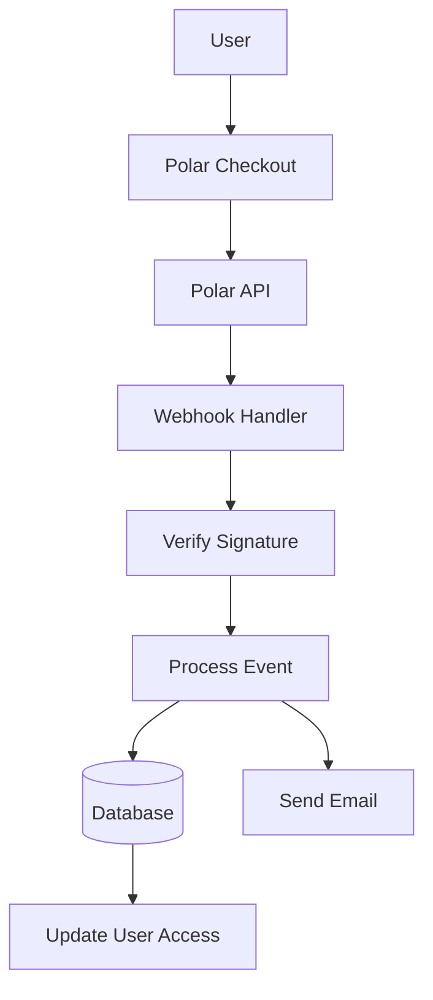

# 极性配置

本指南介绍了如何在您的 Ever Works 应用程序中将 Polar 配置为支付提供商。

## 概述

Polar 是一个专为开发者和创作者设计的现代支付平台，提供：

- 💻 开发者友好的 API 和文档
- 🔄 订阅和一次性付款支持
- 🐙 GitHub 集成以获取赞助
- 💰 透明的定价结构
- 🔒 安全支付处理
- 📊 内置分析和报告

:::tip 为什么选择 Polar？
Polar 专为开发人员和开源项目构建，提供干净的 API、优秀的文档以及用于赞助和货币化的无缝 GitHub 集成。
:::

## 所需的环境变量

将这些变量添加到您的 0 文件中：

```env
# Polar Configuration
POLAR_API_KEY=your_polar_api_key_here
POLAR_WEBHOOK_SECRET=your_webhook_secret_here
POLAR_APP_URL=https://your-app-url.com

# Product IDs (optional)
NEXT_PUBLIC_POLAR_SUBSCRIPTION_PRODUCT_ID=product_id_here
NEXT_PUBLIC_POLAR_ONETIME_PRODUCT_ID=product_id_here
```

:::warning
切勿将您的密钥提交给版本控制。将 0 保存在 1 文件中。
:::

## Polar 仪表板设置

### 第 1 步：创建您的帐户

1. 注册【Polar】(https://polar.sh)
2. 完成您的帐户设置
3. 验证您的电子邮件地址

### 第 2 步：创建产品

1. 导航至 **产品** → **新产品**
2. 创建您的定价等级：

|产品 |价格|类型 |描述 |
|--------|--------|------|-------------|
| **专业计划** | 10 美元/月 |订阅 |高级功能 |
| **赞助计划** | 20 美元 |一次性|高级支持 |

3. 配置产品设置：
   - 设置定价和计费周期
   - 添加产品描述
   - 配置访问级别
4. 复制每个产品的 **产品 ID**

### 第 3 步：获取 API 密钥

1. 转到 **设置** → **API 密钥**
2. 创建新的API密钥
3.复制API密钥
4. 将其添加到您的 2 作为 3

:::tip
Polar 为开发和生产提供单独的密钥。在开发过程中使用测试密钥。
:::

### 步骤 4：配置 Webhook

1. 转到 **设置** → **Webhooks**
2. 单击**创建 Webhook**
3. 配置网络钩子：
   - **网址**：4
   - **事件**：选择所有付款和订阅事件
   - **秘密**：生成密钥

4. 复制 **Webhook Secret** 并将其添加到您的 5 中

#### 推荐活动

在您的 Webhook 配置中选择这些事件：

- ✅ 6 - 付款成功
- ✅ 7 - 付款失败
- ✅ 8 - 新订阅
- ✅ 9 - 订阅变更
- ✅ 10 - 取消
- ✅ 11 - 试用结束
- ✅ 12 - 退款已处理

## 支付系统架构



### Polar 提供商

Polar 提供商 (0) 实施：

- ✅ 客户管理
- ✅ 产品和定价管理
- ✅ 订阅生命周期
- ✅ 付款处理
- ✅ Webhook 处理
- ✅ 退款支持

### API 路由

可以使用以下 API 路由：

|路线 |方法|描述 |
|--------|--------|-------------|
| 1 |发布 |处理 Polar webhooks |
| 2 |发布 |创建订阅 |
| 3 |放置|更新订阅 |
| 4 |删除 |取消订阅 |
| 5 |发布 |创建结帐会话 |
| 6 |获取 |验证付款状态 |

### 用户界面组件

该系统使用 Polar 的结账组件：

- 7 - 结帐按钮组件
- 8 - 带有验证的付款表格
- 移动端和桌面端的响应式设计
- 支持多种支付方式

## 用法示例

### 创建订阅

```typescript
import { PolarProvider } from '@/lib/payment/providers/polar-provider';

const configs = createProviderConfigs({
  apiKey: process.env.POLAR_API_KEY!,
  webhookSecret: process.env.POLAR_WEBHOOK_SECRET!,
  options: {
    appUrl: process.env.POLAR_APP_URL!
  }
});

const polarProvider = new PolarProvider(configs.polar);

const subscription = await polarProvider.createSubscription({
  customerId: 'customer_id',
  productId: 'product_id',
  paymentMethodId: 'payment_method_id',
  trialPeriodDays: 7
});
```

### 创建结账会话

```typescript
const checkout = await polarProvider.createCheckout({
  productId: 'product_id_here',
  customerId: 'customer_id',
  successUrl: 'https://yoursite.com/success',
  cancelUrl: 'https://yoursite.com/cancel'
});

// Redirect user to checkout.url
```

### 使用支付组件

```tsx
import { PolarCheckoutButton } from '@/lib/payment';

function PaymentPage() {
  return (
    <PolarCheckoutButton
      productId="product_id_here"
      amount={1000} // 10.00 USD in cents
      currency="usd"
      isSubscription={true}
      onSuccess={(paymentId) => {
        console.log('Payment succeeded:', paymentId);
        // Redirect to success page or update UI
      }}
      onError={(error) => {
        console.error('Payment error:', error);
        // Show error message to user
      }}
    />
  );
}
```

## 测试您的集成

### 测试模式

1. **使用测试 API 密钥**（在 Polar 仪表板中提供）
2. **使用测试付款方式**：
   - Polar 仪表板中提供的测试卡
   - 所有支付流程的测试模式

3. **使用 ngrok 等工具在本地测试 webhooks：

   ````bash
   恩格洛克 http 3000
   ````

   将 Polar 仪表板中的 webhook URL 更新为您的 ngrok URL。

### Webhook 测试

```bash
# Use ngrok to expose your local server
ngrok http 3000

# Update webhook URL in Polar dashboard
https://your-ngrok-url.ngrok.io/api/polar/webhook

# Trigger test events from Polar dashboard
```

## 错误处理

系统自动处理常见错误：

|错误类型 |处理|
|------------|----------|
|付款被拒绝 |用户友好的错误消息 |
|网络问题 |自动重试逻辑 |
| Webhook 失败 |已记录以进行手动审核 |
|验证错误 |表单字段突出显示 |
|订阅错误 |清除错误信息 |

## 安全最佳实践

1. **API 密钥**：
   - 切勿在客户端代码中暴露密钥
   - 使用环境变量
   - 定期轮换钥匙

2. **Webhook验证**：
   - 始终验证 webhook 签名
   - 在处理之前验证事件数据
   - 对所有 Webhook 端点使用 HTTPS

3. **付款数据**：
   - 绝不存储付款详细信息
   - 使用 Polar 的安全支付处理
   - 实施适当的身份验证

4. **用户会话**：
   - 验证用户身份验证
   - 验证用户权限
   - 记录所有付款活动

## GitHub 集成

Polar 提供无缝 GitHub 集成：

- **GitHub 赞助**：将 Polar 与 GitHub 赞助商联系起来
- **存储库访问**：根据订阅授予访问权限
- **组织支持**：管理团队订阅
- **自动访问**：自动访问管理

### 设置 GitHub 集成

1. 转到 **设置** → **集成** → **GitHub**
2. 连接您的 GitHub 帐户
3.配置仓库访问规则
4. 设置自动访问管理

## 依赖关系

所需的软件包（已包含在 Ever Works 中）：

```json
{
  "@polar-sh/sdk": "^1.0.0"
}
```

## 故障排除

### 常见问题

**问题**：Webhook 未接收事件

- **解决方案**：检查 webhook URL 是否可公开访问
- 使用ngrok进行本地测试
- 验证 webhook 秘密是否正确

**问题**：付款无提示失败

- **解决方案**：检查浏览器控制台是否有错误
- 验证API密钥是否正确
- 检查 Polar 仪表板日志

**问题**：订阅未更新

- **解决方案**：验证已配置 Webhook 事件
- 检查 webhook 处理程序日志
- 确保数据库更新正常工作

**问题**：GitHub 集成不起作用

- **解决方案**：在 Polar 仪表板中验证 GitHub 连接
- 检查存储库访问设置
- 确保授予适当的权限

## 比较：Polar 与其他提供商

|特色 |极地 |条纹|柠檬挤压 |
|--------|--------|--------|--------------|
| **开发者焦点** | ✅ 优秀 | ⚠️ 好 | ⚠️ 好 |
| **GitHub 集成** | ✅ 本地人 | ❌ 否 | ❌ 否 |
| **开源友好** | ✅ 是的 | ⚠️ 有限公司 | ⚠️ 有限公司 |
| **设置复杂性** | ✅ 简单 | ⚠️ 中等 | ✅ 简单 |
| **API 质量** | ✅ 优秀 | ✅ 优秀 | ⚠️ 好 |
| **税务合规** | ⚠️ 手册 | ⚠️ 手册 | ✅ 自动 |
| **最适合** |开发人员、OSS |高产量|全球销售|

## 后续步骤

- [Stripe 配置](./stripe) - 替代支付提供商
- [LemonSqueezy 配置](./lemonsqueezy) - 替代支付提供商
- [付款概览](/付款) - 比较付款提供商
- [环境变量](/deployment/environment-variables) - 完整的环境设置
- [部署](/部署) - 部署您的支付集成

## 资源

- [Polar 文档](https://docs.polar.sh/)
- [API参考](https://docs.polar.sh/api)
- [Webhook 指南](https://docs.polar.sh/webhooks)
- [GitHub 集成](https://docs.polar.sh/integrations/github)

## 支持

需要 Polar 集成方面的帮助吗？查看我们的[支持页面](/advanced-guide/support) 或加入我们的社区。
