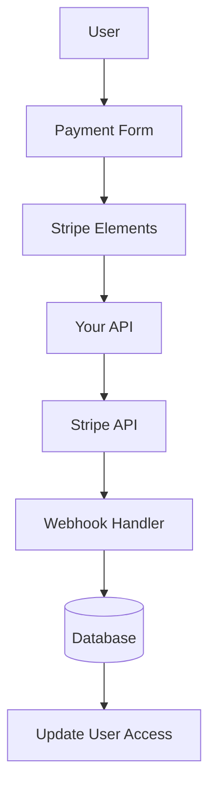

# 条带配置

本指南介绍了如何在 Ever Works 应用程序中使用完整的订阅和支付系统配置 Stripe。

## 概述

Stripe 是一个综合支付平台，支持：

- 💳 一次性付款
- 🔄 定期订阅
- 🌍多种支付方式（银行卡、Apple Pay、Google Pay）
- 💰 多种货币
- 📊 高级分析和报告

## 所需的环境变量

将这些变量添加到您的 0 文件中：

```bash
# Stripe Configuration
STRIPE_SECRET_KEY=sk_test_your_stripe_secret_key_here
STRIPE_WEBHOOK_SECRET=whsec_your_stripe_webhook_secret_here
NEXT_PUBLIC_STRIPE_PUBLISHABLE_KEY=pk_test_your_stripe_publishable_key_here

# Stripe Price IDs
NEXT_PUBLIC_STRIPE_SUBSCRIPTION_PRICE_ID=price_subscription_id_here
NEXT_PUBLIC_STRIPE_ONETIME_PRICE_ID=price_onetime_id_here
NEXT_PUBLIC_STRIPE_FREE_PRICE_ID=price_free_id_here

# Product Pricing (for display purposes)
NEXT_PUBLIC_PRODUCT_PRICE_PRO=10.00
NEXT_PUBLIC_PRODUCT_PRICE_SPONSOR=20.00
NEXT_PUBLIC_PRODUCT_PRICE_FREE=0.00
```

:::warning
切勿将您的密钥提交给版本控制。将 0 保存在 1 文件中。
:::

## Stripe 仪表板配置

### 第 1 步：创建产品

在您的 [Stripe 仪表板](https://dashboard.stripe.com/) 中：

1. 导航至 **产品** → **添加产品**
2. 创建以下产品：

|产品 |价格|类型 |描述 |
|--------|--------|------|-------------|
| **免费计划** | 0.00 美元 |一次性|基本特点|
| **专业计划** | 10.00 美元 |包月订阅 |高级功能 |
| **赞助计划** | 20.00 美元 |一次性|高级支持 |

3. 复制每个产品的 **价格 ID**（以 2 开头）

### 第 2 步：配置 Webhook

Webhook 允许 Stripe 通知您的应用程序有关付款事件的信息。

1. 转到 **开发人员** → **Webhooks** → **添加端点**
2. 设置端点 URL：
   - 发展：3
   - 产量：4

3. 选择要监听的事件：
   - 5
   -6
   -7
   -8
   - 9
   -10
   - 11
   - 12

4. 复制**签名密钥**（以13开头）

### 第 3 步：检索 API 密钥

在您的 Stripe 仪表板中：

1. **密钥**：**开发人员** → **API密钥** → **密钥**（以14开头）
2. **可发布密钥**：**开发人员** → **API 密钥** → **可发布密钥**（以 15 开头）
3. **Webhook 秘密**：**开发人员** → **Webhook** → 选择您的 Webhook → **签名秘密**

:::tip
在开发过程中使用**测试模式**键（以16 和17 开头）。切换到**实时模式**键进行制作。
:::

## 支付系统架构



### 条纹提供商

Stripe 提供商 (0) 实现：

- ✅ 客户管理
- ✅ 创建付款意向
- ✅ 订阅管理
- ✅ Webhook 处理
- ✅ 设置意图支持
- ✅ 退款和取消

### API 路由

可以使用以下 API 路由：

|路线 |方法|描述 |
|--------|--------|-------------|
| 1 |发布 |处理 Stripe webhook |
| 2 |发布 |创建订阅 |
| 3 |放置|更新订阅 |
| 4 |删除 |取消订阅 |
| 5 |发布 |创建付款意向 |
| 6 |获取 |验证付款 |
| 7 |发布 |设置付款方式 |

### 用户界面组件

该系统使用 Stripe Elements 来实现安全支付形式：

- 8 - 主要包装组件
- 9 - 带有验证的付款表格
- 支持Apple Pay和Google Pay
- 移动端和桌面端的响应式设计

## 用法示例

### 创建订阅

```typescript
import { StripeProvider } from '@/lib/payment/providers/stripe-provider';

const configs = createProviderConfigs({
  apiKey: process.env.STRIPE_SECRET_KEY!,
  webhookSecret: process.env.STRIPE_WEBHOOK_SECRET!,
  options: {
    publishableKey: process.env.NEXT_PUBLIC_STRIPE_PUBLISHABLE_KEY!,
    apiVersion: '2023-10-16'
  }
});

const stripeProvider = new StripeProvider(configs.stripe);

const subscription = await stripeProvider.createSubscription({
  customerId: 'cus_customer_id',
  priceId: 'price_subscription_id',
  paymentMethodId: 'pm_payment_method_id',
  trialPeriodDays: 7
});
```

### 使用支付组件

```tsx
import { PaymentForm } from '@/lib/payment';

function PaymentPage() {
  return (
    <PaymentForm
      amount={1000} // 10.00 USD in cents
      currency="usd"
      isSubscription={true}
      onSuccess={(paymentId) => {
        console.log('Payment succeeded:', paymentId);
        // Redirect to success page or update UI
      }}
      onError={(error) => {
        console.error('Payment error:', error);
        // Show error message to user
      }}
    />
  );
}
```

## 测试您的集成

### 测试模式

1. **使用测试 API 密钥**（以 0 和 1 开头）
2. **使用测试卡号码**：
   - 成功：2
   - 下降：3
   3D安全：4

3. **使用 Stripe CLI 在本地测试 Webhooks：

   ````bash
   stripe 监听 --forward-to localhost:3000/api/stripe/webhook
   ````

### Webhook 测试

```bash
# Install Stripe CLI
brew install stripe/stripe-cli/stripe

# Login to your Stripe account
stripe login

# Forward webhooks to your local server
stripe listen --forward-to localhost:3000/api/stripe/webhook

# Trigger test events
stripe trigger payment_intent.succeeded
```

## 错误处理

系统自动处理常见错误：

|错误类型 |处理|
|------------|----------|
|卡被拒绝 |用户友好的错误消息 |
|资金不足|使用不同的卡重试 |
|网络问题 |自动重试逻辑 |
| Webhook 失败 |已记录以进行手动审核 |
|验证错误 |表单字段突出显示 |

## 安全最佳实践

1. **API 密钥**：
   - 切勿在客户端代码中暴露密钥
   - 使用环境变量
   - 定期轮换钥匙

2. **Webhook验证**：
   - 始终验证 webhook 签名
   - 在处理之前验证事件数据

3. **付款数据**：
   - 切勿存储卡号
   - 使用 Stripe 的标记化
   - 实施 PCI 合规性

4. **用户会话**：
   - 验证用户身份验证
   - 验证用户权限
   - 记录所有付款活动

## 依赖关系

所需的软件包（已包含在 Ever Works 中）：

```json
{
  "@stripe/react-stripe-js": "^3.7.0",
  "@stripe/stripe-js": "^7.3.0",
  "stripe": "^18.1.0"
}
```

## 故障排除

### 常见问题

**问题**：Webhook 未接收事件

- **解决方案**：检查 webhook URL 是否可公开访问
- 使用 Stripe CLI 进行本地测试
- 验证 webhook 秘密是否正确

**问题**：付款无提示失败

- **解决方案**：检查浏览器控制台是否有错误
- 验证API密钥是否正确
- 检查 Stripe 仪表板日志

**问题**：3D Secure 不起作用

- **解决方案**：确保您正在处理 0 状态
- 实施适当的重定向流程
- 使用 3D Secure 测试卡进行测试

## 后续步骤

- [LemonSqueezy 配置](./lemonsqueezy) - 替代支付提供商
- [环境变量](/deployment/environment-variables) - 完整的环境设置
- [部署](/部署) - 部署您的支付集成

## 资源

- [Stripe 文档](https://stripe.com/docs)
- [Next.js 集成指南](https://stripe.com/docs/ payments/accept-a- payment?platform=web&ui=elements)
- [订阅管理](https://stripe.com/docs/billing/subscriptions)
- [Webhook 事件](https://stripe.com/docs/api/events/types)

## 支持

需要 Stripe 集成帮助？查看我们的[支持页面](/advanced-guide/support) 或加入我们的社区。
