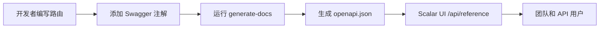

# API 文档培训

掌握使用 Swagger 注解和 Scalar UI 界面的自动化 API 文档系统。

## 🎯 学习目标

完成本模块后，您将能够：

- ✅ 理解 API 文档工作流程
- ✅ 编写正确的 Swagger 注解
- ✅ 遵循标准标签约定
- ✅ 生成和验证文档
- ✅ 排查常见问题
- ✅ 维护高质量的 API 文档

**预计时间**：2–3 天

---

## 为什么使用这个系统？

### 解决的问题

- **文档不一致**：以前有 8 个不同的 Stripe 标签分散在各个端点中
- **手动同步**：文档经常落后于实际代码
- **开发者体验差**：基础 Swagger UI 功能有限

### 获得的优势

- **自动同步**：文档直接从代码中的注解生成
- **现代界面**：Scalar UI 提供交互式测试和更好的用户体验
- **统一标准**：统一的标签系统和文档模板

---

## 系统架构

### 核心组件

1. **代码中的 Swagger 注解**
   - 带有 `@swagger` 标签的 JSDoc 注释
   - OpenAPI 3.0 规范格式
   - 直接嵌入路由文件中

2. **generate-docs 脚本**
   - 扫描所有 `app/api/**/route.ts` 文件
   - 提取并验证 Swagger 注解
   - 生成统一的 `public/openapi.json`

3. **Scalar UI 界面**
   - 现代响应式文档界面
   - 交互式 API 测试
   - 可在 `/api/reference` 访问

### 完整工作流程



---

## 核心命令

```bash
yarn generate-docs
yarn docs:watch
yarn docs:validate
git status public/openapi.json
```

---

## 标准标签系统

### 标签约定

#### 管理操作

```yaml
"Admin - Users"        # 用户管理
"Admin - Categories"   # 分类管理
"Admin - Items"        # 内容管理
"Admin - Comments"     # 评论审核
```

#### 核心应用功能

```yaml
"Authentication"       # 登录、注销、密码重置
"Favorites"           # 用户收藏
"Items & Content"     # 公共内容浏览
```

#### 支付系统

```yaml
"Stripe - Core"              # 结账、支付意图
"Stripe - Subscriptions"     # 订阅管理
"LemonSqueezy - Core"        # 所有 LemonSqueezy 操作
```

---

## 最佳实践

### 编写有效的描述

- 使用动作动词："创建"、"更新"、"删除"、"获取"
- 具体明确："获取用户资料"而非"获取用户"
- 不超过 50 个字符以确保界面可读性

### 真实示例

```yaml
# ❌ 不好的示例
example: "string"

# ✅ 好的示例
example: "john.doe@company.com"
example: "user_123abc456def"
```

---

## 开发者检查清单

提交 API 更改前：

- [ ] 已添加或更新 Swagger 注解
- [ ] 使用了标准系统中的正确标签
- [ ] 包含有意义的标题和描述
- [ ] 记录了所有请求体字段
- [ ] 记录了所有响应代码
- [ ] 已运行 `yarn generate-docs`
- [ ] 已在 `/api/reference` 验证文档
- [ ] `public/openapi.json` 已包含在提交中
