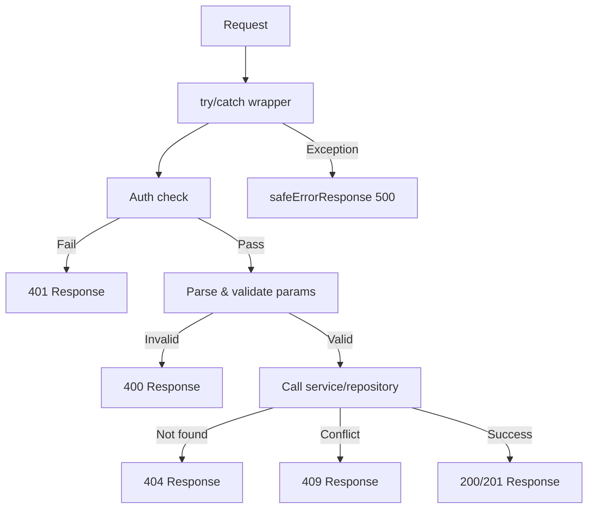

# API Response Patterns

All API routes follow consistent response conventions: discriminated union types for success/error, environment-aware error messages, standard HTTP status codes, and Swagger/JSDoc documentation. This page covers each pattern.

## Response Type System

### Discriminated Union (`lib/api/types.ts`)

API responses use a `success` boolean as the discriminant:

```typescript
export type ApiResponse<T = unknown> =
  | { success: true; data: T; total?: number; page?: number; limit?: number; totalPages?: number }
  | { success: false; error: string };
```

This allows callers to narrow the type safely:

```typescript
const response: ApiResponse<User[]> = await fetchUsers();
if (response.success) {
  // TypeScript knows: response.data is User[]
  console.log(response.data);
} else {
  // TypeScript knows: response.error is string
  console.error(response.error);
}
```

### Paginated Response

List endpoints use a dedicated paginated wrapper:

```typescript
export type PaginatedResponse<T> =
  | {
      success: true;
      data: T[];
      meta: {
        page: number;
        totalPages: number;
        total: number;
        limit: number;
      };
    }
  | { success: false; error: string };
```

### Error Types

```typescript
export interface ApiError {
  message: string;
  status?: number;
  code?: string;
}

export interface ErrorResponse {
  success: false;
  error: string;
}
```

## Standard Response Shapes

### Success Responses

#### Single Resource

```typescript
return NextResponse.json({
  success: true,
  item,
  message: "Item created successfully",
}, { status: 201 });
```

#### List with Pagination

```typescript
return NextResponse.json({
  success: true,
  items: result.items,
  total: result.total,
  page: result.page,
  limit: result.limit,
  totalPages: result.totalPages,
});
```

#### Action Confirmation

```typescript
return NextResponse.json({
  success: true,
  message: "Profile updated successfully",
});
```

### Error Responses

All error responses include `success: false` and an `error` string:

```typescript
// Unauthorized
return NextResponse.json(
  { success: false, error: "Unauthorized. Admin access required." },
  { status: 401 }
);

// Validation error
return NextResponse.json(
  { success: false, error: "Invalid page parameter. Must be a positive integer." },
  { status: 400 }
);

// Conflict
return NextResponse.json(
  { success: false, error: `Item with slug '${slug}' already exists` },
  { status: 409 }
);
```

## HTTP Status Code Conventions

| Status | Usage | Example |
|--------|-------|---------|
| `200` | Successful GET, PUT, PATCH, DELETE | List items, update profile |
| `201` | Successful POST (resource created) | Create item, create comment |
| `400` | Invalid parameters or body | Bad pagination, missing required fields |
| `401` | Authentication required or failed | Missing session, non-admin user |
| `404` | Resource not found | Item not found, profile not found |
| `409` | Conflict (duplicate resource) | Duplicate item ID or slug |
| `413` | Request body too large | Body exceeds `readBodyWithLimit` max |
| `500` | Internal server error | Unhandled exceptions |

## Safe Error Response (`lib/utils/api-error.ts`)

### `safeErrorResponse`

Prevents information leakage by showing generic messages in production and detailed messages in development:

```typescript
export function safeErrorResponse(
  error: unknown,
  fallbackMessage: string,
  status: number = 500
): NextResponse {
  const detail = error instanceof Error ? error.message : String(error);

  // Always log full details server-side
  console.error(`[API Error] ${fallbackMessage}:`, detail);

  const message = process.env.NODE_ENV === "development" ? detail : fallbackMessage;

  return NextResponse.json({ success: false, error: message }, { status });
}
```

Usage in route handlers:

```typescript
export async function GET(request: NextRequest) {
  try {
    // ... handler logic
  } catch (error) {
    return safeErrorResponse(error, 'Failed to fetch items');
  }
}
```

### `safeErrorMessage`

Extracts a safe message string without creating a `NextResponse`:

```typescript
export function safeErrorMessage(error: unknown, fallbackMessage: string): string {
  if (process.env.NODE_ENV === "development") {
    return error instanceof Error ? error.message : String(error);
  }
  return fallbackMessage;
}
```

### Environment Behavior

| Environment | Error Output | Server Log |
|-------------|-------------|------------|
| Development | `error.message` (full detail) | Full error logged |
| Production | `fallbackMessage` (generic) | Full error logged |

## Route Handler Structure

All API route handlers follow a consistent structure:



### Canonical GET Handler Example

```typescript
export async function GET(request: NextRequest) {
  try {
    // 1. Auth check
    const session = await auth();
    if (!session?.user?.isAdmin) {
      return NextResponse.json(
        { success: false, error: "Unauthorized. Admin access required." },
        { status: 401 }
      );
    }

    // 2. Parse and validate parameters
    const { searchParams } = new URL(request.url);
    const paginationResult = validatePaginationParams(searchParams);
    if ('error' in paginationResult) {
      return NextResponse.json(
        { success: false, error: paginationResult.error },
        { status: paginationResult.status }
      );
    }

    // 3. Call service layer
    const result = await repository.findAll(paginationResult);

    // 4. Return structured response
    return NextResponse.json({
      success: true,
      items: result.items,
      total: result.total,
      page: result.page,
      limit: result.limit,
      totalPages: result.totalPages,
    });

  } catch (error) {
    return safeErrorResponse(error, 'Failed to fetch items');
  }
}
```

### Canonical POST Handler Example

```typescript
export async function POST(request: NextRequest) {
  try {
    // 1. Auth check
    const session = await auth();
    if (!session?.user?.isAdmin) {
      return NextResponse.json(
        { success: false, error: "Unauthorized." },
        { status: 401 }
      );
    }

    // 2. Parse and validate body
    const body = await request.json();
    if (!body.name || !body.description) {
      return NextResponse.json(
        { success: false, error: "Name and description are required" },
        { status: 400 }
      );
    }

    // 3. Check for conflicts
    const existing = await repository.findBySlug(body.slug);
    if (existing) {
      return NextResponse.json(
        { success: false, error: `Resource with slug '${body.slug}' already exists` },
        { status: 409 }
      );
    }

    // 4. Create resource
    const item = await repository.create(body);

    // 5. Return created resource
    return NextResponse.json({
      success: true,
      item,
      message: "Created successfully",
    }, { status: 201 });

  } catch (error) {
    return safeErrorResponse(error, 'Failed to create resource');
  }
}
```

## Swagger / JSDoc Documentation

API routes are documented with inline Swagger annotations for auto-generated API documentation:

```typescript
/**
 * @swagger
 * /api/admin/items:
 *   get:
 *     tags: ["Admin - Items"]
 *     summary: "Get paginated items list"
 *     security:
 *       - sessionAuth: []
 *     parameters:
 *       - name: "page"
 *         in: "query"
 *         schema:
 *           type: integer
 *           minimum: 1
 *           default: 1
 *     responses:
 *       200:
 *         description: "Items list retrieved successfully"
 *       400:
 *         description: "Bad request"
 *       401:
 *         description: "Unauthorized"
 *       500:
 *         description: "Internal server error"
 */
```

## Client-Side API Types

The API client configuration and fetch options:

```typescript
export interface ApiClientConfig extends Partial<AxiosRequestConfig> {
  baseURL?: string;
  timeout?: number;
  headers?: Record<string, string>;
  accessToken?: string;
  frontendUrl?: string;
}

export interface FetchOptions {
  method?: 'GET' | 'POST' | 'PUT' | 'PATCH' | 'DELETE';
  headers?: Record<string, string>;
  body?: unknown;
  params?: Record<string, string | number | boolean | undefined>;
}
```

## Summary of Conventions

| Convention | Description |
|------------|-------------|
| All responses include `success` | Discriminated union for type safety |
| Errors use `{ success: false, error: string }` | Consistent error shape |
| `safeErrorResponse` wraps catch blocks | Environment-aware error masking |
| Pagination uses `total`, `page`, `limit`, `totalPages` | Consistent metadata |
| Auth check is the first operation | Fail-fast pattern |
| Validation returns early on failure | No nested conditionals |
| Swagger annotations on all admin routes | Auto-generated API docs |
