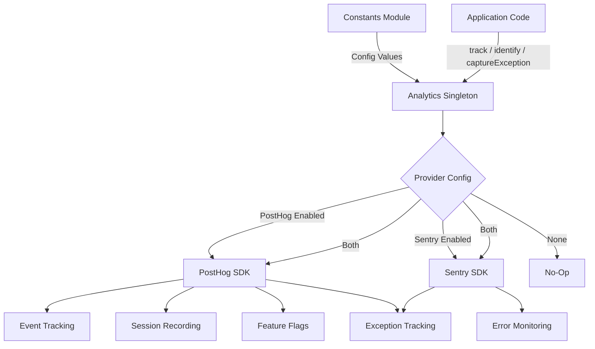
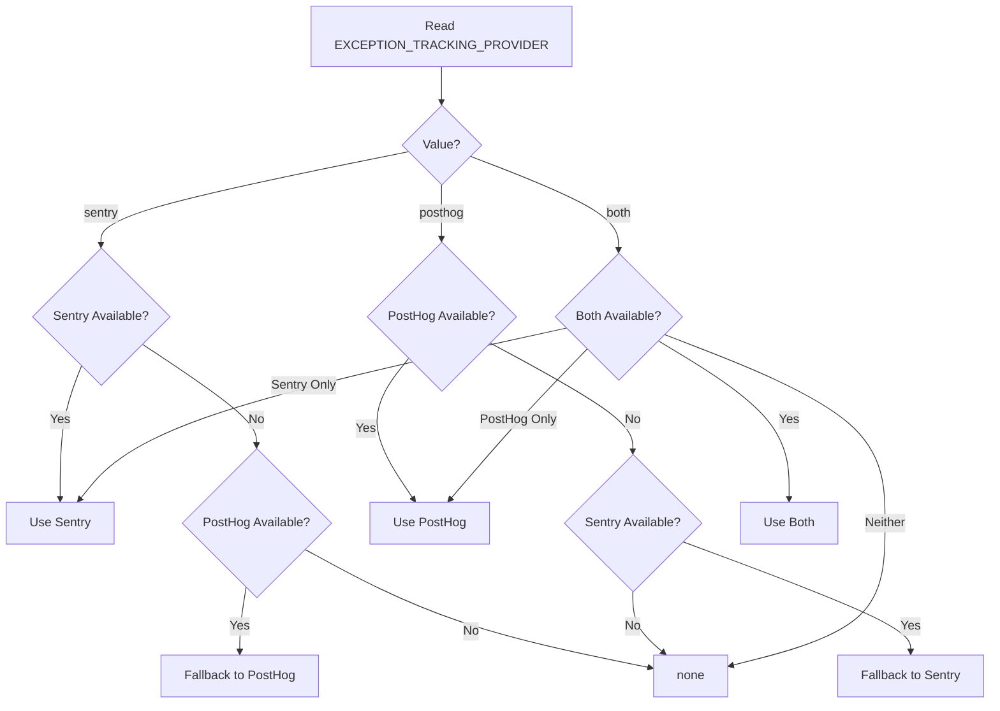

# Analytics Module

The analytics module (`template/lib/analytics/`) provides a unified singleton class for client-side event tracking, user identification, feature flag evaluation, and exception capture. It integrates **PostHog** for product analytics and **Sentry** for error monitoring, with support for using either provider individually, both simultaneously, or neither.

## Architecture Overview



## Source Files

| File | Description |
|------|-------------|
| `lib/analytics/index.ts` | `Analytics` singleton class and `analytics` export |

## Core Class: `Analytics`

The `Analytics` class is a singleton that wraps PostHog and Sentry. It is safe to call on the server side -- all methods silently return when `window` is undefined.

### Type Definitions

```typescript
type EventProperties = Properties;          // PostHog Properties type
type UserProperties = Record<string, any>;
type ExceptionTrackingProvider = 'sentry' | 'posthog' | 'both' | 'none';
```

### Singleton Access

```typescript
// Get the singleton instance
const analytics = Analytics.getInstance();

// Or use the pre-created export
import { analytics } from '@/lib/analytics';
```

### `init(): void`

Initializes PostHog with centralized configuration and sets up exception tracking. Must be called once on the client side (typically in a root layout or provider component).

```typescript
// In your root layout or PostHog provider
'use client';
import { analytics } from '@/lib/analytics';

useEffect(() => {
  analytics.init();
}, []);
```

**Behavior:**
- Skips initialization if already initialized or if running server-side
- Reads configuration from constants (`POSTHOG_KEY`, `POSTHOG_HOST`, `POSTHOG_ENABLED`, etc.)
- Configures session recording with masking when `POSTHOG_SESSION_RECORDING_ENABLED` is true
- Applies sampling rate (`POSTHOG_SAMPLE_RATE`) -- in production defaults to 10%
- Sets up global `window.onerror` and `unhandledrejection` handlers when PostHog exception tracking is enabled
- Links PostHog with Sentry when both providers are active

### `identify(userId: string, properties?: UserProperties): void`

Associates the current anonymous user with an identified user ID. Also sets the Sentry user context when Sentry is enabled.

```typescript
analytics.identify(session.user.id, {
  email: session.user.email,
  plan: 'premium',
});
```

### `reset(): void`

Resets the current user identity (e.g., on logout). Clears both PostHog and Sentry user contexts.

```typescript
analytics.reset();
```

### `track(eventName: string, properties?: EventProperties): void`

Captures a custom event in PostHog.

```typescript
analytics.track('item_submitted', {
  itemId: 'abc-123',
  category: 'SaaS Tools',
});
```

### `trackPageView(url: string, properties?: EventProperties): void`

Manually captures a page view event. Use when `POSTHOG_AUTO_CAPTURE` is disabled and you need explicit page view tracking.

```typescript
analytics.trackPageView(window.location.href, {
  referrer: document.referrer,
});
```

### `isFeatureEnabled(flagKey: string, defaultValue?: boolean): boolean`

Evaluates a PostHog feature flag synchronously.

```typescript
const showNewUI = analytics.isFeatureEnabled('new-dashboard-ui', false);
```

### `reloadFeatureFlags(): Promise<void>`

Forces a re-fetch of feature flags from the PostHog server.

```typescript
await analytics.reloadFeatureFlags();
```

### `captureException(error: Error | string, context?: Record<string, any>): void`

Unified exception tracking that dispatches to the configured provider(s).

```typescript
try {
  await riskyOperation();
} catch (error) {
  analytics.captureException(error, {
    component: 'PaymentForm',
    action: 'submit',
  });
}
```

**Provider routing:**
- `'posthog'` -- Sends `$exception` event to PostHog with stack trace
- `'sentry'` -- Calls `Sentry.captureException` with extra context
- `'both'` -- Sends to both providers
- `'none'` -- Silently discards

### `captureError(error: Error, context?: Record<string, any>): void`

**Deprecated.** Alias for `captureException`. Logs a deprecation warning.

### `getExceptionTrackingProvider(): ExceptionTrackingProvider`

Returns the currently active exception tracking provider.

### `setUserProperties(properties: UserProperties): void`

Sets persistent user properties on the PostHog person profile via `posthog.people.set()`.

```typescript
analytics.setUserProperties({
  subscription_tier: 'premium',
  company: 'Acme Corp',
});
```

### `setSuperProperties(properties: Record<string, any>): void`

Registers super properties sent with every subsequent event via `posthog.register()`.

```typescript
analytics.setSuperProperties({
  app_version: '2.1.0',
  environment: 'production',
});
```

## Configuration Constants

All analytics configuration is driven by constants from `lib/constants.ts`:

| Constant | Default | Description |
|----------|---------|-------------|
| `POSTHOG_KEY` | env var | PostHog project API key |
| `POSTHOG_HOST` | env var | PostHog API host URL |
| `POSTHOG_ENABLED` | derived | True when both key and host are set |
| `POSTHOG_DEBUG` | env var | Enable PostHog debug logging |
| `POSTHOG_SESSION_RECORDING_ENABLED` | `'true'` | Enable session recording |
| `POSTHOG_AUTO_CAPTURE` | `'false'` | Auto-capture page views |
| `POSTHOG_SAMPLE_RATE` | `0.1` (prod) / `1.0` (dev) | Event sampling rate |
| `POSTHOG_SESSION_RECORDING_SAMPLE_RATE` | `0.1` (prod) / `1.0` (dev) | Recording sampling rate |
| `EXCEPTION_TRACKING_PROVIDER` | `'both'` | Which provider handles exceptions |
| `SENTRY_ENABLED` | derived | True when DSN is set and env allows |

## Exception Tracking Provider Resolution

The provider is determined at construction time with fallback logic:



## Usage with Next.js

Typical integration in a Next.js App Router project:

```tsx
// app/providers.tsx
'use client';
import { useEffect } from 'react';
import { analytics } from '@/lib/analytics';
import { useSession } from 'next-auth/react';
import { usePathname } from 'next/navigation';

export function AnalyticsProvider({ children }: { children: React.ReactNode }) {
  const { data: session } = useSession();
  const pathname = usePathname();

  useEffect(() => {
    analytics.init();
  }, []);

  useEffect(() => {
    if (session?.user?.id) {
      analytics.identify(session.user.id, {
        email: session.user.email,
      });
    }
  }, [session]);

  useEffect(() => {
    analytics.trackPageView(pathname);
  }, [pathname]);

  return <>{children}</>;
}
```
