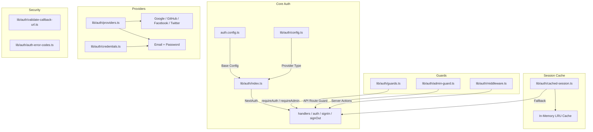
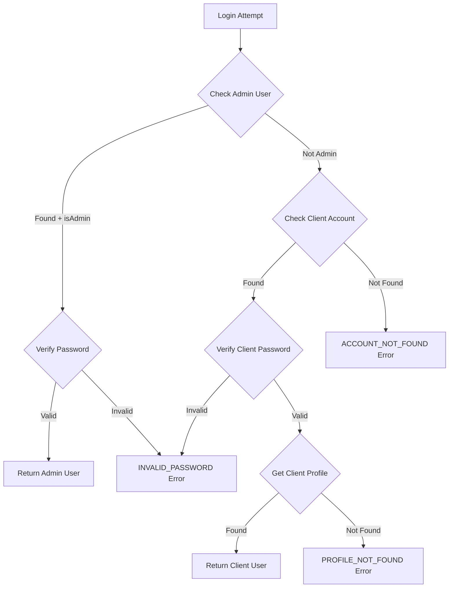

# Auth Utilities Module

The authentication utilities module (`template/lib/auth/`) provides a comprehensive authentication layer built on NextAuth.js (Auth.js) with support for multiple providers, session caching, server-side guards, validated server actions, and Supabase as an alternative auth backend.

## Architecture Overview



## Source Files

| File | Description |
|------|-------------|
| `lib/auth/index.ts` | NextAuth.js configuration with Drizzle adapter |
| `lib/auth/config.ts` | Auth provider type configuration |
| `lib/auth/credentials.ts` | Email/password credentials provider |
| `lib/auth/providers.ts` | OAuth provider factory |
| `lib/auth/guards.ts` | Server-side page guards |
| `lib/auth/admin-guard.ts` | API route admin guard |
| `lib/auth/middleware.ts` | Validated server action middleware |
| `lib/auth/cached-session.ts` | Session caching layer |
| `lib/auth/session-cache.ts` | Cache implementation |
| `lib/auth/validate-callback-url.ts` | Redirect URL validation |
| `lib/auth/auth-error-codes.ts` | Error code enum |
| `lib/auth/supabase/` | Supabase auth client/server/middleware |

## NextAuth.js Configuration (`index.ts`)

The main export provides the standard NextAuth.js interface:

```typescript
import { auth, signIn, signOut, handlers, unstable_update } from '@/lib/auth';
```

### Session Strategy

- **Strategy:** JWT (not database sessions)
- **Max Age:** 30 days
- **Update Age:** 24 hours (session refresh interval)

### JWT Callback

The JWT callback enriches tokens with:
- `userId` -- from user object or token `sub`
- `clientProfileId` -- auto-created for OAuth users on first login
- `isAdmin` -- determined from `isClient`/`isAdmin` flags or defaults to `false`
- `provider` -- the authentication provider name

### Session Callback

The session callback maps JWT fields to the session object:
- `session.user.id`
- `session.user.clientProfileId`
- `session.user.provider`
- `session.user.isAdmin`

### Custom Pages

```typescript
pages: {
  signIn: '/auth/signin',
  signOut: '/auth/signout',
  error: '/auth/error',
  verifyRequest: '/auth/verify-request',
  newUser: '/auth/register',
}
```

### Events

- **signOut** -- invalidates the session cache for the user
- **updateUser** -- invalidates the session cache when user data changes

## Auth Configuration (`config.ts`)

### `AuthProviderType`

```typescript
type AuthProviderType = 'supabase' | 'next-auth' | 'both';
```

### `AuthConfig`

```typescript
interface AuthConfig {
  provider: AuthProviderType;
  supabase?: {
    url: string;
    anonKey: string;
    redirectUrl?: string;
  };
  nextAuth?: {
    enableCredentials?: boolean;
    enableOAuth?: boolean;
    providers?: any[];
  };
}
```

### `getAuthConfig(): AuthConfig`

Resolves configuration with this priority:
1. Global override via `configureAuth()`
2. Environment-based detection (Supabase URL/key presence)
3. Default: `next-auth` with credentials and OAuth enabled

## Credentials Provider (`credentials.ts`)

### Password Functions

```typescript
async function hashPassword(password: string): Promise<string>;
// Uses bcryptjs with 10 salt rounds, loaded via dynamic import

async function comparePasswords(plainText: string, hashed: string | null): Promise<boolean>;
// Returns false if hashed is null
```

### Authentication Flow



### `AuthProviders` Enum

```typescript
enum AuthProviders {
  CREDENTIALS = 'credentials',
  GOOGLE = 'google',
  FACEBOOK = 'facebook',
  GITHUB = 'github',
  TWITTER = 'twitter',
  X = 'x',
  MICROSOFT = 'microsoft',
}
```

## OAuth Providers (`providers.ts`)

### `createNextAuthProviders(config?): Provider[]`

Dynamically creates NextAuth provider instances based on configuration:

```typescript
import { createNextAuthProviders } from '@/lib/auth/providers';

const providers = createNextAuthProviders({
  google: { enabled: true, clientId: '...', clientSecret: '...' },
  github: { enabled: true, clientId: '...', clientSecret: '...' },
  credentials: { enabled: true },
});
```

Supported providers: **Google**, **GitHub**, **Facebook**, **Twitter**, **Credentials**.

## Server-Side Guards (`guards.ts`)

### `requireAuth(): Promise<Session>`

Requires authentication. Redirects to `/auth/signin` if not authenticated.

```typescript
export default async function ProtectedPage() {
  const session = await requireAuth();
  return <div>Welcome {session.user.email}</div>;
}
```

### `requireAdmin(): Promise<Session>`

Requires admin role. Redirects to `/admin/auth/signin` if not authenticated, `/unauthorized` if not admin.

```typescript
export default async function AdminPage() {
  const session = await requireAdmin();
  return <div>Admin Dashboard</div>;
}
```

### `getSession(): Promise<Session | null>`

Gets the current session without redirecting. Returns `null` for unauthenticated users.

### `checkIsAdmin(): Promise<boolean>`

Checks admin status without redirecting.

## API Route Guard (`admin-guard.ts`)

### `checkAdminAuth(): Promise<NextResponse | null>`

Returns `null` if authorized, or an error `NextResponse` (401/403/500) if not:

```typescript
export async function GET() {
  const authError = await checkAdminAuth();
  if (authError) return authError;
  // ... handle authorized request
}
```

### `withAdminAuth(handler): handler`

Higher-order function that wraps API route handlers:

```typescript
import { withAdminAuth } from '@/lib/auth/admin-guard';

export const GET = withAdminAuth(async (request) => {
  // Only reached if user is authenticated admin
  return NextResponse.json({ data: await getAdminData() });
});
```

## Validated Server Actions (`middleware.ts`)

### `validatedAction(schema, action)`

Wraps a server action with Zod validation:

```typescript
import { validatedAction } from '@/lib/auth/middleware';
import { z } from 'zod';

const schema = z.object({ name: z.string().min(1), email: z.string().email() });

export const updateProfile = validatedAction(schema, async (data, formData) => {
  await db.update(users).set(data);
  return { success: 'Profile updated' };
});
```

### `validatedActionWithUser(schema, action)`

Same as above but also verifies authentication and injects the user:

```typescript
export const submitItem = validatedActionWithUser(schema, async (data, formData, user) => {
  await db.insert(items).values({ ...data, userId: user.id });
  return { success: 'Item submitted' };
});
```

### `ActionState` Type

```typescript
type ActionState = {
  error?: string;
  success?: string;
  redirect?: string;
  [key: string]: any;
};
```

## Session Caching (`cached-session.ts`)

Reduces authentication overhead by caching decoded sessions in memory.

### `getCachedSession(request?): Promise<Session | null>`

```typescript
import { getCachedSession } from '@/lib/auth/cached-session';

// In server components
const session = await getCachedSession();

// In API routes (pass request for token extraction)
const session = await getCachedSession(request);
```

### `invalidateSessionCache(token?, userId?): Promise<void>`

Invalidates cached sessions by token or user ID.

### `clearSessionCache(): void`

Clears all cached sessions (for deployments or critical updates).

### Token Extraction

Tokens are extracted from requests in this order:
1. `next-auth.session-token` or `__Secure-next-auth.session-token` cookie
2. `Authorization: Bearer <token>` header
3. `X-Session-Token` custom header

## Error Codes (`auth-error-codes.ts`)

```typescript
enum AuthErrorCode {
  ACCOUNT_NOT_FOUND = 'ACCOUNT_NOT_FOUND',
  INVALID_PASSWORD = 'INVALID_PASSWORD',
  PROFILE_NOT_FOUND = 'PROFILE_NOT_FOUND',
  GENERIC_ERROR = 'GENERIC_ERROR',
  RATE_LIMITED = 'RATE_LIMITED',
  USE_OAUTH_PROVIDER = 'USE_OAUTH_PROVIDER',
  SESSION_REFRESH_FAILED = 'SESSION_REFRESH_FAILED',
  PAGE_REFRESH_FAILED = 'PAGE_REFRESH_FAILED',
}
```

## Callback URL Validation (`validate-callback-url.ts`)

### `isValidCallbackUrl(url: string | null): boolean`

Prevents open redirect vulnerabilities:

```typescript
isValidCallbackUrl('/admin/items')       // true
isValidCallbackUrl('/client/dashboard')  // true
isValidCallbackUrl('https://evil.com')   // false
isValidCallbackUrl('//evil.com')         // false
```

### `getSafeRedirectPath(callbackUrl, fallbackPath): string`

Returns the callback URL if valid, otherwise the fallback path.

### `createSafeCallbackUrl(pathname, search?): string`

Creates a callback URL limited to 2048 characters to prevent parameter pollution.
