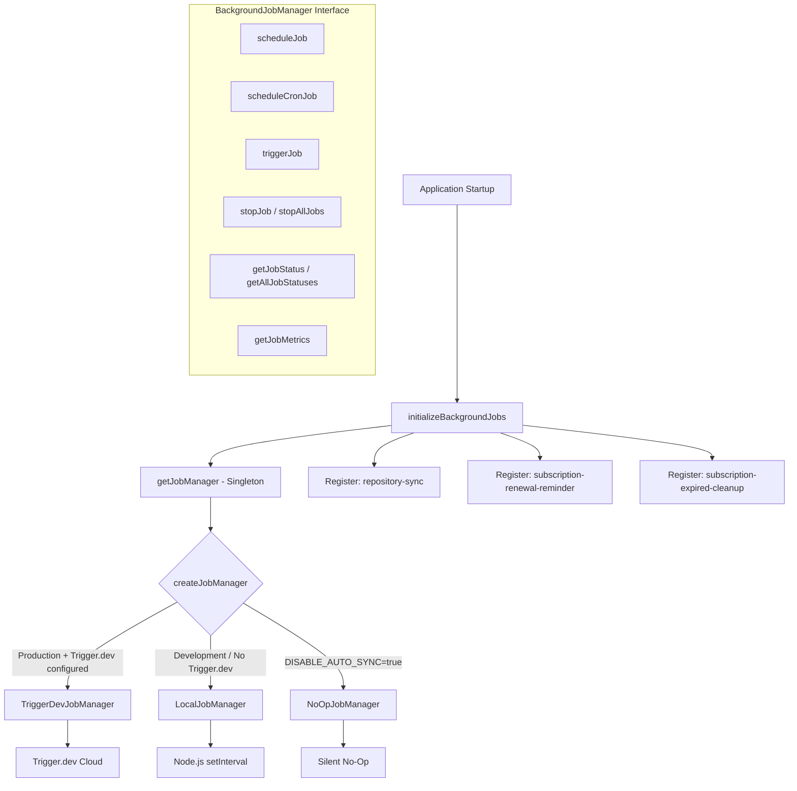
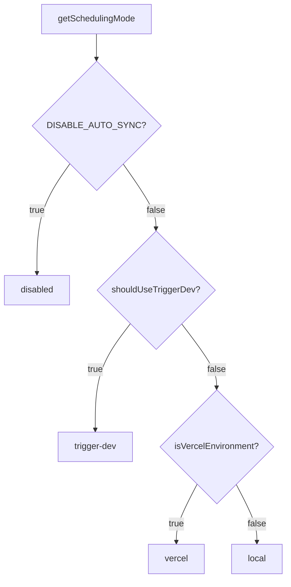

# Background Jobs Module

The background jobs module (`template/lib/background-jobs/`) provides an abstraction layer for scheduling and executing recurring tasks. It supports three runtime strategies -- **Trigger.dev** for production, **local `setInterval`** for development, and a **no-op** mode to disable jobs entirely -- selected automatically based on environment configuration.

## Architecture Overview



## Source Files

| File | Description |
|------|-------------|
| `lib/background-jobs/types.ts` | Interface and type definitions |
| `lib/background-jobs/config.ts` | Trigger.dev config and scheduling mode detection |
| `lib/background-jobs/job-factory.ts` | Factory function and singleton manager |
| `lib/background-jobs/local-job-manager.ts` | `LocalJobManager` implementation |
| `lib/background-jobs/trigger-dev-job-manager.ts` | `TriggerDevJobManager` implementation |
| `lib/background-jobs/noop-job-manager.ts` | `NoOpJobManager` implementation |
| `lib/background-jobs/initialize-jobs.ts` | Job registration on app startup |
| `lib/background-jobs/index.ts` | Barrel exports |

## Type Definitions

### `BackgroundJobManager` Interface

```typescript
interface BackgroundJobManager {
  scheduleJob(id: string, name: string, job: () => void | Promise<void>, interval: number): void;
  scheduleCronJob(id: string, name: string, job: () => void | Promise<void>, cronExpression: string): void;
  triggerJob(id: string): Promise<void>;
  stopJob(id: string): void;
  stopAllJobs(): void;
  getJobStatus(id: string): JobStatus | undefined;
  getAllJobStatuses(): JobStatus[];
  getJobMetrics(): JobMetrics;
}
```

### `JobStatus`

```typescript
type JobStatusType = 'running' | 'completed' | 'failed' | 'scheduled' | 'stopped';

interface JobStatus {
  id: string;
  name: string;
  status: JobStatusType;
  lastRun: Date | null;
  nextRun: Date | null;
  duration: number;     // Last execution duration in ms
  error?: string;       // Error message if status is 'failed'
}
```

### `JobMetrics`

```typescript
interface JobMetrics {
  totalExecutions: number;       // Total invocations (not unique jobs)
  successfulJobs: number;
  failedJobs: number;
  averageJobDuration: number;    // Rolling average in ms
  lastCleanup: Date;
}
```

### `TriggerDevConfig`

```typescript
interface TriggerDevConfig {
  enabled: boolean;
  apiKey?: string;
  apiUrl?: string;
  environment: string;
  isFullyConfigured: boolean;
  isPartiallyConfigured: boolean;
}
```

### `SchedulingMode`

```typescript
type SchedulingMode = 'trigger-dev' | 'vercel' | 'local' | 'disabled';
```

## Configuration Functions

### `getTriggerDevConfig(): TriggerDevConfig`

Reads Trigger.dev settings from the ConfigService.

### `shouldUseTriggerDev(): boolean`

Returns `true` when Trigger.dev is fully configured, enabled, and the environment is production.

### `getSchedulingMode(): SchedulingMode`

Determines which scheduling system should be active using this priority:



## Factory and Singleton

### `createJobManager(): BackgroundJobManager`

Creates the appropriate job manager based on environment:

```typescript
import { createJobManager } from '@/lib/background-jobs';

const manager = createJobManager();
// Returns: TriggerDevJobManager | LocalJobManager | NoOpJobManager
```

### `getJobManager(): BackgroundJobManager`

Returns the singleton instance, creating it on first call:

```typescript
import { getJobManager } from '@/lib/background-jobs';

const manager = getJobManager();
manager.scheduleJob('my-job', 'My Job', async () => {
  await doWork();
}, 60_000);
```

### `resetJobManager(): void`

Stops all jobs and destroys the singleton (useful for testing):

```typescript
import { resetJobManager } from '@/lib/background-jobs';
resetJobManager();
```

## LocalJobManager

Uses Node.js `setInterval` for development and fallback environments.

**Key behaviors:**
- Skips execution when a job is already running (prevents overlap)
- Tracks metrics with rolling average duration
- Converts cron expressions to intervals via simplified mapping
- Reduces console logging in development mode

### Cron-to-Interval Mapping

| Cron Pattern | Interval |
|-------------|----------|
| `*/30 * * * * *` | 30 seconds |
| `*/2 * * * *` | 2 minutes |
| `*/5 * * * *` | 5 minutes |
| `*/15 * * * *` | 15 minutes |
| `0 * * * *` | 1 hour |
| `0 9 * * *` | 24 hours |
| Default | 1 minute |

## TriggerDevJobManager

Registers schedules with the `@trigger.dev/sdk` v4 schedules API. Does **not** execute local timers -- execution is handled by the Trigger.dev worker process.

**Key behaviors:**
- Lazy-loads `@trigger.dev/sdk` via dynamic import
- Converts interval-based schedules to cron expressions
- Tracks local metrics when tasks run in the worker context
- `stopJob` / `stopAllJobs` only clear local state (remote schedules are managed by Trigger.dev)

## NoOpJobManager

All operations are silent no-ops. Used when `DISABLE_AUTO_SYNC=true` in development.

## Job Registration

The `initializeBackgroundJobs()` function registers all application jobs on startup:

```typescript
import { initializeBackgroundJobs } from '@/lib/background-jobs/initialize-jobs';

// Called once during app initialization
await initializeBackgroundJobs();
```

### Registered Jobs

| Job ID | Schedule | Description |
|--------|----------|-------------|
| `repository-sync` | Every 5 minutes | Syncs Git-based CMS content via `syncManager.performSync()` |
| `subscription-renewal-reminder` | Daily at 9:00 AM | Sends renewal reminders for subscriptions expiring in 7 days |
| `subscription-expired-cleanup` | Daily at midnight | Processes and expires subscriptions past their end date |

**Important:** All job callbacks use dynamic imports to prevent webpack from bundling Node.js-specific modules at build time:

```typescript
manager.scheduleJob('repository-sync', 'Repository Synchronization', async () => {
  // Dynamic import prevents webpack bundling of isomorphic-git chain
  const { syncManager } = await import('@/lib/services/sync-service');
  await syncManager.performSync();
}, 5 * 60 * 1000);
```

## Usage Examples

### Scheduling a Custom Job

```typescript
import { getJobManager } from '@/lib/background-jobs';

const manager = getJobManager();

// Interval-based (every 10 minutes)
manager.scheduleJob('cleanup-temp', 'Temp File Cleanup', async () => {
  await cleanupTempFiles();
}, 10 * 60 * 1000);

// Cron-based (every hour)
manager.scheduleCronJob('hourly-report', 'Hourly Report', async () => {
  await generateReport();
}, '0 * * * *');
```

### Monitoring Jobs

```typescript
const manager = getJobManager();

// Check specific job
const status = manager.getJobStatus('repository-sync');
console.log(status?.status, status?.lastRun, status?.duration);

// List all jobs
const allStatuses = manager.getAllJobStatuses();

// Get aggregate metrics
const metrics = manager.getJobMetrics();
console.log(`Total: ${metrics.totalExecutions}, Failed: ${metrics.failedJobs}`);
```

### Manual Trigger

```typescript
const manager = getJobManager();
await manager.triggerJob('repository-sync');
```
