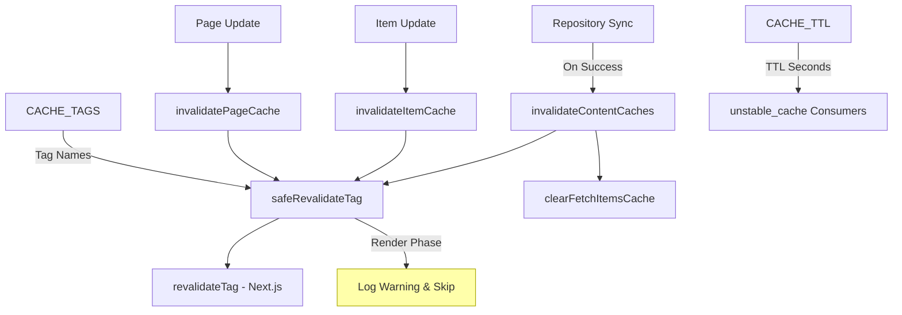
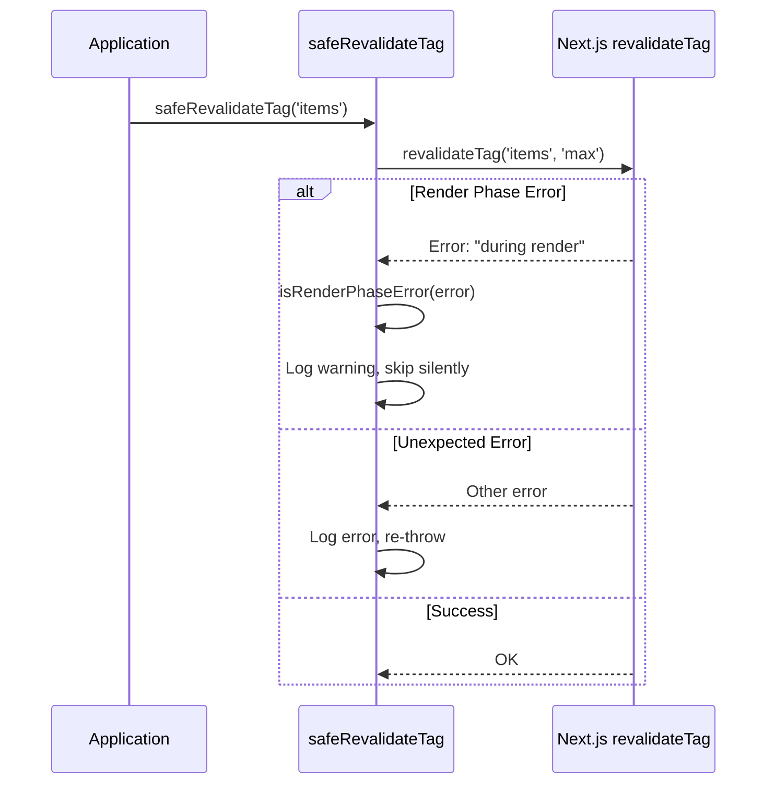
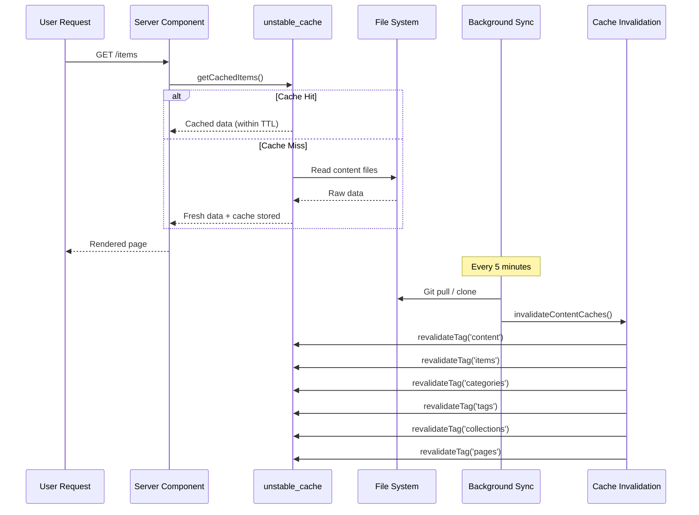

# Cache Invalidation Module

The cache invalidation module (`template/lib/cache-config.ts` and `template/lib/cache-invalidation.ts`) provides a centralized cache tag system and invalidation functions for Next.js `unstable_cache` and `revalidateTag`. It ensures content caches are properly invalidated after repository syncs while handling Next.js render-phase restrictions gracefully.

## Architecture Overview



## Source Files

| File | Description |
|------|-------------|
| `lib/cache-config.ts` | Cache TTL constants and tag definitions |
| `lib/cache-invalidation.ts` | Invalidation functions with render-phase safety |

## Cache TTL Configuration

All TTL values are in **seconds**, used with Next.js `unstable_cache`:

```typescript
const CACHE_TTL = {
  CONTENT: 600,   // 10 minutes -- content listings
  ITEM: 600,      // 10 minutes -- individual items
  CONFIG: 600,    // 10 minutes -- site configuration
  PAGES: 600,     // 10 minutes -- static pages
} as const;
```

### Usage with `unstable_cache`

```typescript
import { unstable_cache } from 'next/cache';
import { CACHE_TTL, CACHE_TAGS } from '@/lib/cache-config';

const getCachedItems = unstable_cache(
  async () => fetchAllItems(),
  ['items-list'],
  {
    revalidate: CACHE_TTL.CONTENT,
    tags: [CACHE_TAGS.CONTENT, CACHE_TAGS.ITEMS],
  }
);
```

## Cache Tags

Tags are used with `revalidateTag()` to selectively invalidate caches.

### Static Tags

| Tag Constant | Value | Description |
|-------------|-------|-------------|
| `CACHE_TAGS.CONTENT` | `'content'` | Master tag -- invalidates all content caches |
| `CACHE_TAGS.ITEMS` | `'items'` | All items collection |
| `CACHE_TAGS.CATEGORIES` | `'categories'` | All categories |
| `CACHE_TAGS.TAGS` | `'tags'` | All tags |
| `CACHE_TAGS.COLLECTIONS` | `'collections'` | All collections |
| `CACHE_TAGS.CONFIG` | `'config'` | Site configuration |
| `CACHE_TAGS.PAGES` | `'pages'` | All static pages |

### Dynamic Tags (Functions)

| Tag Function | Example Output | Description |
|-------------|---------------|-------------|
| `CACHE_TAGS.ITEM(slug)` | `'item:my-tool'` | Specific item by slug |
| `CACHE_TAGS.PAGE(slug)` | `'page:about'` | Specific page by slug |
| `CACHE_TAGS.ITEMS_LOCALE(locale)` | `'items:en'` | Items filtered by locale |
| `CACHE_TAGS.CATEGORIES_LOCALE(locale)` | `'categories:fr'` | Categories by locale |
| `CACHE_TAGS.TAGS_LOCALE(locale)` | `'tags:de'` | Tags by locale |
| `CACHE_TAGS.COLLECTIONS_LOCALE(locale)` | `'collections:es'` | Collections by locale |

### Example: Locale-Specific Caching

```typescript
import { CACHE_TAGS, CACHE_TTL } from '@/lib/cache-config';

const getCachedItemsByLocale = unstable_cache(
  async (locale: string) => fetchItemsByLocale(locale),
  ['items-by-locale'],
  {
    revalidate: CACHE_TTL.CONTENT,
    tags: [CACHE_TAGS.ITEMS, CACHE_TAGS.ITEMS_LOCALE('en')],
  }
);
```

## Invalidation Functions

### `invalidateContentCaches(): Promise<void>`

Invalidates **all** content-related caches. Called after repository sync completes successfully.

```typescript
import { invalidateContentCaches } from '@/lib/cache-invalidation';

// After successful repository sync
await performSync();
await invalidateContentCaches();
```

**Invalidates these tags:**
- `CONTENT`, `ITEMS`, `CATEGORIES`, `TAGS`, `COLLECTIONS`, `PAGES`
- Also clears the in-memory `fetchItems` cache via `clearFetchItemsCache()`

### `invalidateItemCache(slug: string): Promise<void>`

Invalidates the cache for a single item.

```typescript
import { invalidateItemCache } from '@/lib/cache-invalidation';

await invalidateItemCache('my-saas-tool');
// Revalidates tag: 'item:my-saas-tool'
```

### `invalidatePageCache(slug: string): Promise<void>`

Invalidates the cache for a single static page.

```typescript
import { invalidatePageCache } from '@/lib/cache-invalidation';

await invalidatePageCache('about');
// Revalidates tag: 'page:about'
```

## Render-Phase Safety

Next.js does not allow `revalidateTag()` during the render phase of server components. The module handles this with a `safeRevalidateTag` wrapper.

### How It Works



### Error Detection Patterns

The `isRenderPhaseError` function checks multiple patterns to be resilient against Next.js error message changes:

- `"during render"` -- Current Next.js message
- `"render phase"` -- Alternative phrasing
- `"revalidate"` + `"render"` -- Both keywords present
- `"unsupported"` + `"render"` -- Combination check

## Cache Flow Diagram


