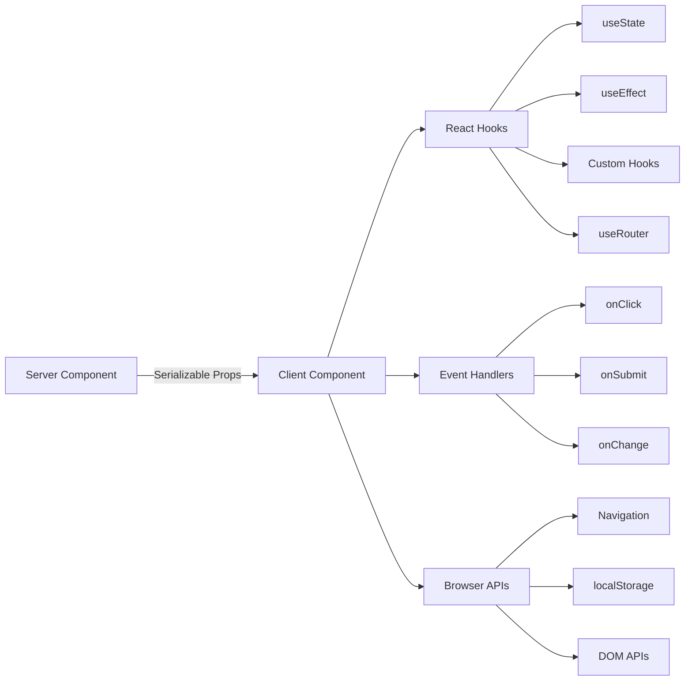

# Client Components Patterns

## Overview

Client components in the Ever Works Template are interactive "islands" that handle user events, manage local state, and integrate with browser APIs. They are identified by the `"use client"` directive at the top of the file and are used selectively where interactivity is required.

## Architecture



## Source Files

| File | Pattern |
|------|---------|
| `template/app/[locale]/admin/page.tsx` | Minimal client wrapper delegating to component |
| `template/app/not-found.tsx` | Client navigation with `useRouter` |
| `template/app/global-error.tsx` | Error boundary with reset functionality |
| `template/components/filters/filter-url-parser.tsx` | URL state management |
| `template/components/header/more-menu.tsx` | Interactive dropdown menus |

## Core Patterns

### Pattern 1: Minimal Client Wrappers

Many page components use the thinnest possible client wrapper:

```typescript
"use client";

import { AdminDashboard } from "@/components/admin";

export default function AdminPage() {
    return <AdminDashboard />;
}
```

This pattern keeps the page file small while delegating all logic to a separate component. The `"use client"` directive marks the boundary where the server component tree transitions to client rendering.

### Pattern 2: Error Boundary Components

The global error handler demonstrates the error boundary pattern:

```typescript
'use client';

export default function GlobalError({
    error,
    reset,
}: {
    error: Error & { digest?: string };
    reset: () => void;
}) {
    useEffect(() => {
        console.error(error);
    }, [error]);

    return (
        <html lang="en">
            <body>
                <div>
                    <h1>Something went wrong!</h1>
                    {process.env.NODE_ENV !== 'production' && (
                        <div>
                            <p>{error.message}</p>
                            {error.digest && <p>Error ID: {error.digest}</p>}
                        </div>
                    )}
                    <Button onPress={() => reset()}>Refresh</Button>
                    <Link href="/">Go Home</Link>
                </div>
            </body>
        </html>
    );
}
```

Key aspects:
- The `error` prop includes an optional `digest` for server error tracking
- The `reset()` function re-renders the error boundary's children
- Stack traces are only shown in development
- The component wraps its own `<html>` and `<body>` tags since global errors replace the entire page

### Pattern 3: Client-Side Navigation

The Not Found page demonstrates client-side navigation patterns:

```typescript
'use client';

import { useRouter } from 'next/navigation';

export default function NotFound() {
    const router = useRouter();

    return (
        <div>
            <Button onClick={() => router.back()}>Go Back</Button>
            <Button onClick={() => router.push('/')}>Back to Home</Button>
            <button onClick={() => router.push('/help')}>Contact Support</button>
        </div>
    );
}
```

The `useRouter` hook from `next/navigation` provides programmatic navigation. Note this is from `next/navigation`, not `next/router` (Pages Router).

### Pattern 4: i18n-Aware Client Navigation

The template provides locale-aware navigation hooks via `i18n/navigation.ts`:

```typescript
import { createNavigation } from "next-intl/navigation";
import { routing } from "./routing";

export const { Link, redirect, usePathname, useRouter, getPathname } =
    createNavigation(routing);
```

Client components that need locale-aware navigation import from this module instead of `next/navigation`:

```typescript
'use client';

import { Link, useRouter, usePathname } from '@/i18n/navigation';

function LocaleAwareComponent() {
    const router = useRouter();
    const pathname = usePathname();

    // router.push('/about') automatically includes the current locale prefix
    return <Link href="/about">About</Link>;
}
```

### Pattern 5: Server Actions with Form Validation

Client components integrate with server actions using the validated action pattern from `lib/auth/middleware.ts`:

```typescript
// Server action (lib/auth/middleware.ts)
export function validatedAction<S extends z.ZodType, T>(
    schema: S,
    action: ValidatedActionFunction<S, T>
) {
    return async (prevState: ActionState, formData: FormData): Promise<T> => {
        const result = schema.safeParse(Object.fromEntries(formData));
        if (!result.success) {
            return { error: result.error.issues[0].message } as T;
        }
        return action(result.data, formData);
    };
}

// Client component
'use client';

import { useActionState } from 'react';
import { myServerAction } from './actions';

function MyForm() {
    const [state, formAction, isPending] = useActionState(myServerAction, {});

    return (
        <form action={formAction}>
            {state.error && <p>{state.error}</p>}
            <input name="email" type="email" />
            <button type="submit" disabled={isPending}>Submit</button>
        </form>
    );
}
```

### Pattern 6: State Management with Custom Hooks

The template organizes client-side logic into custom hooks in the `hooks/` directory:

```typescript
'use client';

import { useFavorites } from '@/hooks/useFavorites';
import { useFilters } from '@/hooks/useFilters';

function ItemList() {
    const { favorites, toggleFavorite } = useFavorites();
    const { filters, updateFilter, resetFilters } = useFilters();

    return (
        <div>
            <FilterBar filters={filters} onChange={updateFilter} onReset={resetFilters} />
            <ItemGrid items={items} favorites={favorites} onToggleFavorite={toggleFavorite} />
        </div>
    );
}
```

## Client Component Boundaries

### When to Use `"use client"`

- **Event handlers**: `onClick`, `onSubmit`, `onChange`
- **React hooks**: `useState`, `useEffect`, `useRef`, custom hooks
- **Browser APIs**: `window`, `localStorage`, `navigator`
- **Third-party client libraries**: UI component libraries requiring interactivity

### When to Keep as Server Component

- Static content rendering
- Data fetching and transformation
- Translation loading (`getTranslations`)
- Metadata generation
- Layout wrappers

## Best Practices in the Template

1. **Push `"use client"` as deep as possible** -- keep the boundary close to the interactive leaf
2. **Pass server data as props** -- avoid re-fetching on the client
3. **Use `useEffect` for side effects only** -- not for data fetching
4. **Prefer server actions over API routes** -- for form submissions and mutations
5. **Import navigation from `@/i18n/navigation`** -- ensures locale-aware routing
6. **Gate development-only UI** -- use `process.env.NODE_ENV !== 'production'` checks
