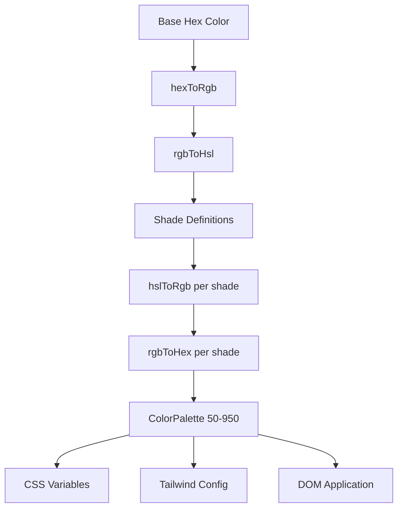

# Color System

The template uses a dynamic color generation system that creates complete color palettes from base hex colors. This powers the theming engine and allows runtime color customization through CSS variables and Tailwind CSS integration.

## Architecture Overview



## Source Files

| File | Purpose |
|------|---------|
| `lib/color-generator.ts` | Core palette generation from hex colors |
| `lib/theme-color-manager.ts` | Theme-level color application and CSS generation |
| `lib/theme-utils.ts` | Utility classes, opacity helpers, and theme presets |

## Color Conversion Pipeline

The system converts colors through multiple representations to accurately generate shades. Four conversion functions handle the full round-trip.

```typescript
// Hex -> RGB -> HSL (for manipulation) -> RGB -> Hex (output)
export function hexToRgb(hex: string): { r: number; g: number; b: number };
export function rgbToHsl(r: number, g: number, b: number): { h: number; s: number; l: number };
export function hslToRgb(h: number, s: number, l: number): { r: number; g: number; b: number };
export function rgbToHex(r: number, g: number, b: number): string;
```

Lightness and saturation adjustments happen in HSL color space, which provides perceptually uniform shade transitions across the palette.

## Shade Definitions

Each shade level has fixed lightness and saturation adjustments relative to the base color (500):

| Shade | Lightness Adjust | Saturation Adjust | Usage |
|-------|-----------------|-------------------|-------|
| 50 | +45 | -30 | Lightest backgrounds |
| 100 | +40 | -25 | Hover backgrounds |
| 200 | +30 | -20 | Active backgrounds |
| 300 | +20 | -10 | Borders |
| 400 | +10 | -5 | Placeholder text |
| **500** | **0** | **0** | **Base color** |
| 600 | -10 | +5 | Hover states |
| 700 | -20 | +10 | Active states |
| 800 | -30 | +15 | Emphasis text |
| 900 | -40 | +20 | Headlines |
| 950 | -45 | +25 | Darkest backgrounds |

## ColorPalette Interface

```typescript
export interface ColorPalette {
  50: string;
  100: string;
  200: string;
  300: string;
  400: string;
  500: string;  // Base color
  600: string;
  700: string;
  800: string;
  900: string;
  950: string;
}
```

## Generating a Palette

The `generateColorPalette` function takes any hex color and produces the full 11-shade palette:

```typescript
import { generateColorPalette } from '@/lib/color-generator';

const palette = generateColorPalette('#3b82f6');
// Returns: { 50: '#e8f0fe', 100: '#d4e4fd', ..., 950: '#0a1d3d' }
```

Values are clamped between 0 and 100 for both lightness and saturation to prevent out-of-range colors.

## CSS Variable Generation

The system generates CSS custom properties for each shade:

```typescript
import { generateCssVariables } from '@/lib/color-generator';

const palette = generateColorPalette('#3b82f6');
const css = generateCssVariables('theme-primary', palette);
// Output:
// --theme-primary: #3b82f6;
// --theme-primary-50: #e8f0fe;
// --theme-primary-100: #d4e4fd;
// ... (all 11 shades)
```

## Tailwind CSS Integration

Generate Tailwind config objects that reference CSS variables:

```typescript
import { generateTailwindConfig } from '@/lib/color-generator';

const config = generateTailwindConfig('theme-primary');
// Returns: {
//   DEFAULT: 'var(--theme-primary)',
//   50: 'var(--theme-primary-50)',
//   100: 'var(--theme-primary-100)',
//   ...
// }
```

## Theme Color Manager

The `theme-color-manager.ts` module applies palettes to the DOM at runtime.

### Extended Theme Configurations

Four built-in themes define base colors for primary, secondary, accent, background, surface, and text:

```typescript
export const EXTENDED_THEME_CONFIGS: Record<ThemeKey, ThemeConfig> = {
  everworks: {
    primary: "#3d70ef",
    secondary: "#00c853",
    accent: "#0056b3",
    background: "#ffffff",
    surface: "#f8f9fa",
    text: "#1a1a1a",
    textSecondary: "#6c757d",
  },
  corporate: { /* ... */ },
  material: { /* ... */ },
  funny: { /* ... */ },
};
```

### Applying Palettes to the DOM

```typescript
import { applyColorPalette, applyThemeWithPalettes } from '@/lib/theme-color-manager';

// Apply a single color palette
applyColorPalette('theme-primary', '#3d70ef');

// Apply an entire theme (primary + secondary + accent + utility colors)
applyThemeWithPalettes('everworks');
```

The `applyColorPalette` function also generates an RGB variant for opacity support:

```typescript
// Sets both:
// --theme-primary: #3d70ef
// --theme-primary-rgb: 61, 112, 239
```

### Generating Static CSS

For server-side rendering or build-time CSS generation:

```typescript
import { generateThemeCss } from '@/lib/theme-color-manager';

const css = generateThemeCss('everworks');
// Returns full CSS variable string for all theme colors
```

## Theme Utility Classes

The `theme-utils.ts` module provides pre-built Tailwind class combinations:

```typescript
import { themeClasses } from '@/lib/theme-utils';

// Button variants
themeClasses.button.primary   // "bg-theme-primary hover:bg-theme-accent text-white"
themeClasses.button.secondary // "bg-theme-secondary hover:bg-theme-secondary/80 text-white"
themeClasses.button.outline   // "border-2 border-theme-primary text-theme-primary ..."
themeClasses.button.ghost     // "text-theme-primary hover:bg-theme-primary/10"

// Text variants
themeClasses.text.primary     // "text-theme-text"
themeClasses.text.secondary   // "text-theme-text-secondary"
themeClasses.text.accent      // "text-theme-primary"
```

### Helper Functions

```typescript
import { withOpacity, getCssVariable, cn, buildThemeClasses } from '@/lib/theme-utils';

// Generate opacity variant
withOpacity('bg-theme-primary', 50); // "bg-theme-primary/50"

// Get CSS variable reference
getCssVariable('theme-primary'); // "var(--theme-primary)"

// Conditional class building
buildThemeClasses('base-class', 'theme-class', {
  'active-class': isActive,
  'disabled-class': isDisabled,
});
```

## Batch Theme Color Generation

Generate CSS and Tailwind configuration for multiple colors at once:

```typescript
import { generateThemeColors } from '@/lib/color-generator';

const result = generateThemeColors({
  primary: '#3d70ef',
  secondary: '#00c853',
  accent: '#0056b3',
});

// result.css - Complete CSS variable declarations
// result.tailwind - Tailwind config object for all colors
```

## Custom Theme Application

Apply arbitrary colors without using the preset themes:

```typescript
import { applyCustomTheme } from '@/lib/theme-color-manager';

applyCustomTheme({
  primary: '#e91e63',
  secondary: '#9c27b0',
  accent: '#673ab7',
});
```

## Error Handling

The theme color manager includes fallback behavior:

- If a theme key is not found, it falls back to the `everworks` default theme.
- If applying a theme throws an error and the requested theme is not `everworks`, it automatically retries with the default theme.
- SSR safety: `useThemeWithPalettes` checks for `window` availability before applying DOM changes.
