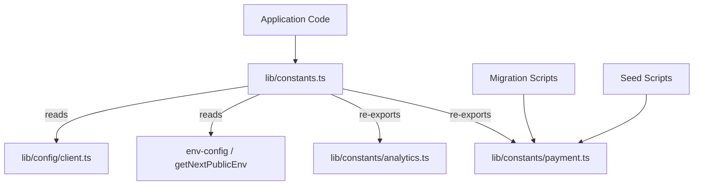

# Constants Reference

The constants module (`template/lib/constants.ts` and `template/lib/constants/`) centralizes all application-wide configuration values, enums, environment-driven settings, and magic numbers. Constants are organized into domain-specific files to allow safe imports in contexts outside the Next.js runtime (e.g., migration scripts, seed scripts).

## Architecture Overview



## Source Files

| File | Description |
|------|-------------|
| `lib/constants.ts` | Main constants barrel -- imports from env-config and re-exports sub-modules |
| `lib/constants/payment.ts` | Payment enums and types (safe for scripts) |
| `lib/constants/analytics.ts` | Analytics-related constants |

## Localization Constants

```typescript
const DEFAULT_LOCALE = 'en';

const LOCALES = [
  'en', 'fr', 'es', 'de', 'zh', 'ar', 'he', 'ru', 'uk', 'pt',
  'it', 'ja', 'ko', 'nl', 'pl', 'tr', 'vi', 'th', 'hi', 'id', 'bg'
] as const;

type Locale = (typeof LOCALES)[number];

/** Right-to-left locales */
const RTL_LOCALES: readonly Locale[] = ['ar', 'he'] as const;
```

## Branding and UI

```typescript
const LOGO_URL = '/logo-ever-work-3.png';
```

## API and Backend

```typescript
/** Base URL for internal Next.js API routes */
const API_BASE_URL = getNextPublicEnv('NEXT_PUBLIC_API_BASE_URL');
```

## Authentication and Security

```typescript
const COOKIE_SECRET = getNextPublicEnv('COOKIE_SECRET');
const JWT_ACCESS_TOKEN_EXPIRES_IN = getNextPublicEnv('JWT_ACCESS_TOKEN_EXPIRES_IN');
const JWT_REFRESH_TOKEN_EXPIRES_IN = getNextPublicEnv('JWT_REFRESH_TOKEN_EXPIRES_IN');
```

## Analytics -- PostHog

| Constant | Source | Description |
|----------|--------|-------------|
| `POSTHOG_KEY` | `NEXT_PUBLIC_POSTHOG_KEY` | PostHog project API key |
| `POSTHOG_HOST` | `NEXT_PUBLIC_POSTHOG_HOST` | PostHog API host |
| `POSTHOG_ENABLED` | Derived | True when both key and host exist |
| `POSTHOG_DEBUG` | `POSTHOG_DEBUG` | Enable debug logging |
| `POSTHOG_SESSION_RECORDING_ENABLED` | env / `'true'` | Session recording toggle |
| `POSTHOG_AUTO_CAPTURE` | env / `'false'` | Auto-capture page views |
| `POSTHOG_SAMPLE_RATE` | Computed | `0.1` in production, `1.0` in development |
| `POSTHOG_SESSION_RECORDING_SAMPLE_RATE` | Computed | `0.1` in production, `1.0` in development |

## Error Tracking -- Sentry

| Constant | Source | Description |
|----------|--------|-------------|
| `SENTRY_DSN` | `NEXT_PUBLIC_SENTRY_DSN` | Sentry Data Source Name |
| `SENTRY_ENABLE_DEV` | `SENTRY_ENABLE_DEV` | Enable Sentry in development |
| `SENTRY_DEBUG` | `SENTRY_DEBUG` | Sentry debug mode |
| `SENTRY_ENABLED` | Derived | True when DSN is set and environment allows |

## Unified Exception Tracking

```typescript
const EXCEPTION_TRACKING_PROVIDER = getNextPublicEnv('EXCEPTION_TRACKING_PROVIDER', 'both');
const POSTHOG_EXCEPTION_TRACKING = getNextPublicEnv('POSTHOG_EXCEPTION_TRACKING', 'true');
const SENTRY_EXCEPTION_TRACKING = getNextPublicEnv('SENTRY_EXCEPTION_TRACKING', 'true');

type ExceptionTrackingProvider = 'sentry' | 'posthog' | 'both' | 'none';
```

## ReCAPTCHA

```typescript
const RECAPTCHA_SITE_KEY = getNextPublicEnv('NEXT_PUBLIC_RECAPTCHA_SITE_KEY');
const RECAPTCHA_SECRET_KEY = getNextPublicEnv('RECAPTCHA_SECRET_KEY');
```

## Payment Constants (`constants/payment.ts`)

This file is intentionally separated from `constants.ts` to avoid importing `@/lib/config`, allowing use in migration and seed scripts that run outside Next.js.

### Enums

```typescript
enum PaymentFlow {
  PAY_AT_START = 'pay_at_start',
  PAY_AT_END = 'pay_at_end',
}

enum PaymentStatus {
  PENDING = 'pending',
  PAID = 'paid',
  FAILED = 'failed',
}

enum PaymentInterval {
  DAILY = 'daily',
  WEEKLY = 'weekly',
  MONTHLY = 'monthly',
  YEARLY = 'yearly',
  ONE_TIME = 'one-time',
  PER_SUBMISSION = 'per-submission',
}

enum PaymentPlan {
  FREE = 'free',
  STANDARD = 'standard',
  PREMIUM = 'premium',
}

enum PaymentMethod {
  CREDIT_CARD = 'credit_card',
  PAYPAL = 'paypal',
}

enum PaymentCurrency {
  USD = 'USD',
  EUR = 'EUR',
  GBP = 'GBP',
  CAD = 'CAD',
  AUD = 'AUD',
  ETH = 'ETH',
}

enum PaymentProvider {
  STRIPE = 'stripe',
  SOLIDGATE = 'solidgate',
  LEMONSQUEEZY = 'lemonsqueezy',
  POLAR = 'polar',
}

enum SubmissionStatus {
  DRAFT = 'draft',
  PENDING = 'pending',
  APPROVED = 'approved',
  REJECTED = 'rejected',
  PUBLISHED = 'published',
  ARCHIVED = 'archived',
}
```

### Plan Display Names

```typescript
const PAYMENT_PLAN_NAMES: Record<PaymentPlan, string> = {
  free: 'Free Plan',
  standard: 'Standard Plan',
  premium: 'Premium Plan',
};
```

### Sponsor Ad Pricing

```typescript
const SponsorAdPricing = {
  WEEKLY: 100,    // $100.00
  MONTHLY: 300,   // $300.00
} as const;
```

## Analytics Constants (`constants/analytics.ts`)

```typescript
/** Cookie name for anonymous viewer tracking */
const VIEWER_COOKIE_NAME = 'ever_viewer_id';

/** Cookie max age: 365 days in seconds */
const VIEWER_COOKIE_MAX_AGE = 365 * 24 * 60 * 60;  // 31,536,000
```

## Import Patterns

### Full Application Code

```typescript
// Import everything from the main barrel
import {
  DEFAULT_LOCALE,
  LOCALES,
  POSTHOG_ENABLED,
  PaymentPlan,
  PaymentProvider,
  SubmissionStatus,
  VIEWER_COOKIE_NAME,
} from '@/lib/constants';
```

### Scripts Outside Next.js Runtime

```typescript
// Import only from payment.ts to avoid Next.js dependencies
import { PaymentPlan, PaymentStatus, SubmissionStatus } from '@/lib/constants/payment';
```
