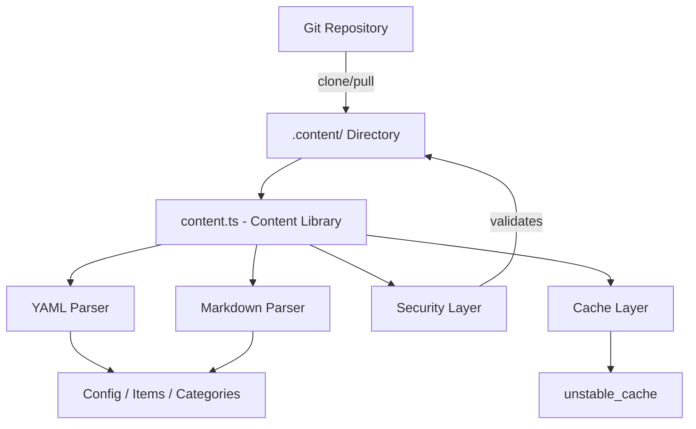
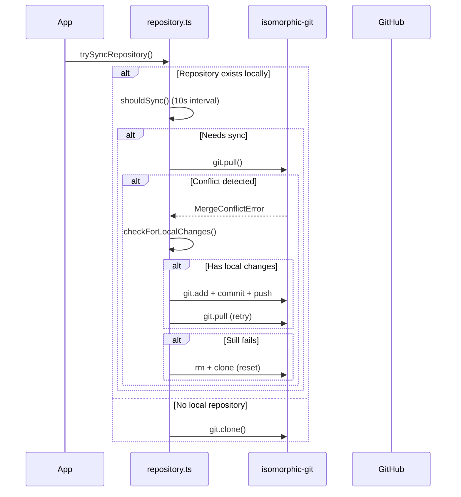

# Content Library

The content library (`lib/content.ts`) provides server-side utilities for reading, parsing, and caching content from a Git-based CMS repository. It handles YAML/Markdown content files, configuration management, and content synchronization with robust security measures.

## Architecture Overview



## Source Files

| File | Purpose |
|------|---------|
| `lib/content.ts` | Main content processing, reading, and caching |
| `lib/repository.ts` | Git clone/pull synchronization with remote repository |
| `lib/lib.ts` | Path utilities (`getContentPath`, `fsExists`, `dirExists`) |
| `lib/cache-config.ts` | Cache tags and TTL configuration |

## Security Layer

The content library enforces multiple security measures to prevent path traversal and injection attacks.

### Language Code Validation

```typescript
function validateLanguageCode(lang: string): boolean {
  const validLangPattern = /^[a-zA-Z0-9_-]+$/;
  return validLangPattern.test(lang) && lang.length <= 10;
}
```

Only alphanumeric characters, hyphens, and underscores are accepted with a maximum length of 10 characters.

### Filename Sanitization

```typescript
function sanitizeFilename(filename: string): string {
  const sanitized = path.basename(filename);
  if (sanitized.includes('..') || sanitized.includes('/') || sanitized.includes('\\')) {
    throw new Error('Invalid filename: contains dangerous characters');
  }
  return sanitized;
}
```

Uses `path.basename` to strip directory components and rejects any remaining traversal characters.

### Path Validation

```typescript
function validatePath(filepath: string, basePath: string): void {
  const resolvedPath = path.resolve(filepath);
  const resolvedBase = path.resolve(basePath);
  if (!resolvedPath.startsWith(resolvedBase + path.sep) && resolvedPath !== resolvedBase) {
    throw new Error('Invalid file path: outside of allowed directory');
  }
}
```

The `safeReadFile` function performs a double check: it validates the path and then verifies the resolved real path (following symlinks) stays within the base directory.

### URL Validation

```typescript
function isValidUrl(url: string): boolean {
  const trimmed = url.trim();
  if (trimmed.startsWith('/') && !trimmed.startsWith('//')) return true;
  return trimmed.startsWith('http://') || trimmed.startsWith('https://');
}
```

Blocks `javascript:`, `data:`, `vbscript:`, and other dangerous protocol schemes.

### CSS Size Validation

```typescript
function isValidCssSize(value: string): boolean {
  if (['auto', 'inherit', 'initial', 'unset'].includes(value.trim())) return true;
  return /^\d+(\.\d+)?(px|em|rem|vh|vw|%|pt|cm|mm|in)?$/.test(value.trim());
}
```

Prevents CSS injection through custom hero frontmatter fields.

## Content Processing

### YAML Parsing

Content files are parsed using the `yaml` library with Zod schema validation for frontmatter:

```typescript
const customHeroFrontmatterSchema = z.object({
  background_image: z.string().refine(isValidUrl, {
    message: 'Invalid URL: must be http, https, or relative path'
  }).optional(),
  // ... additional validated fields
});
```

### Configuration Caching

Site configuration is cached using Next.js `unstable_cache` with defined TTLs and cache tags:

```typescript
import { CACHE_TAGS, CACHE_TTL } from './cache-config';

const getCachedConfig = unstable_cache(
  async () => { /* read and parse config.yml */ },
  [CACHE_TAGS.CONFIG],
  { revalidate: CACHE_TTL }
);
```

## Git Repository Synchronization

The `repository.ts` module manages Git operations using `isomorphic-git`.

### Sync Flow



### Timeout Protection

All Git operations are wrapped with configurable timeouts:

```typescript
async function withTimeout<T>(promise: Promise<T>, timeoutMs: number = 120000): Promise<T> {
  const timeoutPromise = new Promise<never>((_, reject) => {
    setTimeout(() => reject(new Error(`Operation timeout after ${timeoutMs}ms`)), timeoutMs);
  });
  return Promise.race([promise, timeoutPromise]);
}
```

### Conflict Resolution

The system handles merge conflicts through a multi-step strategy:

1. **Detect local changes** via `git.statusMatrix()`
2. **Attempt push** of local changes before pulling
3. **Retry pull** after successful push
4. **Full reset** (delete + re-clone) as last resort

### Fallback Behavior

If `DATA_REPOSITORY` is not configured or cloning fails, the system creates minimal fallback content:

```typescript
// Creates empty content directory with minimal config
const DEFAULT_CONFIG = `site_name: Website
item_name: Item
items_name: Items
copyright_year: ${new Date().getFullYear()}
`;
```

## Server-Only Enforcement

Both `content.ts` and `repository.ts` use the `server-only` import to prevent accidental client-side usage:

```typescript
'use server';
import 'server-only';
```

This ensures content operations with filesystem access never leak into client bundles.

## Key Exported Functions

| Function | Description |
|----------|-------------|
| `getCachedConfig()` | Returns cached site configuration from `config.yml` |
| `trySyncRepository()` | Clones or pulls content from remote Git repository |
| `pullChanges()` | Pulls latest changes with conflict resolution |
| `validateLanguageCode()` | Validates i18n language code format |
| `sanitizeFilename()` | Strips directory components from filenames |
| `safeReadFile()` | Reads files with full path traversal protection |
