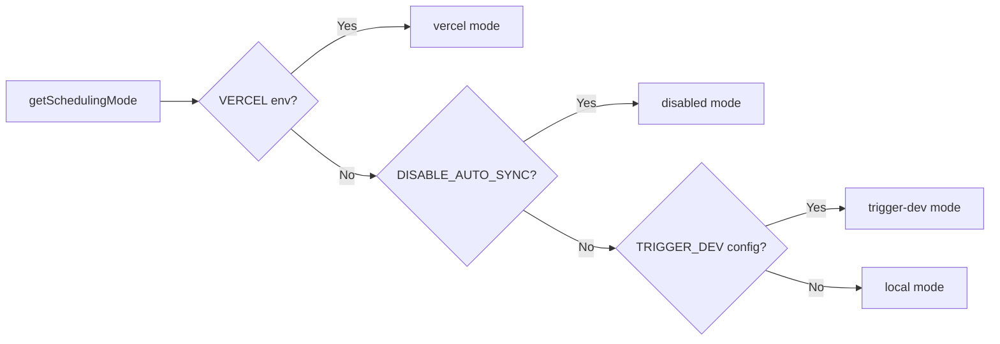

# Cron Job System

## Overview

The Ever Works Template implements a flexible background job system that supports three scheduling modes: **Vercel Cron**, **Trigger.dev**, and a **local scheduler**. Cron endpoints are standard Next.js API routes authenticated via `CRON_SECRET`, and the system includes a singleton initialization module that ensures jobs are set up exactly once per process.

## Architecture

```mermaid
flowchart TD
    A[Scheduling Mode Detection] --> B{getSchedulingMode}

    B -->|vercel| C[Vercel Cron]
    B -->|trigger-dev| D[Trigger.dev]
    B -->|local| E[Local Scheduler]
    B -->|disabled| F[No Jobs]

    C --> G[vercel.json crons]
    G --> G1[/api/cron/sync]
    G --> G2[/api/cron/subscription-reminders]
    G --> G3[/api/cron/subscription-expiration]

    G1 --> H[CRON_SECRET Verification]
    G2 --> H
    G3 --> H

    H -->|Valid| I[Execute Job]
    H -->|Invalid| J[401 Unauthorized]

    I --> I1[triggerManualSync]
    I --> I2[subscriptionRenewalReminderJob]
    I --> I3[processExpiredSubscriptions]

    D --> K[Trigger.dev SDK]
    E --> L[Internal setInterval]

    K --> I
    L --> I
```

## Source Files

| File | Purpose |
|------|---------|
| `template/vercel.json` | Vercel cron schedule definitions |
| `template/app/api/cron/sync/route.ts` | Content sync cron endpoint |
| `template/app/api/cron/subscription-reminders/route.ts` | Renewal reminder emails |
| `template/app/api/cron/subscription-expiration/route.ts` | Expired subscription processing |
| `template/app/api/cron/jobs/background-jobs-init.ts` | Singleton job initialization |

## Cron Schedule Configuration

### vercel.json

```json
{
    "crons": [
        {
            "path": "/api/cron/sync",
            "schedule": "0 3 * * *"
        },
        {
            "path": "/api/cron/subscription-reminders",
            "schedule": "0 9 * * *"
        },
        {
            "path": "/api/cron/subscription-expiration",
            "schedule": "0 0 * * *"
        }
    ]
}
```

| Job | Schedule | Time | Description |
|-----|----------|------|-------------|
| Content Sync | `0 3 * * *` | 3:00 AM UTC daily | Syncs content from Git-based CMS |
| Subscription Reminders | `0 9 * * *` | 9:00 AM UTC daily | Sends renewal reminder emails |
| Subscription Expiration | `0 0 * * *` | Midnight UTC daily | Processes expired subscriptions |

## Authentication

### Timing-Safe Secret Verification

All cron endpoints verify the `CRON_SECRET` using timing-safe comparison to prevent timing attacks:

```typescript
import crypto from 'crypto';

function verifyCronSecret(request: NextRequest): boolean {
    const authHeader = request.headers.get('authorization');
    const cronSecret = process.env.CRON_SECRET;

    // Development bypass
    if (!cronSecret && process.env.NODE_ENV === 'development') {
        console.log('[Cron] Bypassing cron auth in development');
        return true;
    }

    if (!cronSecret || !authHeader) return false;

    const expectedValue = `Bearer ${cronSecret}`;

    // Length check before timing-safe comparison
    if (authHeader.length !== expectedValue.length) return false;

    return crypto.timingSafeEqual(
        Buffer.from(authHeader, 'utf8'),
        Buffer.from(expectedValue, 'utf8')
    );
}
```

Key security features:
- **Timing-safe comparison** via `crypto.timingSafeEqual` -- prevents attackers from measuring response time differences to guess the secret
- **Length pre-check** -- `timingSafeEqual` requires equal-length buffers
- **Development bypass** -- only when `CRON_SECRET` is not configured and `NODE_ENV=development`

### Vercel Automatic Authentication

When deployed on Vercel, the platform automatically includes the `Authorization: Bearer <CRON_SECRET>` header for configured cron jobs. You only need to set the `CRON_SECRET` environment variable in the Vercel dashboard.

## Job Implementations

### Content Sync Job

```typescript
export async function GET(request: Request): Promise<NextResponse> {
    const startTime = Date.now();

    // Verify authorization
    if (!isAuthorized) {
        return NextResponse.json({ success: false, message: "Unauthorized" }, { status: 401 });
    }

    try {
        const result = await triggerManualSync();
        const duration = Date.now() - startTime;

        return NextResponse.json({
            success: result.success,
            timestamp: new Date().toISOString(),
            duration,
            message: result.message,
        }, {
            headers: { "Cache-Control": "no-cache, no-store, must-revalidate" },
        });
    } catch (error) {
        return NextResponse.json({
            success: false,
            message: "Cron sync failed",
            details: safeErrorMessage(error, "Unknown error"),
        }, { status: 500 });
    }
}
```

Response format:
```json
{
    "success": true,
    "timestamp": "2025-01-15T03:00:05.123Z",
    "duration": 5123,
    "message": "Sync completed successfully"
}
```

### Subscription Expiration Job

This job processes expired subscriptions and sends notification emails:

```typescript
export async function GET(request: NextRequest) {
    if (!verifyCronSecret(request)) {
        return NextResponse.json({ success: false, message: 'Unauthorized' }, { status: 401 });
    }

    // 1. Find and update expired subscriptions
    const result = await subscriptionService.processExpiredSubscriptions();

    // 2. Send notification emails
    const { service: emailService } = await createEmailService();
    if (emailService.isServiceAvailable()) {
        for (const subscription of result.subscriptions) {
            const user = await getUserById(subscription.userId);
            const emailTemplate = getSubscriptionExpiredTemplate({ /* ... */ });
            await sendEmailSafely(emailService, emailConfig, emailTemplate, user.email);
        }
    }

    // 3. Return results
    return NextResponse.json({
        success: true,
        data: {
            processed: result.processed,
            affectedUsers,
            errors: result.errors,
            timestamp: new Date().toISOString()
        }
    });
}
```

Key behaviors:
- Email failures do not cause the job to fail
- The `POST` method is also exported as an alias for manual triggers
- Returns `207 Multi-Status` for partial successes

### Subscription Reminders Job

```typescript
export async function GET(request: NextRequest) {
    if (!verifyCronSecret(request)) {
        return NextResponse.json({ error: 'Unauthorized' }, { status: 401 });
    }

    const result = await subscriptionRenewalReminderJob();

    if (!result.success) {
        return NextResponse.json(
            { error: 'Job completed with errors', ...result },
            { status: 207 }  // Multi-Status for partial success
        );
    }

    return NextResponse.json({
        message: 'Subscription reminder job completed',
        ...result
    });
}

// Support POST for Vercel Cron
export async function POST(request: NextRequest) {
    return GET(request);
}
```

## Background Jobs Initialization

### Singleton Pattern

The initialization module uses `globalThis` to ensure jobs are set up exactly once, even across serverless function invocations:

```typescript
const GLOBAL_KEY = '__BACKGROUND_JOBS_INIT__' as const;

interface BackgroundJobsGlobalState {
    initializationState: 'pending' | 'initializing' | 'completed';
    initializationPromise: Promise<void> | null;
    loggedMode: SchedulingMode | null;
}

export async function ensureBackgroundJobsInitialized(): Promise<void> {
    // Skip during tests and builds
    if (process.env.NODE_ENV === 'test') return;
    if (process.env.NEXT_PHASE === 'phase-production-build') return;

    const state = getGlobalState();

    // Fast path: already completed
    if (state.initializationState === 'completed') return;

    // Wait for in-progress initialization
    if (state.initializationState === 'initializing') {
        return state.initializationPromise;
    }

    // Start initialization
    state.initializationState = 'initializing';
    state.initializationPromise = doInitialize();

    try {
        await state.initializationPromise;
        state.initializationState = 'completed';
    } catch (error) {
        state.initializationState = 'pending'; // Allow retry
        throw error;
    }
}
```

### Scheduling Modes



| Mode | Behavior |
|------|----------|
| `vercel` | Jobs handled by Vercel Cron via HTTP endpoints |
| `trigger-dev` | Jobs managed by Trigger.dev cloud scheduler |
| `local` | Internal `setInterval`-based scheduler for development |
| `disabled` | No automatic scheduling (`DISABLE_AUTO_SYNC=true`) |

## Environment Variables

| Variable | Required | Description |
|----------|----------|-------------|
| `CRON_SECRET` | Production only | Bearer token for cron authentication |
| `DISABLE_AUTO_SYNC` | No | Set to `true` to disable all background jobs |
| `VERCEL` | Auto-set | Automatically set by Vercel platform |

## Best Practices

1. **Always use timing-safe comparison** for cron secrets -- prevents timing attacks
2. **Export both GET and POST** -- Vercel Cron can use either method
3. **Set `Cache-Control: no-cache`** on responses -- prevent caching of job results
4. **Log job duration** -- helps identify performance regressions
5. **Handle email failures gracefully** -- do not let notification failures crash the job
6. **Use `207 Multi-Status`** for partial successes -- distinguishes from full success/failure
