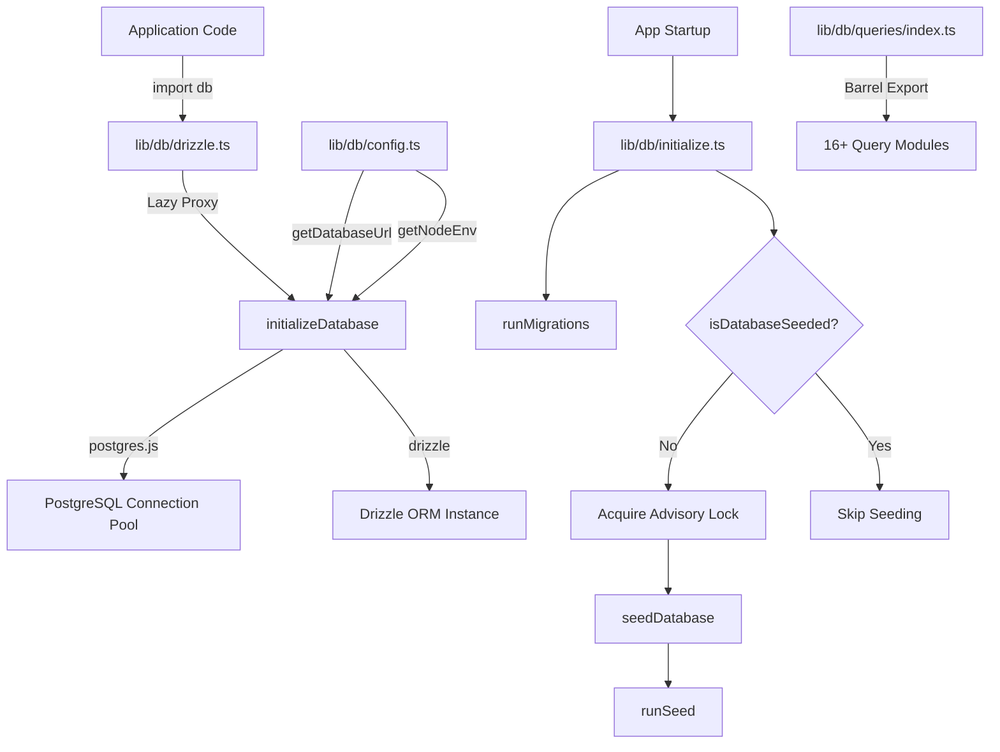
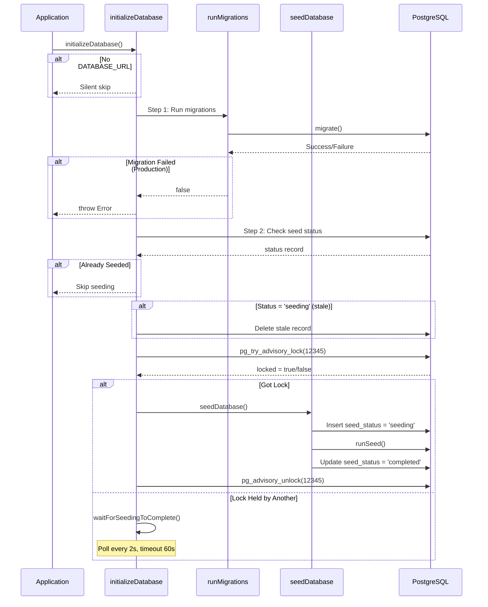

# Database Utilities Module

The database utilities module (`template/lib/db/`) manages PostgreSQL connection pooling via `postgres.js`, Drizzle ORM initialization, automated migrations, and database seeding with concurrency-safe locking. It is designed to work in serverless environments (Vercel) where multiple cold starts can race to initialize the database.

## Architecture Overview



## Source Files

| File | Description |
|------|-------------|
| `lib/db/config.ts` | Script-safe database configuration (no `server-only`) |
| `lib/db/drizzle.ts` | Connection pool and Drizzle instance with lazy proxy |
| `lib/db/initialize.ts` | Auto-migration and seeding orchestration |
| `lib/db/migrate.ts` | Migration runner |
| `lib/db/queries/index.ts` | Barrel export for all query modules |

## Database Configuration (`config.ts`)

Script-safe functions that do **not** import `server-only`, allowing use in migration and seed scripts:

```typescript
function getDatabaseUrl(): string | undefined;
function getNodeEnv(): 'development' | 'production' | 'test';
function isProduction(): boolean;
```

## Connection and ORM (`drizzle.ts`)

### Lazy Proxy Pattern

The `db` export uses a JavaScript `Proxy` to defer connection initialization until first use. This prevents connection errors during build time when `DATABASE_URL` may not be available.

```typescript
// Proxy intercepts all property access and initializes on demand
export const db = new Proxy({} as ReturnType<typeof drizzle>, {
  get(target, prop) {
    const database = initializeDatabase();
    return database[prop as keyof typeof database];
  },
});
```

### Connection Pool Configuration

```typescript
function getPoolSize(): number;
// - Reads DB_POOL_SIZE env var (clamped to 1-50)
// - Defaults: 20 (production), 10 (development)
```

Pool settings:
- `idle_timeout`: 20 seconds
- `connect_timeout`: 30 seconds
- `prepare`: false (required for some serverless environments)

### Singleton via `globalThis`

The connection is cached on `globalThis` to survive Next.js hot module reloads in development:

```typescript
const globalForDb = globalThis as unknown as {
  conn: postgres.Sql | undefined;
  db: ReturnType<typeof drizzle> | undefined;
};
```

### Direct Instance Access

For cases requiring the actual Drizzle instance (e.g., the NextAuth.js Drizzle adapter):

```typescript
import { getDrizzleInstance } from '@/lib/db/drizzle';

const adapter = DrizzleAdapter(getDrizzleInstance(), { ... });
```

## Migration Runner (`migrate.ts`)

### `runMigrations(): Promise<boolean>`

Runs Drizzle migrations from the `./lib/db/migrations` folder. Safe to call on every startup because Drizzle's `migrate()` is idempotent -- it tracks applied migrations in a `__drizzle_migrations` table.

```typescript
import { runMigrations } from '@/lib/db/migrate';

const success = await runMigrations();
if (!success) {
  console.error('Migrations failed -- run pnpm db:migrate manually');
}
```

**Behavior:**
- Logs recent migration history before and after execution
- Returns `true` on success, `false` on failure
- Does not throw -- failures are logged and returned as boolean

## Database Initialization (`initialize.ts`)

### `initializeDatabase(): Promise<void>`

The main initialization function called on application startup. Handles the complete lifecycle:



### Concurrency Safety

Multiple serverless instances can start simultaneously. The module prevents duplicate seeding using:

1. **PostgreSQL advisory lock** (`pg_try_advisory_lock(12345)`) -- non-blocking
2. **Seed status table** tracking `seeding`, `completed`, `failed` states
3. **Stale detection** -- 5-minute threshold for stuck `seeding` status
4. **Wait-and-poll** -- instances that cannot acquire the lock poll every 2 seconds

### Helper Functions

```typescript
// Check if database has been successfully seeded
async function isDatabaseSeeded(): Promise<boolean>;

// Wait for another instance to finish seeding (60s timeout, 2s intervals)
async function waitForSeedingToComplete(): Promise<boolean>;
```

## Query Modules

The `lib/db/queries/` directory contains domain-specific query modules, all re-exported via `index.ts`:

| Module | Domain |
|--------|--------|
| `activity.queries.ts` | Activity logging |
| `auth.queries.ts` | Authentication (user lookup, password verification) |
| `client.queries.ts` | Client profiles |
| `comment.queries.ts` | Comments |
| `company.queries.ts` | Company profiles |
| `dashboard.queries.ts` | Dashboard statistics |
| `engagement.queries.ts` | Views, votes, favorites aggregation |
| `item.queries.ts` | Item CRUD |
| `location-index.queries.ts` | Location-based indexing |
| `newsletter.queries.ts` | Newsletter subscriptions |
| `payment.queries.ts` | Payment records |
| `report.queries.ts` | Reports |
| `subscription.queries.ts` | Subscriptions |
| `survey.queries.ts` | Surveys and responses |
| `user.queries.ts` | User management |
| `vote.queries.ts` | Voting system |

### Import Pattern

```typescript
import {
  getUserByEmail,
  getClientProfileByUserId,
  logActivity,
  isUserAdmin,
} from '@/lib/db/queries';
```

## Environment Variables

| Variable | Required | Description |
|----------|----------|-------------|
| `DATABASE_URL` | No (optional DB) | PostgreSQL connection string |
| `DB_POOL_SIZE` | No | Connection pool size (default: 10/20) |
| `NODE_ENV` | No | Determines pool size defaults and logging |
