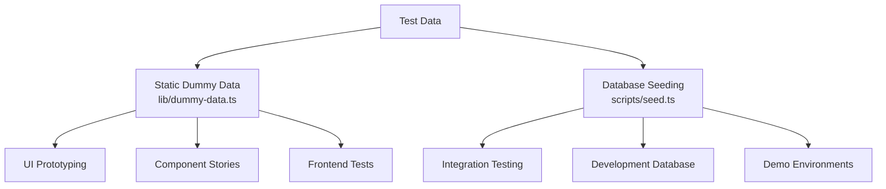
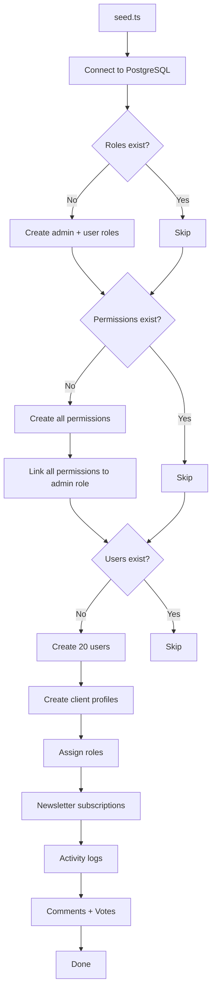
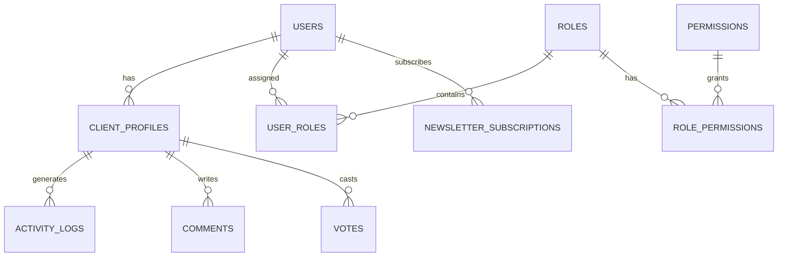

# Dummy Data System

The template provides two approaches to test data: static dummy data for UI development and prototyping, and a database seeding system for generating realistic records in PostgreSQL. Together they cover the full development lifecycle from mockups to integration testing.

## Overview



## Static Dummy Data

The `lib/dummy-data.ts` module exports typed sample data for use in components during development.

### Submission Interface

```typescript
export interface Submission {
  id: string;
  title: string;
  description: string;
  status: "approved" | "pending" | "rejected";
  submittedAt: string | null;
  approvedAt?: string;
  rejectedAt?: string;
  rejectionReason?: string;
  category: string;
  tags: string[];
  views: number;
  likes: number;
}
```

### dummySubmissions

Six sample submissions covering all status states:

| ID | Title | Status | Category | Views | Likes |
|---|---|---|---|---|---|
| 1 | Modern E-commerce Platform | approved | Web Development | 1250 | 89 |
| 2 | Task Management App | pending | Mobile Development | 567 | 23 |
| 3 | Weather Dashboard | rejected | Web Development | 890 | 45 |
| 4 | AI Chat Assistant | approved | AI/ML | 2100 | 156 |
| 5 | Fitness Tracking App | pending | Mobile Development | 432 | 18 |
| 6 | Blog Platform | pending | Web Development | 0 | 0 |

Usage in components:

```typescript
import { dummySubmissions } from '@/lib/dummy-data';

export function SubmissionList() {
  return (
    <div>
      {dummySubmissions.map((submission) => (
        <SubmissionCard key={submission.id} submission={submission} />
      ))}
    </div>
  );
}
```

### dummyPortfolio

Three sample portfolio items for showcasing project cards:

| ID | Title | Featured | Tags |
|---|---|---|---|
| 1 | E-commerce Platform | Yes | Next.js, Stripe, E-commerce |
| 2 | Task Management App | Yes | React, Firebase, Real-time |
| 3 | Weather Dashboard | No | Vue.js, Weather API, Dashboard |

Each portfolio item includes:

```typescript
{
  id: string;
  title: string;
  description: string;
  imageUrl: string;      // Unsplash placeholder image
  externalUrl: string;   // Demo link
  tags: string[];
  isFeatured: boolean;
}
```

## Database Seeding

The `scripts/seed.ts` script generates realistic data directly in PostgreSQL using Drizzle ORM.

### Seeding Architecture



### Data Relationships



### Generated User Profiles

The seeder creates profiles with deterministic variation:

```typescript
// Plan distribution
plan: i % 5 === 0 ? 'premium'    // 20% premium
    : i % 3 === 0 ? 'standard'   // ~13% standard
    : 'free';                     // ~67% free

// Job titles alternate
jobTitle: i % 2 === 0 ? 'Developer' : 'Designer';

// Companies alternate
company: i % 2 === 0 ? 'Acme Inc.' : 'Globex';

// Bios for every 3rd user
bio: i % 3 === 0 ? 'Power user' : null;
```

### Activity Log Patterns

Activity logs cycle through four action types:

| Index Pattern | Action | Description |
|---|---|---|
| `i % 4 === 0` | `SIGN_UP` | Account creation |
| `i % 4 === 1` | `SIGN_IN` | Login event |
| `i % 4 === 2` | `COMMENT` | Comment posted |
| `i % 4 === 3` | `VOTE` | Vote cast |

Timestamps are randomized within the past 7 days.

### Vote Distribution

Votes use a 75/25 split favoring upvotes:

```typescript
voteType: i % 4 === 0 ? VoteType.DOWNVOTE : VoteType.UPVOTE
```

### Connection Configuration

The seeder uses conservative connection settings suitable for scripts:

```typescript
const conn = postgres(databaseUrl, {
  max: 1,              // Single connection (no pool needed)
  idle_timeout: 20,    // Close idle connections after 20s
  connect_timeout: 10, // 10-second connection timeout
  prepare: false,      // Disable prepared statements
});
```

## Stripe Product Seeding

The `scripts/seed-stripe-products.ts` script creates the billing catalog in Stripe. See the [Database Scripts](../development/database-scripts.md) documentation for the complete product listing.

## Idempotency

Both seeding approaches are designed to be safe for repeated execution:

| Data Type | Guard Condition | Behavior on Re-run |
|---|---|---|
| Roles | `SELECT * FROM roles LIMIT 1` | Skip if any exist |
| Permissions | `SELECT * FROM permissions LIMIT 1` | Skip if any exist |
| Users | `SELECT count(*) FROM users` | Skip if count > 0 |
| Newsletter | Included in user creation block | Skipped with users |

## Using Dummy Data in Development

### Pattern 1: Component Prototyping

Use static dummy data to build UI components before the backend is ready:

```typescript
import { dummySubmissions, type Submission } from '@/lib/dummy-data';

interface SubmissionCardProps {
  submission: Submission;
}

export function SubmissionCard({ submission }: SubmissionCardProps) {
  const statusColors = {
    approved: 'bg-green-100 text-green-800',
    pending: 'bg-yellow-100 text-yellow-800',
    rejected: 'bg-red-100 text-red-800',
  };

  return (
    <div className="p-4 border rounded-lg">
      <h3>{submission.title}</h3>
      <span className={statusColors[submission.status]}>
        {submission.status}
      </span>
      <p>{submission.description}</p>
      <div className="flex gap-2">
        {submission.tags.map(tag => (
          <span key={tag} className="badge">{tag}</span>
        ))}
      </div>
    </div>
  );
}
```

### Pattern 2: Dashboard Mockups

```typescript
import { dummySubmissions } from '@/lib/dummy-data';

// Derive stats from dummy data
const stats = {
  total: dummySubmissions.length,
  approved: dummySubmissions.filter(s => s.status === 'approved').length,
  pending: dummySubmissions.filter(s => s.status === 'pending').length,
  rejected: dummySubmissions.filter(s => s.status === 'rejected').length,
  totalViews: dummySubmissions.reduce((sum, s) => sum + s.views, 0),
};
```

### Pattern 3: Replace with Real Data

When backend integration is ready, swap the import:

```typescript
// Before (dummy data)
import { dummySubmissions } from '@/lib/dummy-data';
const submissions = dummySubmissions;

// After (real data)
const submissions = await getSubmissions();
```

## Adding New Dummy Data

When adding new features, extend `lib/dummy-data.ts` with typed sample data:

1. Define the TypeScript interface for the data shape
2. Export it for use in components
3. Create sample entries covering edge cases (empty fields, max-length strings, all status values)
4. Use realistic values (proper names, valid URLs, reasonable numbers)
5. Include both featured and non-featured items where applicable

```typescript
// Example: adding dummy reviews
export interface DummyReview {
  id: string;
  authorName: string;
  rating: number;
  comment: string;
  createdAt: string;
}

export const dummyReviews: DummyReview[] = [
  {
    id: "1",
    authorName: "Jane Developer",
    rating: 5,
    comment: "Excellent tool for rapid prototyping",
    createdAt: "2024-02-01T10:00:00Z"
  },
  // ... more entries covering 1-star, no comment, etc.
];
```
