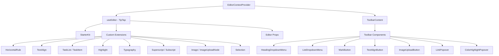

# Editor System

The template includes a rich text editor built on TipTap (ProseMirror) with a modular architecture of extensions, toolbar components, hooks, and utility functions. The editor supports headings, lists, task lists, images, code blocks, text formatting, and more.

## Architecture Overview



## Source Files

| Directory | Contents |
|-----------|----------|
| `lib/editor/extensions/` | TipTap extension re-exports and configuration |
| `lib/editor/components/` | UI components (toolbar buttons, popovers, icons) |
| `lib/editor/hooks/` | React hooks for editor state management |
| `lib/editor/providers/` | Editor context provider with extension setup |
| `lib/editor/contents/` | Toolbar layout and editor content components |
| `lib/editor/utils/` | Utility functions (shortcuts, validation, upload) |

## Extension Configuration

Extensions are registered in the `EditorContextProvider`. The `StarterKit` provides base functionality, with additional extensions layered on top:

```typescript
const extensions = useMemo(() => [
  StarterKit.configure({
    horizontalRule: false,
    link: { openOnClick: false, enableClickSelection: true },
  }),
  HorizontalRule,
  TextAlign.configure({ types: ['heading', 'paragraph'] }),
  ImageUploadNode.configure({
    accept: 'image/*',
    maxSize: MAX_FILE_SIZE, // 5MB
    limit: 3,
    upload: handleImageUpload,
    onError: (error) => console.error('Upload failed:', error),
  }),
  TaskList,
  TaskItem.configure({ nested: true }),
  Highlight.configure({ multicolor: true }),
  Image,
  Typography,
  Superscript,
  Subscript,
  Selection,
], []);
```

### Extension Summary

| Extension | Source | Purpose |
|-----------|--------|---------|
| `StarterKit` | `@tiptap/starter-kit` | Paragraphs, bold, italic, lists, code, blockquote |
| `HorizontalRule` | `@tiptap/extension-horizontal-rule` | Horizontal dividers |
| `TextAlign` | `@tiptap/extension-text-align` | Left, center, right, justify alignment |
| `TaskList` / `TaskItem` | `@tiptap/extension-list` | Interactive checkbox lists |
| `Highlight` | `@tiptap/extension-highlight` | Multi-color text highlighting |
| `Typography` | `@tiptap/extension-typography` | Smart quotes, dashes, ellipsis |
| `Superscript` | `@tiptap/extension-superscript` | Superscript text |
| `Subscript` | `@tiptap/extension-subscript` | Subscript text |
| `Selection` | `@tiptap/extensions` | Enhanced selection handling |
| `Image` | `@tiptap/extension-image` | Static image display |
| `ImageUploadNode` | Custom | Drag-and-drop image upload with progress |

## Editor Context Provider

The editor is provided via React Context for tree-wide access:

```typescript
export const EditorContext = createContext<Editor | null>(null);

export function EditorContextProvider({ children }: { children: React.ReactNode }) {
  const editor = useEditor({
    immediatelyRender: false,
    shouldRerenderOnTransaction: false,
    editorProps: {
      attributes: {
        autocomplete: 'on',
        autocorrect: 'on',
        autocapitalize: 'off',
        'aria-label': 'Main content area, start typing to enter text.',
        class: cn('min-h-96'),
      },
    },
    extensions,
  });

  return <EditorContext.Provider value={editor}>{children}</EditorContext.Provider>;
}
```

Key configuration choices:
- `immediatelyRender: false` prevents SSR hydration mismatches
- `shouldRerenderOnTransaction: false` optimizes performance by avoiding unnecessary re-renders

## Toolbar Configuration

The `ToolbarContent` component defines the complete toolbar layout organized in groups:

| Group | Components |
|-------|------------|
| History | Undo, Redo |
| Block Types | Heading Dropdown (H1-H4), List Dropdown (bullet, ordered, task), Blockquote, Code Block |
| Inline Marks | Bold, Italic, Strikethrough, Code, Underline, Color Highlight, Link |
| Script | Superscript, Subscript |
| Alignment | Left, Center, Right, Justify |
| Media | Image Upload |

Groups are separated by `ToolbarSeparator` components with `Spacer` elements for positioning.

## Editor Hooks

### `useTiptapEditor`

Provides flexible access to the editor instance either from props or context:

```typescript
export function useTiptapEditor(providedEditor?: Editor | null): {
  editor: Editor | null;
  editorState?: Editor["state"];
  canCommand?: Editor["can"];
}
```

This hook merges a directly provided editor with the context editor, enabling components to work both standalone and within the provider tree.

### Additional Hooks

| Hook | Purpose |
|------|---------|
| `use-editor.ts` | Core editor state management |
| `use-editor-sync.ts` | Synchronization between editor instances |
| `use-cursor-visibility.ts` | Cursor position and visibility tracking |
| `use-element-rect.ts` | Element bounding rectangle tracking |
| `use-scrolling.ts` | Scroll position and behavior |
| `use-throttled-callback.ts` | Throttled callback execution |
| `use-window-size.ts` | Responsive window size tracking |
| `use-unmount.ts` | Cleanup on component unmount |

## Utility Functions

### Shortcut Key Formatting

The system handles platform-specific keyboard shortcuts:

```typescript
export const MAC_SYMBOLS: Record<string, string> = {
  mod: "Command", command: "Command", meta: "Command",
  ctrl: "Ctrl", alt: "Option", shift: "Shift",
  // ... additional mappings
};

export const formatShortcutKey = (key: string, isMac: boolean, capitalize?: boolean) => {
  // Returns Mac symbols or formatted key names
};

export const parseShortcutKeys = (props: {
  shortcutKeys: string | undefined;
  delimiter?: string;
  capitalize?: boolean;
}) => string[];
```

### Schema Validation

```typescript
// Check if a mark type exists in the editor schema
export const isMarkInSchema = (markName: string, editor: Editor | null): boolean;

// Check if a node type exists in the editor schema
export const isNodeInSchema = (nodeName: string, editor: Editor | null): boolean;

// Check if extensions are registered
export function isExtensionAvailable(editor: Editor | null, extensionNames: string | string[]): boolean;
```

### Node Navigation

```typescript
// Find a node at a specific document position
export function findNodeAtPosition(editor: Editor, position: number): TiptapNode | null;

// Find a node by reference or position
export function findNodePosition(props: {
  editor: Editor | null;
  node?: TiptapNode | null;
  nodePos?: number | null;
}): { pos: number; node: TiptapNode } | null;

// Move focus to the next node
export function focusNextNode(editor: Editor): boolean;
```

### Image Upload

```typescript
export const MAX_FILE_SIZE = 5 * 1024 * 1024; // 5MB

export const handleImageUpload = async (
  file: File,
  onProgress?: (event: { progress: number }) => void,
  abortSignal?: AbortSignal
): Promise<string>;
```

The upload handler validates file size, supports progress tracking, and handles cancellation via `AbortSignal`.

### URL Sanitization

```typescript
export function isAllowedUri(uri: string | undefined, protocols?: ProtocolConfig): boolean;
export function sanitizeUrl(inputUrl: string, baseUrl: string, protocols?: ProtocolConfig): string;
```

Ensures that only safe protocols (`http`, `https`, `ftp`, `mailto`, etc.) are allowed in links. Unsafe URLs are replaced with `"#"`.
