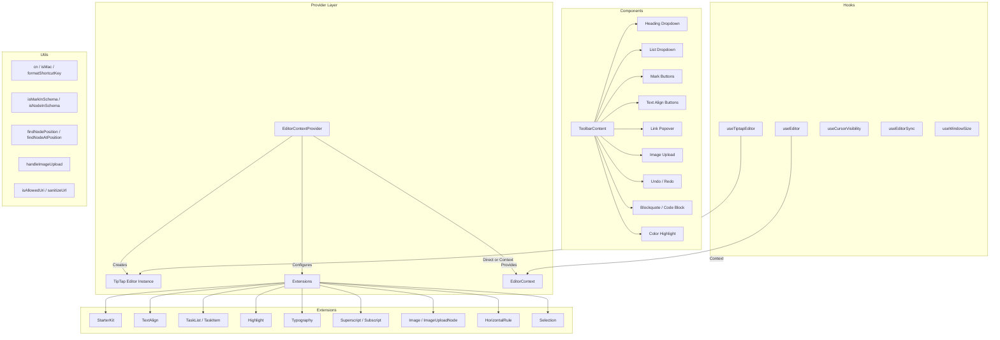

# Editor Utilities Module

The editor utilities module (`template/lib/editor/`) provides a complete rich text editing solution built on **TipTap** (ProseMirror). It includes a pre-configured editor provider, TipTap extensions, a full toolbar component library, utility functions for DOM manipulation, and custom React hooks for editor state management.

## Architecture Overview



## Source Files

| Directory | Description |
|-----------|-------------|
| `lib/editor/index.ts` | Barrel export for all sub-modules |
| `lib/editor/providers/` | `EditorContextProvider` and `EditorContext` |
| `lib/editor/extensions/` | TipTap extension re-exports |
| `lib/editor/hooks/` | Custom React hooks |
| `lib/editor/utils/` | Utility functions |
| `lib/editor/contents/` | `ToolbarContent` and `EditorContent` components |
| `lib/editor/components/` | UI primitives, toolbar buttons, icons, nodes |
| `lib/editor/styles/` | Editor CSS styles |

## Editor Provider

### `EditorContextProvider`

Wraps children with a pre-configured TipTap editor instance:

```tsx
import { EditorContextProvider } from '@/lib/editor';

function MyEditor() {
  return (
    <EditorContextProvider>
      <ToolbarContent editor={null} />
      <EditorContent />
    </EditorContextProvider>
  );
}
```

### Configuration

The provider configures TipTap with these settings:

```typescript
const editor = useEditor({
  immediatelyRender: false,
  shouldRerenderOnTransaction: false,
  editorProps: {
    attributes: {
      autocomplete: 'on',
      autocorrect: 'on',
      autocapitalize: 'off',
      'aria-label': 'Main content area, start typing to enter text.',
      class: 'min-h-96',
    },
  },
  extensions: [/* ... */],
});
```

### Pre-configured Extensions

| Extension | Configuration |
|-----------|--------------|
| `StarterKit` | `horizontalRule: false`, `link.openOnClick: false` |
| `HorizontalRule` | Default |
| `TextAlign` | Applies to `heading` and `paragraph` nodes |
| `ImageUploadNode` | Accept: `image/*`, max 5MB, limit 3 images |
| `TaskList` / `TaskItem` | Nested tasks enabled |
| `Highlight` | Multicolor enabled |
| `Image` | Default |
| `Typography` | Smart quotes and dashes |
| `Superscript` / `Subscript` | Default |
| `Selection` | Default |

## Hooks

### `useEditor(): Editor`

Retrieves the editor instance from the `EditorContext`. Must be used within an `EditorContextProvider`.

```typescript
import { useEditor } from '@/lib/editor';

function MyComponent() {
  const editor = useEditor();
  // editor is the TipTap Editor instance
}
```

### `useTiptapEditor(providedEditor?): { editor, editorState?, canCommand? }`

Flexible hook that accepts an optional editor instance or falls back to the TipTap context:

```typescript
import { useTiptapEditor } from '@/lib/editor/hooks';

function ToolbarButton({ editor: externalEditor }) {
  const { editor, editorState, canCommand } = useTiptapEditor(externalEditor);

  const isBold = editorState ? editor?.isActive('bold') : false;
  const canBold = canCommand ? canCommand().toggleBold() : false;
}
```

### Other Hooks

| Hook | Purpose |
|------|---------|
| `useCursorVisibility` | Tracks cursor position visibility in viewport |
| `useEditorSync` | Synchronizes editor content with external state |
| `useElementRect` | Tracks element bounding rectangle |
| `useScrolling` | Detects scroll state |
| `useThrottledCallback` | Throttles a callback function |
| `useUnmount` | Runs cleanup on component unmount |
| `useWindowSize` | Tracks window dimensions |

## Utility Functions

### Class Name Helper

```typescript
function cn(...classes: (string | boolean | undefined | null)[]): string;
// Filters falsy values and joins with space
cn('min-h-96', isActive && 'bg-blue-500', undefined); // 'min-h-96 bg-blue-500'
```

### Platform Detection

```typescript
function isMac(): boolean;
// Returns true if navigator.platform includes 'mac'
```

### Shortcut Key Formatting

```typescript
function formatShortcutKey(key: string, isMac: boolean, capitalize?: boolean): string;
// Mac: 'ctrl' -> '???', 'alt' -> '???', 'shift' -> '???', 'meta' -> '???'
// Windows: 'ctrl' -> 'Ctrl'

function parseShortcutKeys(props: {
  shortcutKeys: string | undefined;
  delimiter?: string;    // default: '+'
  capitalize?: boolean;  // default: true
}): string[];
// 'ctrl+shift+b' -> ['???', '???', 'B'] (Mac) or ['Ctrl', 'Shift', 'B'] (Windows)
```

### Schema Inspection

```typescript
function isMarkInSchema(markName: string, editor: Editor | null): boolean;
// Checks if a mark type exists in the editor schema

function isNodeInSchema(nodeName: string, editor: Editor | null): boolean;
// Checks if a node type exists in the editor schema

function isExtensionAvailable(editor: Editor | null, extensionNames: string | string[]): boolean;
// Checks if one or more extensions are registered
// Logs a warning if none found
```

### Node Operations

```typescript
function findNodeAtPosition(editor: Editor, position: number): TiptapNode | null;
// Returns the node at the given document position

function findNodePosition(props: {
  editor: Editor | null;
  node?: TiptapNode | null;
  nodePos?: number | null;
}): { pos: number; node: TiptapNode } | null;
// Finds position by node reference or position number

function focusNextNode(editor: Editor): boolean;
// Moves cursor to the next node, creating a paragraph if at end

function isNodeTypeSelected(editor: Editor | null, types: string[]): boolean;
// Checks if current selection is a NodeSelection matching any type

function isValidPosition(pos: number | null | undefined): pos is number;
// Type guard for valid document positions (>= 0)
```

### Image Upload

```typescript
const MAX_FILE_SIZE = 5 * 1024 * 1024; // 5MB

async function handleImageUpload(
  file: File,
  onProgress?: (event: { progress: number }) => void,
  abortSignal?: AbortSignal,
): Promise<string>;
// Returns the URL of the uploaded image
// Default implementation is a demo stub -- replace with actual upload logic
```

### URL Validation

```typescript
function isAllowedUri(uri: string | undefined, protocols?: ProtocolConfig): boolean;
// Checks URI against allowed protocols:
// http, https, ftp, ftps, mailto, tel, callto, sms, cid, xmpp
// Plus any custom protocols passed in

function sanitizeUrl(inputUrl: string, baseUrl: string, protocols?: ProtocolConfig): string;
// Returns sanitized URL or '#' if not allowed
```

## Toolbar Content

The `ToolbarContent` component provides a complete, pre-configured toolbar:

```tsx
import { ToolbarContent } from '@/lib/editor/contents';

<ToolbarContent editor={editor} />
```

### Toolbar Groups

| Group | Components |
|-------|-----------|
| Undo/Redo | `UndoRedoButton` (undo, redo) |
| Block Formatting | `HeadingDropdownMenu` (H1-H4), `ListDropdownMenu` (bullet, ordered, task), `BlockquoteButton`, `CodeBlockButton` |
| Inline Formatting | `MarkButton` (bold, italic, strike, code, underline), `ColorHighlightPopover`, `LinkPopover` |
| Superscript | `MarkButton` (superscript, subscript) |
| Text Alignment | `TextAlignButton` (left, center, right, justify) |
| Media | `ImageUploadButton` |

## Component Library

### Primitive Components

Base UI components used by toolbar buttons:

- `Badge`, `Button`, `Card`, `DropdownMenu`, `Input`, `Popover`, `Separator`, `Spacer`, `Toolbar`, `Tooltip`

### Node Components

Custom TipTap node views:

- `HorizontalRuleNode` -- custom horizontal rule extension
- `ImageUploadNode` -- file upload node with drag-and-drop

### Icon Components

SVG icons for all toolbar actions (bold, italic, heading levels, lists, alignment, etc.).
