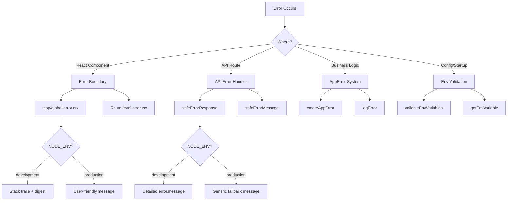

# Error Handling Patterns

## Overview

The Ever Works Template implements a multi-layered error handling strategy that covers React error boundaries, API route error responses, typed application errors, and environment variable validation. The design prioritizes security (no information leakage in production) while maintaining developer-friendly debugging in development.

## Architecture



## Source Files

| File | Purpose |
|------|---------|
| `template/app/global-error.tsx` | Root-level React error boundary |
| `template/app/not-found.tsx` | 404 Not Found page |
| `template/lib/utils/api-error.ts` | API route error utilities |
| `template/lib/utils/error-handler.ts` | Application error types and logging |
| `template/lib/auth/error-handler.ts` | Auth-specific error handling |

## React Error Boundaries

### Global Error Boundary

The `global-error.tsx` file catches unhandled errors at the application root:

```typescript
'use client';

export default function GlobalError({
    error,
    reset,
}: {
    error: Error & { digest?: string };
    reset: () => void;
}) {
    useEffect(() => {
        console.error(error);
    }, [error]);

    return (
        <html lang="en">
            <body>
                <h1>Something went wrong!</h1>
                {process.env.NODE_ENV !== 'production' && (
                    <div>
                        <p className="text-red-600">{error.message}</p>
                        {error.stack && <pre>{error.stack}</pre>}
                        {error.digest && <p>Error ID: {error.digest}</p>}
                    </div>
                )}
                <Button onPress={() => reset()}>Refresh</Button>
                <Link href="/">Go Home</Link>
            </body>
        </html>
    );
}
```

Key behaviors:
- **Development**: Shows error message, stack trace, and error digest
- **Production**: Shows only a generic message
- **Error digest**: A unique ID generated by Next.js for server-side error correlation
- **Reset function**: Re-renders the error boundary subtree
- **Self-contained HTML**: Includes its own `<html>` and `<body>` tags since it replaces the entire page

### Not Found Page

```typescript
'use client';

export default function NotFound() {
    const router = useRouter();
    return (
        <div>
            <h1>404</h1>
            <h2>Page Not Found</h2>
            <Button onClick={() => router.back()}>Go Back</Button>
            <Button onClick={() => router.push('/')}>Back to Home</Button>
        </div>
    );
}
```

## API Error Handling

### safeErrorResponse

The primary utility for API route error responses:

```typescript
export function safeErrorResponse(
    error: unknown,
    fallbackMessage: string,
    status: number = 500
): NextResponse {
    const detail = error instanceof Error ? error.message : String(error);

    // Always log full details server-side
    console.error(`[API Error] ${fallbackMessage}:`, detail);

    const message = process.env.NODE_ENV === "development" ? detail : fallbackMessage;

    return NextResponse.json({ success: false, error: message }, { status });
}
```

Usage in API routes:

```typescript
export async function GET(request: NextRequest) {
    try {
        const result = await someOperation();
        return NextResponse.json(result);
    } catch (error) {
        return safeErrorResponse(error, 'Failed to process request');
    }
}
```

### safeErrorMessage

For cases where you need the error string without creating a Response:

```typescript
export function safeErrorMessage(error: unknown, fallbackMessage: string): string {
    if (process.env.NODE_ENV === "development") {
        return error instanceof Error ? error.message : String(error);
    }
    return fallbackMessage;
}
```

## Application Error System

### Error Types

```typescript
export enum ErrorType {
    AUTH = 'auth',
    CONFIG = 'config',
    DATABASE = 'database',
    NETWORK = 'network',
    VALIDATION = 'validation',
    UNKNOWN = 'unknown'
}

export interface AppError {
    message: string;
    type: ErrorType;
    code?: string;
    originalError?: unknown;
}
```

### Creating Typed Errors

```typescript
import { createAppError, ErrorType } from '@/lib/utils/error-handler';

const error = createAppError(
    'Failed to configure OAuth providers',
    ErrorType.CONFIG,
    'OAUTH_CONFIG_FAILED',
    originalError
);
```

### Structured Error Logging

```typescript
import { logError } from '@/lib/utils/error-handler';

// Logs: [CONFIG] [Auth Config]: Failed to configure OAuth providers
// Logs: Error code: OAUTH_CONFIG_FAILED
// Logs: Original error: <original error details>
logError(error, 'Auth Config');
```

The `logError` function handles three error shapes:
1. **AppError** -- structured log with type, code, and original error
2. **Error** -- standard log with message and stack trace
3. **Unknown** -- fallback log with string coercion

### Environment Variable Validation

```typescript
import { validateEnvVariables, getEnvVariable } from '@/lib/utils/error-handler';

// Validate multiple variables at once
const validationError = validateEnvVariables([
    'DATABASE_URL', 'AUTH_SECRET', 'CRON_SECRET'
]);
if (validationError) {
    logError(validationError, 'Startup');
}

// Get a single required variable (throws if missing)
const dbUrl = getEnvVariable('DATABASE_URL');

// Get an optional variable
const optional = getEnvVariable('OPTIONAL_VAR', false);
```

## Error Handling in Auth

The auth configuration uses graceful degradation:

```typescript
const configureProviders = () => {
    try {
        const oauthProviders = configureOAuthProviders();
        return createNextAuthProviders({ /* full config */ });
    } catch (error) {
        const appError = createAppError(
            'Failed to configure OAuth providers. Falling back to credentials only.',
            ErrorType.CONFIG,
            'OAUTH_CONFIG_FAILED',
            error
        );
        logError(appError, 'Auth Config');

        // Fallback to credentials only
        return createNextAuthProviders({
            credentials: { enabled: true },
            google: { enabled: false },
            github: { enabled: false },
            facebook: { enabled: false },
            twitter: { enabled: false },
        });
    }
};
```

If OAuth provider configuration fails, the system falls back to credentials-only authentication rather than crashing.

## Error Handling Flow by Layer

| Layer | Strategy | Production Behavior |
|-------|----------|-------------------|
| React Components | Error boundary (`global-error.tsx`) | Generic message, no stack trace |
| API Routes | `safeErrorResponse()` | Generic fallback message |
| Server Actions | `validatedAction()` catches Zod errors | First validation error message |
| Auth Config | Try/catch with `createAppError()` | Graceful degradation to credentials |
| Cron Jobs | Try/catch + structured logging | Error logged, response returned |
| Webhooks | Try/catch + 400 response | Generic failure message to provider |

## Best Practices

1. **Never expose internals in production** -- always use `safeErrorResponse` for API routes
2. **Log everything server-side** -- full error details go to console/logging regardless of environment
3. **Use typed errors** -- `createAppError` with `ErrorType` for consistent categorization
4. **Graceful degradation** -- fall back to reduced functionality rather than crashing
5. **Error digests for correlation** -- use the `digest` field from Next.js errors to trace server-side issues
6. **Validate at boundaries** -- check env vars at startup, validate input at API boundaries
