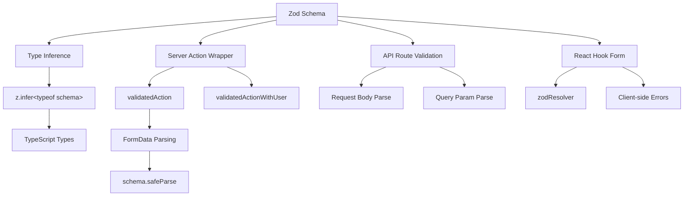

# Form Validation Patterns

## Overview

The Ever Works Template uses **Zod** as the single source of truth for data validation across both client and server boundaries. Validation schemas are organized in `lib/validations/` and are consumed by:

- **Server Actions** via `validatedAction()` and `validatedActionWithUser()` wrappers
- **API Route Handlers** for request body/query parameter validation
- **React Hook Form** integration for client-side form validation
- **Type inference** via `z.infer<>` for end-to-end type safety

## Architecture



## Source Files

| File | Purpose |
|------|---------|
| `template/lib/validations/auth.ts` | Password validation schema |
| `template/lib/validations/company.ts` | Company CRUD schemas |
| `template/lib/validations/client-item.ts` | Client item submission/update schemas |
| `template/lib/validations/client-dashboard.ts` | Dashboard query schemas |
| `template/lib/validations/sponsor-ad.ts` | Sponsor ad lifecycle schemas |
| `template/lib/validations/item.ts` | Location data schema |
| `template/lib/validations/user-location.ts` | User location settings schema |
| `template/lib/auth/middleware.ts` | `validatedAction` / `validatedActionWithUser` utilities |

## Validation Schema Patterns

### Pattern 1: Password Validation with Chained Rules

```typescript
import { z } from "zod";

export const passwordSchema = z
    .string()
    .min(8, "Password must be at least 8 characters")
    .regex(/[A-Z]/, "Password must contain at least one uppercase letter")
    .regex(/[a-z]/, "Password must contain at least one lowercase letter")
    .regex(/[0-9]/, "Password must contain at least one number")
    .regex(/[^A-Za-z0-9]/, "Password must contain at least one special character");
```

This schema enforces strong password requirements through chained refinements. Each `.regex()` provides a specific error message that the UI can display inline.

### Pattern 2: Create/Update Schema Pairs

The company validation demonstrates the create/update pattern:

```typescript
export const createCompanySchema = z.object({
    name: z.string().min(1, "Company name is required").max(255),
    website: z.string().url("Invalid URL format").optional().or(z.literal("")),
    domain: z.string().max(255).optional()
        .transform((val) => val?.toLowerCase().trim() || undefined),
    slug: z.string().max(255).optional()
        .transform((val) => val?.toLowerCase().trim() || undefined)
        .refine(
            (val) => !val || /^[a-z0-9-]+$/.test(val),
            { message: "Slug must contain only lowercase letters, numbers, and hyphens" }
        ),
    status: z.enum(companyStatus).default("active"),
});

export const updateCompanySchema = z.object({
    id: z.string().uuid(),
    name: z.string().min(1).max(255).optional(),  // Optional for updates
    // ... other fields also optional
    status: z.enum(companyStatus).optional(),
});
```

Key differences:
- **Create schemas** have required fields with defaults
- **Update schemas** require an `id` and make all other fields optional
- Both share `.transform()` logic for normalization (e.g., lowercase slugs)

### Pattern 3: Enum-Based Status Fields

```typescript
export const companyStatus = ["active", "inactive"] as const;
export const itemStatus = ['pending', 'approved', 'rejected'] as const;
export const sponsorAdStatuses = [
    "pending_payment", "pending", "rejected",
    "active", "expired", "cancelled",
] as const;

// Usage in schemas
status: z.enum(companyStatus).default("active"),
status: z.enum(sponsorAdStatuses).optional(),
```

Using `as const` arrays with `z.enum()` provides both runtime validation and compile-time type safety.

### Pattern 4: Query Parameter Schemas with Transforms

```typescript
export const clientItemsListQuerySchema = z.object({
    page: z.string().optional()
        .transform(val => (val ? parseInt(val, 10) : 1))
        .refine(val => !Number.isNaN(val), { message: 'Page must be a valid number' })
        .refine(val => val >= 1, { message: 'Page must be at least 1' }),
    limit: z.string().optional()
        .transform(val => (val ? parseInt(val, 10) : 10))
        .refine(val => val >= 1 && val <= 100, { message: 'Limit must be between 1 and 100' }),
    status: z.enum(clientStatusFilter).optional().default('all'),
    search: z.string().max(100, 'Search query is too long').optional(),
    sortBy: z.enum(['name', 'updated_at', 'status', 'submitted_at']).optional().default('updated_at'),
    sortOrder: z.enum(['asc', 'desc']).optional().default('desc'),
    deleted: z.string().optional().transform(val => val === 'true'),
});
```

Query parameters arrive as strings. The schema uses `.transform()` to convert them to the correct types (numbers, booleans) while applying validation and defaults.

### Pattern 5: Nested Object Schemas with Cross-Field Validation

```typescript
export const updateLocationSchema = z
    .object({
        defaultLatitude: z.number().min(-90).max(90).nullable().optional(),
        defaultLongitude: z.number().min(-180).max(180).nullable().optional(),
        defaultCity: z.string().max(200).nullable().optional(),
        defaultCountry: z.string().max(100).nullable().optional(),
        locationPrivacy: locationPrivacySchema.optional(),
    })
    .refine(
        (data) => {
            const hasLat = data.defaultLatitude != null;
            const hasLng = data.defaultLongitude != null;
            return hasLat === hasLng;  // Both or neither
        },
        { message: 'Both latitude and longitude must be provided together' }
    );
```

The `.refine()` at the object level validates cross-field dependencies -- latitude and longitude must both be present or both be absent.

### Pattern 6: Union Types for Flexible Inputs

```typescript
category: z.union([
    z.string().min(1, 'Category is required'),
    z.array(z.string().min(1)).min(1, 'At least one category is required'),
]).optional().nullable(),
```

This accepts both a single string and an array of strings for the category field, accommodating different form input types.

## Server-Side Validation

### validatedAction Wrapper

```typescript
export function validatedAction<S extends z.ZodType<any, any>, T>(
    schema: S,
    action: ValidatedActionFunction<S, T>
) {
    return async (prevState: ActionState, formData: FormData): Promise<T> => {
        const result = schema.safeParse(Object.fromEntries(formData));
        if (!result.success) {
            return { error: result.error.issues[0].message } as T;
        }
        return action(result.data, formData);
    };
}
```

This higher-order function:
1. Converts `FormData` to a plain object
2. Validates against the Zod schema using `safeParse()`
3. Returns the first validation error if invalid
4. Calls the action function with parsed, typed data if valid

### validatedActionWithUser Wrapper

```typescript
export function validatedActionWithUser<S extends z.ZodType<any, any>, T>(
    schema: S,
    action: ValidatedActionWithUserFunction<S, T>
) {
    return async (prevState: ActionState, formData: FormData): Promise<T> => {
        const session = await auth();
        if (!session?.user) {
            throw new Error("User is not authenticated");
        }
        const result = schema.safeParse(Object.fromEntries(formData));
        if (!result.success) {
            return { error: result.error.issues[0].message } as T;
        }
        return action(result.data, formData, session.user);
    };
}
```

This adds an authentication check before validation, passing the authenticated `user` object to the action function.

## Type Inference

Every schema exports inferred TypeScript types:

```typescript
export type CreateCompanyInput = z.infer<typeof createCompanySchema>;
export type UpdateCompanyInput = z.infer<typeof updateCompanySchema>;
export type ClientUpdateItemInput = z.infer<typeof clientUpdateItemSchema>;
export type ClientCreateItemInput = z.infer<typeof clientCreateItemSchema>;
```

These types are used throughout the service layer and API routes, ensuring the validated data shape matches what the business logic expects.

## Best Practices

1. **Single schema, multiple consumers** -- define once in `lib/validations/`, use everywhere
2. **Transform at the boundary** -- use `.transform()` to convert strings to proper types
3. **Custom error messages** -- every validation rule includes a user-friendly message
4. **Shared sub-schemas** -- reuse schemas like `locationSchema` and `passwordSchema` across forms
5. **Infer types from schemas** -- never manually define types that duplicate schema definitions
6. **Cross-field validation** -- use `.refine()` at the object level for multi-field rules
7. **Sensible defaults** -- use `.default()` for optional fields with standard values
