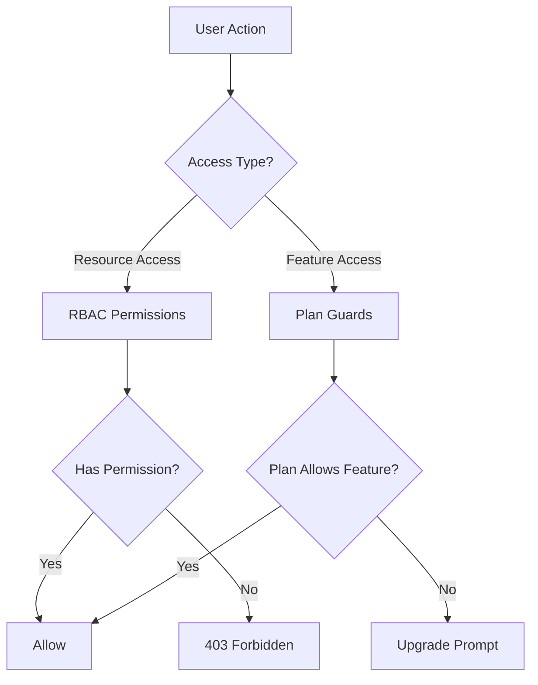
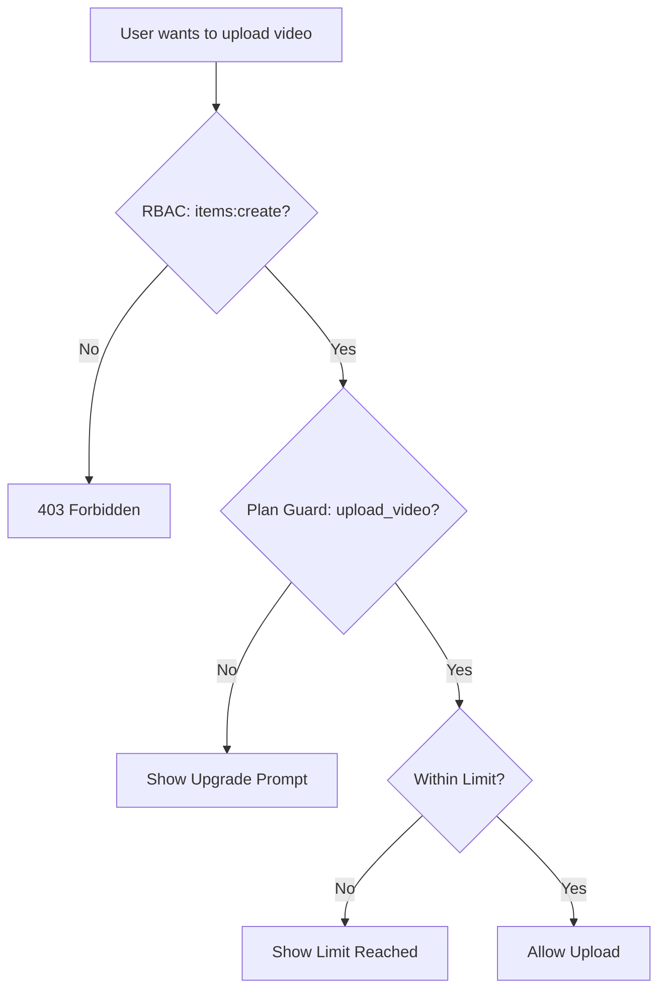

# Guards & Permission System

The Ever Works Template implements a dual-layer access control system: **RBAC permissions** for role-based resource access and **plan guards** for subscription-based feature gating. Together, these systems control what users can do and what features they can access.

## System Architecture



## RBAC Permission System

### Permission Definitions

All permissions are defined in `lib/permissions/definitions.ts` using a `resource:action` format:

```typescript
const PERMISSIONS = {
  items: {
    read: 'items:read',
    create: 'items:create',
    update: 'items:update',
    delete: 'items:delete',
    review: 'items:review',
    approve: 'items:approve',
    reject: 'items:reject',
  },
  categories: { read, create, update, delete },
  tags: { read, create, update, delete },
  roles: { read, create, update, delete },
  users: { read, create, update, delete, assignRoles },
  analytics: { read, export },
  system: { settings },
} as const;
```

### Permission Type

The `Permission` type is derived from the `PERMISSIONS` const object, ensuring type safety:

```typescript
type Permission = 'items:read' | 'items:create' | ... | 'system:settings';
```

### Default Roles

Two default roles are pre-configured:

| Role | ID | Permissions |
|---|---|---|
| Super Administrator | `super-admin` | All system permissions |
| Content Manager | `content-manager` | Items + Categories + Tags (full CRUD + review) |

### Permission Groups

Permissions are organized into UI-friendly groups in `lib/permissions/groups.ts`:

| Group | Icon | Included Resources |
|---|---|---|
| Content Management | `FileText` | Items, Categories, Tags |
| User Management | `Users` | Users, Roles |
| System & Analytics | `Settings` | Analytics, System |

### Utility Functions

The `lib/permissions/utils.ts` module provides state management utilities for the permissions UI:

```typescript
// Create a permission state map for checkboxes
const state = createPermissionState(currentPermissions);
// { 'items:read': true, 'items:create': true, ... }

// Get selected permissions from state
const selected = getSelectedPermissions(state);

// Calculate changes between old and new permissions
const changes = calculatePermissionChanges(original, updated);
// { added: ['items:delete'], removed: ['tags:create'] }

// Compare two permission sets
const equal = arePermissionsEqual(perms1, perms2);

// Filter permissions by search term
const filtered = filterPermissions(allPerms, 'items');
```

## Plan Guards System

Plan guards control access to features based on the user's subscription plan. The system is defined in `lib/guards/plan-features.guard.ts`.

### Plan Hierarchy

```typescript
const PLAN_LEVELS: Record<string, number> = {
  free: 1,
  standard: 2,
  premium: 3,
};
```

### Feature Definitions

All gated features are enumerated in `FEATURES`:

| Category | Features |
|---|---|
| Submission | `submit_product`, `extended_description`, `unlimited_description`, `upload_images`, `upload_video` |
| Badges | `verified_badge`, `sponsored_badge` |
| Review | `priority_review`, `instant_review` |
| Visibility | `search_visibility`, `category_placement`, `sponsored_position`, `homepage_featured`, `newsletter_mention` |
| Analytics | `view_statistics`, `advanced_analytics` |
| Support | `email_support`, `priority_email_support`, `phone_support` |
| Social | `social_sharing`, `learn_more_button` |
| Other | `free_modifications`, `unlimited_submissions` |

### Feature Access Matrix

Each feature maps to an access rule:

| Access Type | Syntax | Example |
|---|---|---|
| All plans | `'all'` | `submit_product`, `upload_images` |
| Single plan | `PaymentPlan.PREMIUM` | `upload_video`, `instant_review` |
| Minimum plan | `{ minPlan: PaymentPlan.STANDARD }` | `verified_badge`, `priority_review` |
| Specific plans | `[PaymentPlan.STANDARD, PaymentPlan.PREMIUM]` | (custom features) |

### Plan Limits

Numeric limits vary by plan:

| Limit | Free | Standard | Premium |
|---|---|---|---|
| `max_images` | 1 | 5 | Unlimited |
| `max_description_words` | 200 | 500 | Unlimited |
| `max_submissions` | 1 | 10 | Unlimited |
| `review_days` | 7 | 3 | 1 |
| `free_modification_days` | 0 | 30 | 365 |

### Server-Side Guard Usage

```typescript
import { canAccessFeature, createPlanGuard, FEATURES } from '@/lib/guards';

// Simple check
const allowed = canAccessFeature(FEATURES.UPLOAD_VIDEO, userPlan);

// Guard factory for multiple checks
const guard = createPlanGuard(userPlan);
guard.canAccess(FEATURES.VERIFIED_BADGE);       // boolean
guard.requireFeature(FEATURES.UPLOAD_VIDEO);     // throws PlanGuardError
guard.getLimit('max_images');                    // number | null
guard.isWithinLimit('max_submissions', count);   // boolean
guard.getAccessibleFeatures();                   // Feature[]
```

### PlanGuardError

When `requireFeature` fails, it throws a typed error:

```typescript
class PlanGuardError extends Error {
  feature: Feature;      // e.g., 'upload_video'
  userPlan: string;      // e.g., 'free'
  requiredPlan: PaymentPlan; // e.g., 'premium'
}
```

### Client-Side Guard Hook

The `usePlanGuard` hook in `hooks/use-plan-guard.ts` wraps the guard system for React components:

```typescript
import { usePlanGuard, FEATURES } from '@/hooks/use-plan-guard';

function VideoUploadButton() {
  const { canAccess, requireUpgrade, isLoading } = usePlanGuard();

  if (isLoading) return <Spinner />;

  const upgradePlan = requireUpgrade(FEATURES.UPLOAD_VIDEO);
  if (upgradePlan) {
    return <UpgradePrompt plan={upgradePlan} />;
  }

  return <Button>Upload Video</Button>;
}
```

### Specialized Hooks

#### `useFeatureAccess`

Check access to a single feature:

```typescript
const { hasAccess, requiredPlan, isLoading } = useFeatureAccess(FEATURES.VERIFIED_BADGE);
```

#### `useFeatureLimit`

Check numeric limits with remaining count:

```typescript
const { limit, isUnlimited, remaining, isWithinLimit } = useFeatureLimit('max_images', currentCount);

if (!isUnlimited && remaining <= 0) {
  return <LimitReached />;
}
```

## Composing Guards

Guards compose naturally for complex access control scenarios:

```typescript
// Server: Combine RBAC + plan check
function canCreateItem(userPermissions: UserPermissions, userPlan: string): boolean {
  const hasRBACAccess = hasPermission(userPermissions, 'items:create');
  const hasPlanAccess = canAccessFeature(FEATURES.SUBMIT_PRODUCT, userPlan);
  return hasRBACAccess && hasPlanAccess;
}

// Client: Combine hooks
function CreateItemButton() {
  const { canAccess } = usePlanGuard();
  const { permissions } = useRolePermissions();

  const canCreate =
    hasPermission(permissions, 'items:create') &&
    canAccess(FEATURES.SUBMIT_PRODUCT);

  if (!canCreate) return null;
  return <Button>Create Item</Button>;
}
```

## Guard Flow Diagram



## Adding New Guards

### Adding a New Permission

1. Add to `PERMISSIONS` in `lib/permissions/definitions.ts`:

```typescript
billing: {
  read: 'billing:read',
  manage: 'billing:manage',
},
```

2. Add to a permission group in `lib/permissions/groups.ts`
3. Assign to appropriate default roles

### Adding a New Plan Feature

1. Add the feature constant to `FEATURES` in `lib/guards/plan-features.guard.ts`
2. Define the access rule in `FEATURE_ACCESS`
3. Optionally add numeric limits to `PLAN_LIMITS`

## Best Practices

1. **Prefer plan guards for feature gating** and RBAC for resource access control -- do not mix them.
2. **Always check on the server** even if the client hides UI elements -- client-side checks are for UX only.
3. **Use `createPlanGuard`** for multiple checks in the same request to avoid repeated plan lookups.
4. **Handle loading states** in hooks -- plan data may load asynchronously from the subscription service.
5. **Keep feature names descriptive** -- use `upload_video` not `feature_3` for clarity in logs and error messages.
