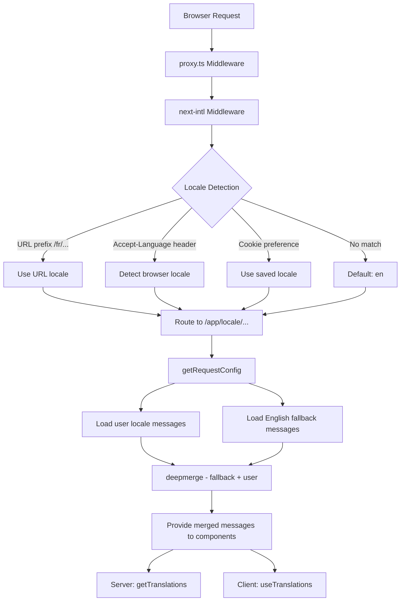

# i18n Implementation

## Overview

The Ever Works Template implements internationalization using **next-intl** with support for 20+ locales, RTL (right-to-left) text direction, deep-merge message fallbacks, and locale-aware navigation. The system is built around three layers: routing configuration, message loading with fallback, and locale-aware navigation helpers.

## Architecture



## Source Files

| File | Purpose |
|------|---------|
| `template/i18n/routing.ts` | Locale routing configuration |
| `template/i18n/request.ts` | Request-scoped message loading |
| `template/i18n/navigation.ts` | Locale-aware navigation exports |
| `template/lib/constants.ts` | Locale and RTL definitions |
| `template/messages/*.json` | Translation message files |
| `template/proxy.ts` | Middleware with locale prefix resolution |

## Supported Locales

```typescript
// lib/constants.ts
export const DEFAULT_LOCALE = 'en';
export const LOCALES = [
    'en', 'fr', 'es', 'de', 'zh', 'ar', 'he',
    'ru', 'uk', 'pt', 'it', 'ja', 'ko', 'nl',
    'pl', 'tr', 'vi', 'th', 'hi', 'id', 'bg'
] as const;

export type Locale = (typeof LOCALES)[number];

/** Locales that use right-to-left text direction */
export const RTL_LOCALES: readonly Locale[] = ['ar', 'he'] as const;
```

The template supports 20 locales including two RTL locales (Arabic and Hebrew).

## Routing Configuration

```typescript
// i18n/routing.ts
import { defineRouting } from "next-intl/routing";
import { DEFAULT_LOCALE, LOCALES } from "@/lib/constants";

export const routing = defineRouting({
    locales: LOCALES,
    defaultLocale: DEFAULT_LOCALE,
    localeDetection: true,
    localePrefix: "as-needed",
});
```

| Setting | Value | Effect |
|---------|-------|--------|
| `locales` | 20 locale codes | Supported language set |
| `defaultLocale` | `'en'` | Fallback when no locale matches |
| `localeDetection` | `true` | Auto-detect from `Accept-Language` header |
| `localePrefix` | `"as-needed"` | Default locale has no prefix; others do |

With `localePrefix: "as-needed"`:
- English (default): `https://example.com/about`
- French: `https://example.com/fr/about`
- Arabic: `https://example.com/ar/about`

## Message Loading with Fallback

```typescript
// i18n/request.ts
import deepmerge from "deepmerge";
import { getRequestConfig } from "next-intl/server";

export default getRequestConfig(async ({ requestLocale }) => {
    let locale = await requestLocale;

    if (!locale || !routing.locales.includes(locale as any)) {
        locale = routing.defaultLocale;
    }

    const userMessages = (await import(`../messages/${locale}.json`)).default;
    const defaultMessages = (await import(`../messages/en.json`)).default;
    const messages = deepmerge(defaultMessages, userMessages) as any;

    return { locale, messages };
});
```

The deep merge strategy ensures that:
1. English messages serve as the complete fallback set
2. Locale-specific messages override English where translations exist
3. Missing translations gracefully fall back to English instead of showing keys

### Message File Structure

```
messages/
  en.json        # Complete English messages (base)
  fr.json        # French translations
  es.json        # Spanish translations
  de.json        # German translations
  ar.json        # Arabic translations
  he.json        # Hebrew translations
  zh.json        # Chinese translations
  ...            # 13+ more locales
```

### Date/Number Formats

```typescript
// i18n/request.ts
export const formats = {
    dateTime: {
        short: {
            day: "numeric",
            month: "short",
            year: "numeric",
        },
    },
    number: {
        precise: {
            maximumFractionDigits: 5,
        },
    },
    list: {
        enumeration: {
            style: "long",
            type: "conjunction",
        },
    },
} satisfies Formats;
```

## Navigation Helpers

```typescript
// i18n/navigation.ts
import { createNavigation } from "next-intl/navigation";
import { routing } from "./routing";

export const { Link, redirect, usePathname, useRouter, getPathname } =
    createNavigation(routing);
```

These exports replace the standard Next.js navigation utilities with locale-aware versions:

| Export | Standard Next.js | Locale-Aware Behavior |
|--------|-----------------|----------------------|
| `Link` | `next/link` | Adds locale prefix to `href` |
| `redirect` | `next/navigation` | Preserves current locale in redirect |
| `usePathname` | `next/navigation` | Returns path without locale prefix |
| `useRouter` | `next/navigation` | `push()` / `replace()` add locale prefix |
| `getPathname` | -- | Server-side path with locale |

### Usage in Server Components

```typescript
import { getTranslations } from 'next-intl/server';

export default async function Page({ params }: { params: Promise<{ locale: string }> }) {
    const { locale } = await params;
    const t = await getTranslations({ locale, namespace: 'common' });

    return <h1>{t('WELCOME')}</h1>;
}
```

### Usage in Client Components

```typescript
'use client';
import { useTranslations } from 'next-intl';
import { Link } from '@/i18n/navigation';

export function NavLink() {
    const t = useTranslations('navigation');
    return <Link href="/about">{t('ABOUT')}</Link>;
}
```

## Middleware Locale Resolution

The middleware in `proxy.ts` resolves locale information for auth guard decisions:

```typescript
function resolveLocalePrefix(pathname: string): {
    prefix: string;           // "/fr" or ""
    hasLocale: boolean;
    locale?: string;
    pathWithoutLocale: string; // "/admin/items"
} {
    const segments = pathname.split('/').filter(Boolean);
    const maybeLocale = segments[0];
    const hasLocale = routing.locales.includes(maybeLocale as any);
    const pathWithoutLocale = hasLocale
        ? `/${segments.slice(1).join('/')}`
        : pathname;
    return {
        prefix: hasLocale ? `/${maybeLocale}` : '',
        hasLocale,
        locale: hasLocale ? maybeLocale : undefined,
        pathWithoutLocale
    };
}
```

This is used to construct locale-aware redirect URLs in auth guards:

```typescript
url.pathname = `${localePrefix}/auth/signin`;
```

## RTL Support

RTL locales are defined in `lib/constants.ts`:

```typescript
export const RTL_LOCALES: readonly Locale[] = ['ar', 'he'] as const;
```

The root layout component should apply the `dir` attribute based on the current locale:

```typescript
// app/[locale]/layout.tsx
const isRTL = RTL_LOCALES.includes(locale as Locale);

return (
    <html lang={locale} dir={isRTL ? 'rtl' : 'ltr'}>
        {/* ... */}
    </html>
);
```

## SEO: Hreflang Alternates

The `lib/seo/hreflang.ts` utility generates alternate language links for SEO:

```typescript
import { generateHreflangAlternates } from '@/lib/seo/hreflang';

export async function generateMetadata(): Promise<Metadata> {
    return {
        alternates: {
            languages: generateHreflangAlternates('/about')
        }
    };
}
```

This generates `<link rel="alternate" hreflang="fr" href="...">` tags for all supported locales, plus an `x-default` entry pointing to the English version.

## Next.js Plugin Integration

```typescript
// next.config.ts
import createNextIntlPlugin from "next-intl/plugin";

const withNextIntl = createNextIntlPlugin('./i18n/request.ts');
const configWithIntl = withNextIntl(nextConfig);
```

The `next-intl` plugin is applied to the Next.js configuration with an explicit path to the request configuration file.

## Best Practices

1. **Always use `getTranslations` in server components** -- loads translations without client bundle cost
2. **Import navigation from `@/i18n/navigation`** -- ensures locale-aware linking
3. **Keep English complete** -- it serves as the fallback for all other locales
4. **Use namespaced translations** -- organize by feature (`common`, `footer`, `pages`, etc.)
5. **Check RTL with `RTL_LOCALES`** -- apply `dir="rtl"` at the layout level
6. **Generate hreflang tags** -- use `generateHreflangAlternates()` in metadata functions
