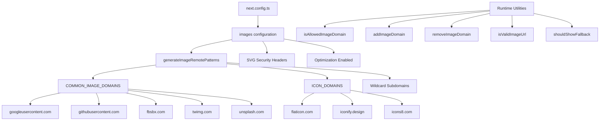

# Image Optimization

## Overview

The Ever Works Template configures Next.js Image Optimization with dynamic remote patterns, SVG support, and a utility layer for domain management. The system handles images from OAuth providers (Google, GitHub, Facebook, Twitter), stock photo services (Unsplash), and icon libraries, while enforcing security headers for SVG content.

## Architecture



## Source Files

| File | Purpose |
|------|---------|
| `template/next.config.ts` | Next.js image configuration |
| `template/lib/utils/image-domains.ts` | Domain management utilities |

## Configuration

### Next.js Image Settings

```typescript
// next.config.ts
images: {
    remotePatterns: generateImageRemotePatterns(),
    dangerouslyAllowSVG: true,
    contentDispositionType: 'attachment',
    contentSecurityPolicy: "default-src 'self'; script-src 'none'; sandbox;",
    unoptimized: false,
},
```

| Setting | Value | Purpose |
|---------|-------|---------|
| `remotePatterns` | Dynamic via `generateImageRemotePatterns()` | Whitelist external image domains |
| `dangerouslyAllowSVG` | `true` | Allow SVG images through the optimizer |
| `contentDispositionType` | `'attachment'` | Force download instead of inline rendering for raw access |
| `contentSecurityPolicy` | Strict sandbox | Prevent SVG-based XSS attacks |
| `unoptimized` | `false` | Keep image optimization enabled |

### SVG Security

SVG files can contain embedded JavaScript. The template mitigates this with:
- **Content Security Policy**: `script-src 'none'; sandbox;` prevents script execution in SVGs
- **Content Disposition**: `attachment` ensures SVGs are downloaded, not executed, when accessed directly

## Remote Pattern Generation

The `generateImageRemotePatterns()` function builds the allowlist dynamically:

```typescript
export function generateImageRemotePatterns() {
    const patterns = [
        {
            protocol: 'https' as const,
            hostname: 'lh3.googleusercontent.com',
            pathname: '/a/**'
        },
        {
            protocol: 'https' as const,
            hostname: 'avatars.githubusercontent.com',
            pathname: '/u/**'
        },
        {
            protocol: 'https' as const,
            hostname: 'platform-lookaside.fbsbx.com',
            pathname: '/platform/**'
        },
        // ... more specific patterns
    ];

    // Add wildcard subdomain patterns
    [...COMMON_IMAGE_DOMAINS, ...ICON_DOMAINS].forEach((domain) => {
        patterns.push({
            protocol: 'https' as const,
            hostname: `*.${domain}`,
            pathname: '/**'
        });
    });

    return patterns;
}
```

### Allowed Domains

**Common Image Domains** (OAuth avatars, stock photos):

| Domain | Source |
|--------|--------|
| `lh3.googleusercontent.com` | Google OAuth avatars |
| `avatars.githubusercontent.com` | GitHub OAuth avatars |
| `platform-lookaside.fbsbx.com` | Facebook OAuth avatars |
| `pbs.twimg.com` | Twitter/X avatars |
| `images.unsplash.com` | Unsplash stock photos |

**Icon Domains** (item icons):

| Domain | Source |
|--------|--------|
| `flaticon.com` | Flaticon icons |
| `iconify.design` | Iconify icons |
| `icons8.com` | Icons8 icons |
| `feathericons.com` | Feather icons |
| `heroicons.com` | Hero icons |
| `tabler-icons.io` | Tabler icons |

## Runtime Domain Management

### Checking Allowed Domains

```typescript
import { isAllowedImageDomain } from '@/lib/utils/image-domains';

// Returns true for whitelisted domains
isAllowedImageDomain('https://lh3.googleusercontent.com/a/photo.jpg'); // true
isAllowedImageDomain('https://cdn.flaticon.com/icons/svg/123.svg');    // true
isAllowedImageDomain('https://evil-site.com/image.jpg');               // false

// Relative URLs are always allowed
isAllowedImageDomain('/images/logo.png'); // true
```

### Dynamic Domain Addition

```typescript
import { addImageDomain, removeImageDomain } from '@/lib/utils/image-domains';

// Add a new domain at runtime
addImageDomain('cdn.example.com');

// Add as an icon domain
addImageDomain('my-icons.com', true);

// Remove a domain
removeImageDomain('old-cdn.com');
```

Note: Runtime additions affect the utility functions but do not modify the Next.js `next.config.ts` remote patterns (those require a rebuild).

### URL Validation

```typescript
import { isValidImageUrl, isProblematicUrl, shouldShowFallback } from '@/lib/utils/image-domains';

// Check URL format validity
isValidImageUrl('https://example.com/photo.jpg'); // true
isValidImageUrl('/images/local.png');              // true (relative)
isValidImageUrl('not-a-url');                      // false

// Check for problematic URLs (non-image pages, redirect URLs)
isProblematicUrl('https://flaticon.com/icone-gratuite/search'); // true (not a direct image)
isProblematicUrl('https://cdn.flaticon.com/icon.svg');          // false (has image extension)

// Determine if fallback icon should be shown
shouldShowFallback('');                                          // true (empty)
shouldShowFallback('https://flaticon.com/icone-gratuite/123');   // true (problematic)
shouldShowFallback('https://cdn.flaticon.com/icon.svg');         // false
```

## Security Headers

The `next.config.ts` applies security headers to all routes:

```typescript
async headers() {
    return [{
        source: "/(.*)",
        headers: [
            { key: "X-Content-Type-Options", value: "nosniff" },
            { key: "X-Frame-Options", value: "DENY" },
            { key: "Referrer-Policy", value: "strict-origin-when-cross-origin" },
            { key: "X-DNS-Prefetch-Control", value: "on" },
            { key: "Strict-Transport-Security", value: "max-age=63072000; includeSubDomains; preload" },
            {
                key: "Content-Security-Policy",
                value: "default-src 'self'; script-src 'self' 'unsafe-inline' https://assets.lemonsqueezy.com; style-src 'self' 'unsafe-inline'; img-src 'self' data: https:; font-src 'self'; connect-src 'self' https:; frame-ancestors 'none';"
            },
        ],
    }];
},
```

The `img-src 'self' data: https:` directive allows images from the same origin, data URIs, and any HTTPS source. This is intentionally permissive for `img-src` because the Next.js Image component handles domain validation at the application level.

## Best Practices

1. **Use `next/image`** for all external images -- it handles optimization, lazy loading, and format conversion
2. **Add new domains to `image-domains.ts`** -- not inline in `next.config.ts`
3. **Check `shouldShowFallback()`** before rendering -- show a default icon for invalid/missing URLs
4. **Keep SVG security headers** -- never remove the `contentSecurityPolicy` or `contentDispositionType` settings
5. **Prefer pathname restrictions** -- use specific `pathname` patterns (e.g., `/a/**`) over broad wildcards when possible
