# Lib Utilities Overview

The `template/lib/` directory is the core utility and business logic layer of the Ever Works Template. It contains shared modules for analytics, API communication, authentication, background jobs, caching, configuration, database access, payments, editor tooling, guards, and more. All non-component, non-route logic lives here following the principle of keeping components presentational and delegating heavy logic to `lib/`.

## Module Map

```mermaid
graph TD
    subgraph Core Infrastructure
        A[config/] --> B[config.ts / config-manager.ts]
        C[db/] --> D[drizzle.ts / queries/ / migrate.ts]
        E[cache-config.ts] --> F[cache-invalidation.ts]
    end

    subgraph Auth & Security
        G[auth/] --> H[NextAuth / Supabase / Guards / Caching]
        I[guards/] --> J[Plan Feature Access Control]
        K[permissions/] --> L[Role-Based Permissions]
    end

    subgraph API Layer
        M[api/] --> N[ApiClient / ServerClient / Error Handling]
    end

    subgraph Analytics & Tracking
        O[analytics/] --> P[PostHog + Sentry Singleton]
    end

    subgraph Background Processing
        Q[background-jobs/] --> R[Trigger.dev / Local / NoOp]
    end

    subgraph Content & Editor
        S[content.ts] --> T[Git CMS Content Loader]
        U[editor/] --> V[TipTap Rich Text Editor]
        W[lib.ts] --> X[Content Path / File Utilities]
    end

    subgraph Business Logic
        Y[services/] --> Z[20+ Domain Services]
        AA[repositories/] --> AB[Data Access Layer]
        AC[payment/] --> AD[Stripe / LemonSqueezy / Polar]
    end

    subgraph Shared Utilities
        AE[constants.ts + constants/]
        AF[utils.ts + utils/]
        AG[types.ts + types/]
        AH[validations/]
        AI[helpers.ts]
    end
```



## Directory Structure

| Directory / File | Description |
|-----------------|-------------|
| `lib/analytics/` | PostHog + Sentry analytics singleton ([docs](./analytics-module)) |
| `lib/api/` | HTTP clients for browser and server ([docs](./api-client-module)) |
| `lib/auth/` | Authentication with NextAuth.js + Supabase ([docs](./auth-utilities-module)) |
| `lib/background-jobs/` | Job scheduling with Trigger.dev / local / no-op ([docs](./background-jobs-module)) |
| `lib/cache-config.ts` | Cache TTL and tag definitions ([docs](./cache-invalidation-module)) |
| `lib/cache-invalidation.ts` | Cache invalidation functions ([docs](./cache-invalidation-module)) |
| `lib/config/` | Centralized configuration service with Zod schemas |
| `lib/config.ts` | Site configuration (`siteConfig`) |
| `lib/config-manager.ts` | Runtime configuration manager |
| `lib/constants.ts` | Application constants barrel ([docs](./constants-reference-module)) |
| `lib/constants/` | Domain-specific constants (payment, analytics) |
| `lib/content.ts` | Git-based CMS content loading and caching |
| `lib/db/` | Database connection, migrations, seeding, queries ([docs](./db-utilities-module)) |
| `lib/editor/` | TipTap rich text editor components and utilities ([docs](./editor-utilities-module)) |
| `lib/guards/` | Plan-based feature access control ([docs](./guards-module)) |
| `lib/helpers.ts` | Language code to country code mapping |
| `lib/lib.ts` | Content path resolution, file system utilities |
| `lib/logger.ts` | Structured logging utility |
| `lib/mail/` | Email sending with template support |
| `lib/mappers/` | Data transformation mappers |
| `lib/maps/` | Map provider integrations (Google Maps, Mapbox) |
| `lib/middleware/` | Next.js middleware utilities |
| `lib/newsletter/` | Newsletter subscription providers |
| `lib/paginate.ts` | Pagination helper function |
| `lib/payment/` | Payment processing (Stripe, LemonSqueezy, Solidgate, Polar) |
| `lib/permissions/` | Role-based permission definitions |
| `lib/query-client.ts` | React Query client configuration |
| `lib/react-query-config.ts` | React Query default options |
| `lib/repositories/` | Data access layer (repository pattern) |
| `lib/repository.ts` | Git repository operations (clone, pull, sync) |
| `lib/seo/` | SEO metadata and structured data generators |
| `lib/services/` | Business logic services (20+ domain services) |
| `lib/stripe-helpers.ts` | Stripe-specific utilities |
| `lib/swagger/` | Swagger/OpenAPI annotations |
| `lib/theme-color-manager.ts` | Dynamic theme color management |
| `lib/theme-utils.ts` | Theme utility functions |
| `lib/themes.tsx` | Theme definitions |
| `lib/types.ts` | Shared type definitions |
| `lib/types/` | Domain-specific type definitions |
| `lib/utils.ts` | General utility functions |
| `lib/utils/` | Domain-specific utilities (15+ modules) |
| `lib/validations/` | Zod validation schemas |

## Key Standalone Modules

### `lib/helpers.ts` -- Language/Country Code Mapping

```typescript
type LanguageCode = 'en' | 'fr' | 'es' | 'zh' | 'de' | 'ar' | ... ;

const LANGUAGE_COUNTRY_CODES: Record<LanguageCode, string>;
// { en: 'US', fr: 'FR', es: 'ES', zh: 'CN', ... }

const appLocales: string[];
// All supported locale codes

function getCountryCode(languageCode?: LanguageCode): string;
// 'en' -> 'US', 'fr' -> 'FR'
```

### `lib/lib.ts` -- Content Path and File System

Server-only utilities for content directory management:

```typescript
function getContentPath(): string;
// Returns '.content' path (local) or '/tmp/.content' (Vercel runtime)

async function ensureContentAvailable(): Promise<string>;
// Ensures content is available, triggering Git clone if needed

async function fsExists(filepath: string): Promise<boolean>;
async function dirExists(dirpath: string): Promise<boolean>;
```

### `lib/paginate.ts` -- Pagination Helper

```typescript
function paginate<T>(items: T[], page: number, limit: number): T[];
```

### `lib/logger.ts` -- Structured Logging

```typescript
const logger = {
  info(message: string, context?: Record<string, any>): void;
  warn(message: string, context?: Record<string, any>): void;
  error(message: string, context?: Record<string, any>): void;
  debug(message: string, context?: Record<string, any>): void;
};
```

### `lib/color-generator.ts` -- Deterministic Color Generation

Generates consistent colors from strings (used for avatars, tags, etc.).

### `lib/theme-color-manager.ts` -- Dynamic Theme Colors

Manages CSS custom property updates for theme switching.

## Services Layer (`lib/services/`)

The services directory contains business logic services organized by domain:

| Service | Responsibility |
|---------|---------------|
| `analytics-background-processor.ts` | Background analytics processing |
| `analytics-export.service.ts` | Analytics data export |
| `analytics-scheduled-reports.service.ts` | Scheduled analytics reports |
| `category-file.service.ts` | Category file operations |
| `category-git.service.ts` | Category Git operations |
| `collection-git.service.ts` | Collection Git operations |
| `company.service.ts` | Company profile management |
| `currency-detection.service.ts` | User currency detection |
| `currency.service.ts` | Currency conversion |
| `email-notification.service.ts` | Email notifications |
| `engagement.service.ts` | View/vote/favorite tracking |
| `file.service.ts` | File upload/management |
| `geocoding/` | Geocoding with Google/Mapbox providers |
| `item-audit.service.ts` | Item audit trail |
| `item-git.service.ts` | Item Git operations |
| `location/` | Location indexing and management |
| `moderation.service.ts` | Content moderation |
| `notification.service.ts` | Push notifications |
| `posthog-api.service.ts` | Server-side PostHog API |
| `role-db.service.ts` | Role management |
| `settings.service.ts` | Application settings |
| `sponsor-ad.service.ts` | Sponsor ad management |
| `stripe-products.service.ts` | Stripe product sync |
| `subscription-jobs.ts` | Subscription background jobs |
| `subscription.service.ts` | Subscription lifecycle |
| `survey.service.ts` | Survey management |
| `sync-service.ts` | Git repository synchronization |
| `tag-git.service.ts` | Tag Git operations |
| `twenty-crm-*.ts` | Twenty CRM integration (5 files) |
| `user-db.service.ts` | User database operations |
| `webhook-subscription.service.ts` | Webhook management |

## Utils Layer (`lib/utils/`)

Utility modules for specific concerns:

| Module | Purpose |
|--------|---------|
| `api-error.ts` | API error class |
| `bot-detection.ts` | Bot user-agent detection |
| `checkout-utils.ts` | Payment checkout helpers |
| `client-auth.ts` | Client-side auth utilities |
| `currency-format.ts` | Currency formatting |
| `custom-navigation.ts` | Custom router navigation |
| `database-check.ts` | Database health check |
| `email-validation.ts` | Email format validation |
| `error-handler.ts` | Global error handler |
| `featured-items.ts` | Featured item selection |
| `footer-utils.ts` | Footer link utilities |
| `image-domains.ts` | Allowed image domains |
| `pagination-validation.ts` | Pagination param validation |
| `payment-provider.ts` | Payment provider detection |
| `plan-expiration.utils.ts` | Plan expiration calculations |
| `rate-limit.ts` | API rate limiting |
| `request-body.ts` | Request body parsing |
| `server-url.ts` | Server URL resolution |
| `settings.ts` | Settings helper functions |
| `slug.ts` | URL slug generation |
| `url-cleaner.ts` | URL sanitization |
| `url-filter-sync.ts` | URL filter state sync |

## Design Principles

1. **Separation of Concerns** -- Business logic in `services/`, data access in `repositories/` and `db/queries/`, presentation in `components/`.

2. **Script Safety** -- Modules used by migration/seed scripts (like `constants/payment.ts` and `db/config.ts`) avoid importing Next.js-specific code.

3. **Lazy Initialization** -- Database connections, API clients, and job managers use singleton patterns with lazy initialization to avoid errors during build time.

4. **Dynamic Imports** -- Node.js-specific modules use dynamic imports in background jobs and auth to prevent webpack bundling issues.

5. **Server/Client Boundary** -- Server-only modules use the `server-only` package. Client-safe modules avoid server imports. The `'use client'` directive is used sparingly.
