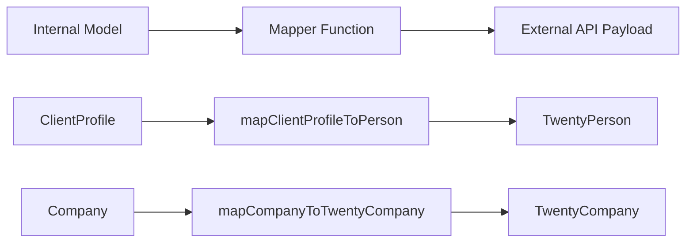

# Mapper Patterns

The template uses pure mapper functions to transform data between internal models and external API payloads. Mappers are side-effect-free, null-safe, and validate required fields before transformation.

## Architecture Overview



## Source Files

| File | Purpose |
|------|---------|
| `lib/mappers/twenty-crm.mapper.ts` | Maps local entities to Twenty CRM API payloads |

## Design Principles

The mapper module follows strict functional programming conventions:

1. **Pure functions** -- no side effects, no mutations, no database calls
2. **Null-safe** -- all optional fields use explicit null/undefined checks
3. **Validation before mapping** -- required fields are validated with descriptive errors
4. **External ID enforcement** -- every mapped entity must have a valid `external_id`

## External ID Validation

Every entity mapped to an external system requires a valid identifier:

```typescript
export function ensureExternalId(id: string | undefined | null, entityType: string): string {
  if (!id || id.trim() === '') {
    throw new Error(`${entityType} ID is required for external_id mapping`);
  }
  return id.trim();
}
```

This function is called at the start of every mapper to guarantee the `external_id` field is never empty.

## Location Extraction

A utility function parses city names from free-text location strings:

```typescript
export function extractCityFromLocation(location: string | undefined | null): string | null {
  if (!location || location.trim() === '') return null;
  const parts = location.split(',');
  const city = parts[0]?.trim();
  return city || null;
}
```

Handles formats like `"San Francisco"`, `"San Francisco, CA"`, and `"San Francisco, CA, USA"`.

## ClientProfile to Twenty CRM Person

Maps internal `ClientProfile` records to the Twenty CRM `TwentyPerson` payload:

```typescript
export function mapClientProfileToPerson(clientProfile: ClientProfile): TwentyPerson {
  const external_id = ensureExternalId(clientProfile.id, 'ClientProfile');

  const person: TwentyPerson = {
    external_id,
    name: clientProfile.name,
    email: clientProfile.email,
  };

  // Optional field mapping (null-safe)
  if (clientProfile.phone)     person.phone = clientProfile.phone;
  if (clientProfile.jobTitle)  person.job_title = clientProfile.jobTitle;
  if (clientProfile.company)   person.company_name = clientProfile.company;
  if (clientProfile.website)   person.website = clientProfile.website;

  const city = extractCityFromLocation(clientProfile.location);
  if (city) person.city = city;

  // Custom fields
  if (clientProfile.accountType) person.account_type = clientProfile.accountType;
  if (clientProfile.plan)        person.plan = clientProfile.plan;
  if (clientProfile.totalSubmissions !== null && clientProfile.totalSubmissions !== undefined) {
    person.total_submissions = clientProfile.totalSubmissions;
  }

  return person;
}
```

### Field Mapping Table

| ClientProfile Field | TwentyPerson Field | Required | Notes |
|--------------------|--------------------|----------|-------|
| `id` | `external_id` | Yes | Validated and trimmed |
| `name` | `name` | Yes | Direct mapping |
| `email` | `email` | Yes | Direct mapping |
| `phone` | `phone` | No | Only if present |
| `jobTitle` | `job_title` | No | camelCase to snake_case |
| `company` | `company_name` | No | Renamed field |
| `website` | `website` | No | Direct mapping |
| `location` | `city` | No | Extracted via `extractCityFromLocation` |
| `accountType` | `account_type` | No | Custom field |
| `plan` | `plan` | No | Custom field |
| `totalSubmissions` | `total_submissions` | No | Explicit null check required |

## Company to Twenty CRM Company

Maps internal `Company` entities to the Twenty CRM `TwentyCompany` payload:

```typescript
export function mapCompanyToTwentyCompany(company: Company): TwentyCompany {
  const external_id = ensureExternalId(company.id, 'Company');

  const twentyCompany: TwentyCompany = {
    external_id,
    name: company.name,
  };

  if (company.domain)  twentyCompany.domain_name = company.domain;
  if (company.website) twentyCompany.website = company.website;
  if (company.status)  twentyCompany.status = company.status;

  return twentyCompany;
}
```

### Field Mapping Table

| Company Field | TwentyCompany Field | Required | Notes |
|--------------|---------------------|----------|-------|
| `id` | `external_id` | Yes | Validated and trimmed |
| `name` | `name` | Yes | Direct mapping |
| `domain` | `domain_name` | No | Renamed field |
| `website` | `website` | No | Direct mapping |
| `status` | `status` | No | `'active'` or `'inactive'` |

## Adding New Mappers

When creating mappers for new integrations, follow the established patterns:

```typescript
// 1. Always validate external_id first
const external_id = ensureExternalId(entity.id, 'EntityName');

// 2. Build the required fields object
const payload: ExternalType = {
  external_id,
  // ... required fields
};

// 3. Conditionally add optional fields (null-safe)
if (entity.optionalField) {
  payload.optional_field = entity.optionalField;
}

// 4. Return the payload -- never mutate the input
return payload;
```

## Testing Considerations

Since mappers are pure functions, they are straightforward to unit test:

- Test with all optional fields populated
- Test with all optional fields as `null` or `undefined`
- Test that missing required IDs throw descriptive errors
- Test location extraction with various string formats
- Verify that the input object is never mutated
