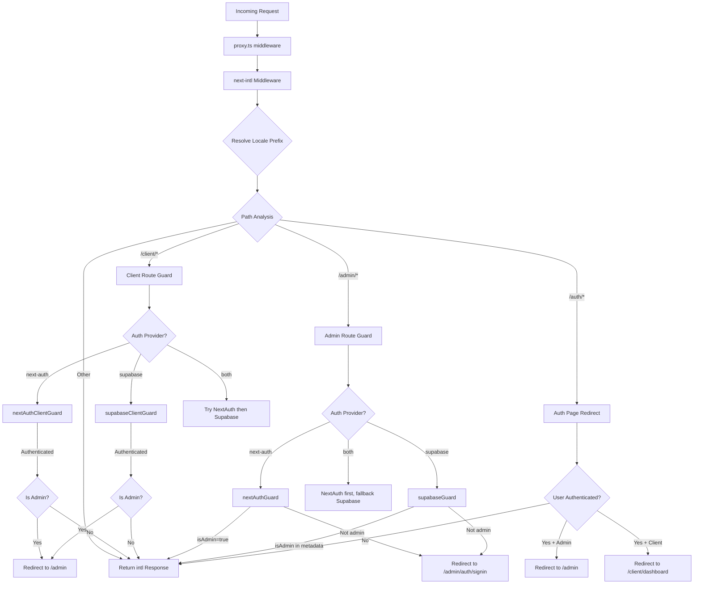

# Middleware Chain & Request Processing

## Overview

The Ever Works Template uses a **unified middleware** architecture defined in `proxy.ts` at the project root. This middleware orchestrates three critical concerns for every incoming request:

1. **Internationalization** -- locale detection, prefix insertion, and routing via `next-intl`
2. **Authentication guards** -- protecting `/admin/*` and `/client/*` routes using NextAuth, Supabase, or both
3. **Role-based redirection** -- sending authenticated users away from public auth pages, and redirecting admins/clients to their respective dashboards

The design supports a **pluggable auth provider** model: the middleware reads the current `AuthProviderType` (`'next-auth'`, `'supabase'`, or `'both'`) from the centralized auth configuration and selects the appropriate guard functions accordingly.

## Architecture Diagram



## Source Files

| File | Purpose |
|------|---------|
| `template/proxy.ts` | Main middleware entry point |
| `template/lib/auth/config.ts` | Auth provider configuration (`getAuthConfig()`) |
| `template/lib/auth/supabase/middleware.ts` | Supabase session refresh helper |
| `template/lib/auth/validate-callback-url.ts` | Safe callback URL construction |
| `template/i18n/routing.ts` | Locale routing configuration |

## Request Processing Order

### Step 1: Internationalization

Every request first passes through the `next-intl` middleware created with `createIntlMiddleware(routing)`:

```typescript
import createIntlMiddleware from 'next-intl/middleware';
import { routing } from './i18n/routing';

const intl = createIntlMiddleware(routing);
```

This handles locale detection via the `Accept-Language` header, cookie preferences, and URL prefix. The routing configuration uses `localePrefix: "as-needed"`, meaning the default locale (`en`) does not require a URL prefix.

### Step 2: Locale Resolution

The `resolveLocalePrefix` helper extracts locale information from the pathname:

```typescript
function resolveLocalePrefix(pathname: string): {
    prefix: string;       // e.g., "/fr" or ""
    hasLocale: boolean;
    locale?: string;
    pathWithoutLocale: string;  // e.g., "/admin/items"
}
```

This is critical because all subsequent path matching (e.g., checking for `/admin` or `/client`) must operate on the path **without** the locale prefix.

### Step 3: Route-Based Guard Selection

The middleware evaluates the `pathWithoutLocale` to determine which guard chain to apply:

| Path Pattern | Guard Applied | Purpose |
|-------------|--------------|---------|
| `/client` or `/client/*` | Client auth guard | Requires authentication; redirects admins to `/admin` |
| `/admin/*` (except `/admin/auth/signin`) | Admin auth guard | Requires authentication + `isAdmin` flag |
| `/auth/*` | Auth page redirect | Redirects authenticated users away from signin/register |
| Everything else | No guard | Passes through with i18n response |

### Step 4: Authentication Verification

#### NextAuth Guard (JWT-based)

```typescript
const token = await getToken({ req, secret: process.env.AUTH_SECRET });
if (token?.isAdmin === true) {
    return baseRes; // Admin access granted
}
```

NextAuth guards use `getToken()` from `next-auth/jwt` to read the JWT token from cookies. This is Edge Runtime compatible and does not require a database lookup.

#### Supabase Guard

```typescript
const supRes = await supabaseUpdate(req);
// Merge cookies...
const { data: { user } } = await supabase.auth.getUser();
const isAdmin = user?.user_metadata?.isAdmin === true
    || user?.user_metadata?.role === 'admin';
```

The Supabase guard first refreshes the session using `updateSession()`, then checks user metadata for admin flags.

### Step 5: Cookie Propagation

A critical implementation detail: when a guard produces a redirect response, all cookies from the `intlResponse` must be propagated:

```typescript
const redirectRes = NextResponse.redirect(url);
baseRes.cookies.getAll().forEach((c) => redirectRes.cookies.set(c));
return redirectRes;
```

This ensures locale preferences and auth session cookies survive redirects.

## Configuration

### Auth Provider Selection

The auth provider is determined by `getAuthConfig()` in `lib/auth/config.ts`:

```typescript
export type AuthProviderType = 'supabase' | 'next-auth' | 'both';

export function getAuthConfig(): AuthConfig {
    // Priority 1: Global override via configureAuth()
    // Priority 2: Environment-based (detects Supabase env vars)
    // Priority 3: Default ('next-auth')
}
```

### Middleware Matcher

```typescript
export const config = {
    matcher: ['/((?!api|trpc|_next|_vercel|.*\\..*).*)']
};
```

This regex excludes:
- `/api/*` routes (handled by Next.js API layer)
- `/trpc/*` routes
- `/_next/*` (Next.js internals)
- `/_vercel/*` (Vercel internals)
- Any path with a file extension (static assets)

### Callback URL Security

The middleware uses `createSafeCallbackUrl()` to prevent open redirect attacks:

```typescript
export function createSafeCallbackUrl(pathname: string, search?: string): string {
    // Limits URL length to 2048 characters
    // Validates relative-only paths
}

export function isValidCallbackUrl(url: string | null): boolean {
    return url?.startsWith('/') && !url.startsWith('//');
}
```

## Dual-Provider Mode ("both")

When `provider === 'both'`, the middleware implements a fallback chain:

1. **Client routes**: Try NextAuth first; if unauthenticated, try Supabase
2. **Admin routes**: Try NextAuth first; if it produces a redirect (denied), try Supabase
3. **Auth pages**: Check NextAuth token first, then check Supabase session

This allows organizations to migrate between auth providers without disrupting existing users.

## Key Implementation Details

### Edge Runtime Compatibility

The middleware runs in the Next.js Edge Runtime. All authentication checks use Edge-compatible APIs:
- NextAuth: `getToken()` (JWT-based, no DB needed)
- Supabase: `createServerClient()` with cookie-based session

### Development vs. Production Logging

Debug logging is gated behind `NODE_ENV === 'development'`:

```typescript
if (process.env.NODE_ENV === 'development') {
    console.log('[Middleware] Admin access granted via token');
}
```

### Supabase Session Refresh

The Supabase middleware helper (`updateSession`) is called before every auth check to ensure tokens are refreshed:

```typescript
export async function updateSession(request: NextRequest) {
    const supabase = createServerClient(url, anonKey, {
        cookies: { getAll, setAll }
    });
    // IMPORTANT: DO NOT REMOVE auth.getUser()
    await supabase.auth.getUser();
    return supabaseResponse;
}
```

The comment in the source code emphasizes that `auth.getUser()` must not be removed -- it triggers the token refresh cycle that prevents random logouts.
