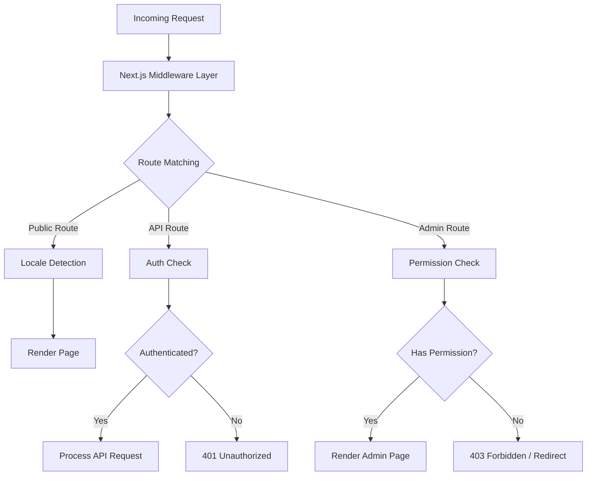
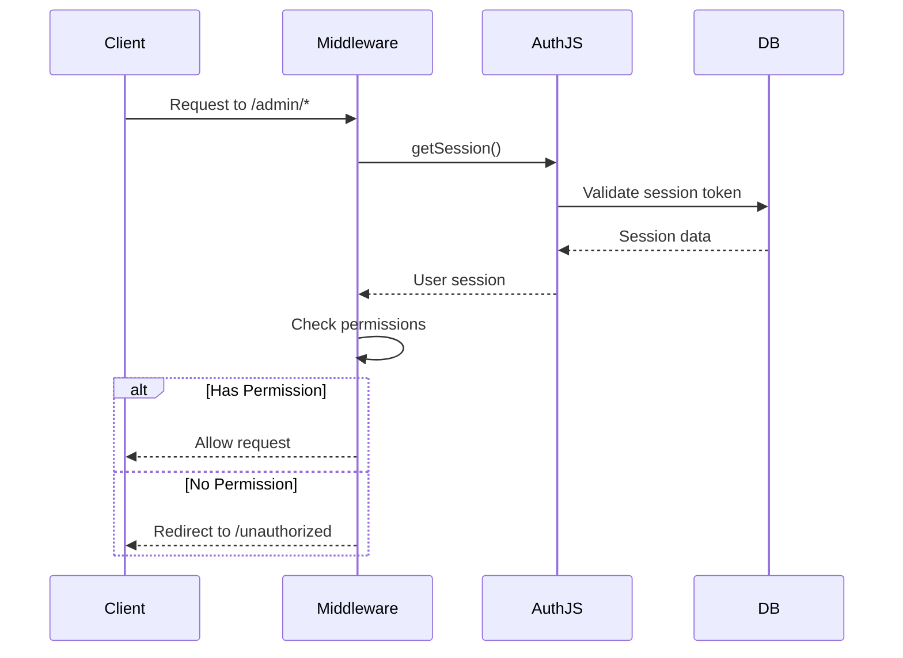
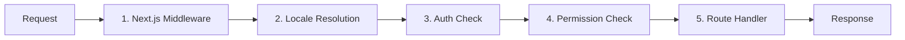

# Middleware Deep Dive

The Ever Works Template uses a layered middleware architecture built on Next.js App Router conventions and custom permission-checking logic. This document covers the full request processing pipeline, permission checks, authentication middleware, locale handling, and middleware ordering.

## Architecture Overview



## Permission Check Middleware

The permission check system lives in `lib/middleware/permission-check.ts` and provides granular access control for API routes and admin pages.

### Core Interface

```typescript
interface UserPermissions {
  userId: string;
  roles: string[];
  permissions: Permission[];
}
```

### Permission Check Functions

| Function | Purpose | Returns |
|---|---|---|
| `hasPermission(user, permission)` | Check single permission | `boolean` |
| `hasAnyPermission(user, permissions)` | Check if user has at least one | `boolean` |
| `hasAllPermissions(user, permissions)` | Check if user has all listed | `boolean` |
| `hasResourcePermission(user, resource, action)` | Check `resource:action` format | `boolean` |
| `getResourcePermissions(user, resource)` | Get all permissions for a resource | `Permission[]` |
| `canManageResource(user, resource)` | Check create/update/delete access | `boolean` |
| `isSuperAdmin(user)` | Check for super-admin role or all permissions | `boolean` |

### Usage in API Routes

```typescript
import { hasPermission, hasAnyPermission } from '@/lib/middleware/permission-check';

export async function GET(request: Request) {
  const userPermissions = await getUserPermissions(session);

  // Single permission check
  if (!hasPermission(userPermissions, 'items:read')) {
    return new Response('Forbidden', { status: 403 });
  }

  // Multiple permission check (any)
  if (!hasAnyPermission(userPermissions, ['items:review', 'items:approve'])) {
    return new Response('Forbidden', { status: 403 });
  }
}
```

### Resource-Level Checks

```typescript
// Check specific resource and action
const canEdit = hasResourcePermission(userPermissions, 'items', 'update');

// Get all permissions for a resource
const itemPerms = getResourcePermissions(userPermissions, 'items');
// Returns: ['items:read', 'items:create', 'items:update']

// Check management capability (create, update, or delete)
const canManage = canManageResource(userPermissions, 'categories');
```

### Specialized Permission Helpers

The middleware provides domain-specific helpers that combine multiple permission checks:

```typescript
// Can the user review, approve, or reject items?
const canReview = canReviewItems(userPermissions);

// Can the user manage users (read, create, update, delete, assignRoles)?
const canAdmin = canManageUsers(userPermissions);

// Can the user view analytics data?
const canView = canViewAnalytics(userPermissions);

// Is the user a super admin?
const isAdmin = isSuperAdmin(userPermissions);
```

### Super Admin Detection

The `isSuperAdmin` function uses a two-tier approach:

1. **Role check** (primary): Checks if user has the `super-admin` role
2. **Permission check** (fallback): Verifies user has every system permission

```typescript
function isSuperAdmin(userPermissions: UserPermissions): boolean {
  // Fast path: check role
  if (userPermissions.roles.includes('super-admin')) {
    return true;
  }
  // Exhaustive check: verify all permissions
  return hasAllPermissions(userPermissions, allSystemPermissions);
}
```

## Authentication Middleware

Authentication is handled through NextAuth.js (Auth.js v5) configured in `auth.config.ts`. The middleware runs on every request to protected routes.

### Provider Configuration

The auth config dynamically configures OAuth providers with graceful fallback:

| Provider | Configuration Source |
|---|---|
| Google | `authConfig.google.clientId/clientSecret` |
| GitHub | `authConfig.github.clientId/clientSecret` |
| Facebook | `authConfig.facebook.clientId/clientSecret` |
| Twitter/X | `authConfig.twitter.clientId/clientSecret` |
| Credentials | Always enabled |

If OAuth configuration fails, the system falls back to credentials-only authentication.

### Auth Session Flow



## Locale Middleware

The template supports 20+ locales through `next-intl` middleware integration. Locale detection follows the "as-needed" prefix pattern:

- Default locale (`en`): No URL prefix -- `/items/my-app`
- Other locales: Locale prefix -- `/fr/items/my-app`

### Supported Locales

| Locale | Language | Locale | Language |
|---|---|---|---|
| `en` | English (default) | `ja` | Japanese |
| `fr` | French | `ko` | Korean |
| `es` | Spanish | `nl` | Dutch |
| `de` | German | `pl` | Polish |
| `zh` | Chinese | `tr` | Turkish |
| `ar` | Arabic | `vi` | Vietnamese |
| `he` | Hebrew | `th` | Thai |
| `ru` | Russian | `hi` | Hindi |
| `uk` | Ukrainian | `id` | Indonesian |
| `pt` | Portuguese | `bg` | Bulgarian |
| `it` | Italian | | |

## Request Processing Pipeline

The complete request processing pipeline follows this order:



### Pipeline Steps

1. **Next.js Middleware** (`middleware.ts`): Runs on every request matching the configured matchers. Handles redirects, rewrites, and header injection.

2. **Locale Resolution**: Detects the user's preferred locale from the URL path, `Accept-Language` header, or cookie. Sets the locale for the request context.

3. **Auth Check**: For protected routes (`/admin/*`, `/dashboard/*`, `/api/admin/*`), validates the user's session token.

4. **Permission Check**: After authentication, verifies the user has the required permissions for the specific resource and action.

5. **Route Handler**: The actual page component or API route handler processes the request.

### Middleware Ordering Guarantees

The system enforces strict ordering:

- Locale detection always runs first (needed for error pages)
- Auth checks run before permission checks (need a user to check permissions)
- Permission checks are the final gate before route handlers
- API routes use function-level permission checks (not middleware-level)

## Permission Validation Utilities

The middleware includes validation helpers for working with permission strings:

```typescript
// Validate a permission string
validatePermission('items:read');     // true
validatePermission('invalid:perm');   // false

// Parse a permission into parts
parsePermission('items:update');
// Returns: { resource: 'items', action: 'update' }

// Get summary grouped by resource
getPermissionSummary(userPermissions);
// Returns: { items: ['read', 'create'], categories: ['read'] }
```

## Error Handling

The middleware system handles errors at each layer:

| Layer | Error | Response |
|---|---|---|
| Locale | Invalid locale | Redirect to default locale |
| Auth | No session | 401 or redirect to login |
| Auth | Expired session | 401 with refresh hint |
| Permission | Missing permission | 403 Forbidden |
| Permission | Invalid permission string | Warning logged, access denied |

## Best Practices

1. **Use the most specific check** -- prefer `hasPermission` with a single permission over `isSuperAdmin` for regular feature gating.

2. **Check permissions in API routes** -- do not rely solely on middleware; always validate in the route handler for defense in depth.

3. **Use dynamic imports** in middleware to avoid bundling server-only modules into the edge runtime.

4. **Keep permission checks fast** -- the `O(1)` permission set lookup ensures minimal overhead per request.

5. **Log permission failures** -- use structured logging with the user ID and attempted permission for security auditing.
