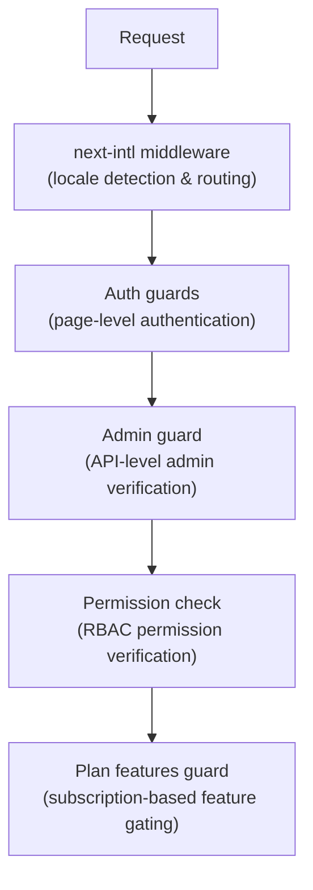

# Middleware & Guards

The Ever Works template uses a layered protection system consisting of Next.js middleware for routing, authentication guards for page and API protection, permission checks for RBAC, and plan-based feature guards for subscription gating.

## Middleware Layers



## Locale Middleware (next-intl)

The root middleware handles internationalization routing via `next-intl`. It is configured through `i18n/routing.ts` and `i18n/request.ts`.

Responsibilities:
- Detect user locale from URL path, cookies, or `Accept-Language` header
- Redirect requests without a locale prefix to the appropriate locale
- Default to English (`en`) when no preference is detected
- Support 6 locales: `en`, `fr`, `es`, `de`, `ar`, `zh`

## Authentication Guards

### Page-Level Guards (`lib/auth/guards.ts`)

The guards module provides server-side authentication checks for pages. These are called at the top of server components to protect page access.

**`requireAuth()`** -- Requires user to be authenticated:

```typescript
import { requireAuth } from '@/lib/auth/guards';

export default async function ProtectedPage() {
  const session = await requireAuth();
  // session.user is guaranteed to exist here
  return <div>Welcome {session.user.email}</div>;
}
```

If the user is not authenticated, they are redirected to `/auth/signin`.

**`requireAdmin()`** -- Requires user to be authenticated AND have admin role:

```typescript
import { requireAdmin } from '@/lib/auth/guards';

export default async function AdminPage() {
  const session = await requireAdmin();
  return <div>Admin: {session.user.email}</div>;
}
```

If the user is not authenticated, they are redirected to `/admin/auth/signin`. If authenticated but not admin, they are redirected to `/unauthorized`.

**`getSession()`** -- Gets session without redirecting:

```typescript
const session = await getSession();
if (session) {
  // Authenticated
} else {
  // Guest
}
```

**`checkIsAdmin()`** -- Checks admin status without redirecting:

```typescript
const isAdmin = await checkIsAdmin();
// Returns true or false
```

### Validated Actions (`lib/auth/guards.ts`)

The guards module also provides validated action wrappers for Next.js Server Actions:

**`validatedAction(schema, action)`** -- Validates form data against a Zod schema:

```typescript
export const myAction = validatedAction(mySchema, async (data, formData) => {
  // data is validated and typed
});
```

**`validatedActionWithUser(schema, action)`** -- Validates and requires authentication:

```typescript
export const myAction = validatedActionWithUser(mySchema, async (data, formData, user) => {
  // data is validated, user is authenticated
});
```

## Admin Guard (`lib/auth/admin-guard.ts`)

The admin guard provides API route protection specifically for admin endpoints.

**`checkAdminAuth()`** -- Middleware function for API routes:

```typescript
import { checkAdminAuth } from '@/lib/auth/admin-guard';

export async function GET(request: NextRequest) {
  const authError = await checkAdminAuth();
  if (authError) return authError;

  // User is verified admin, proceed with handler
}
```

Returns `null` if authorized, or a `NextResponse` with the appropriate error status (401 or 403).

**`withAdminAuth(handler)`** -- Higher-order function wrapper:

```typescript
import { withAdminAuth } from '@/lib/auth/admin-guard';

export const GET = withAdminAuth(async (request) => {
  // Already verified as admin
  return NextResponse.json({ data: 'admin only' });
});
```

The admin guard verifies both authentication (session exists) and authorization (user has admin role in the database via `isAdmin()` check).

## Permission Check System (`lib/middleware/permission-check.ts`)

The permission system implements Role-Based Access Control (RBAC) with granular permissions.

### Permission Structure

Permissions follow a `resource:action` format:

```typescript
// Examples of permission keys
'items:read'
'items:create'
'items:update'
'items:delete'
'items:review'
'items:approve'
'items:reject'
'categories:read'
'categories:create'
'users:assignRoles'
'analytics:read'
'system:settings'
```

### Permission Check Functions

```typescript
import {
  hasPermission,
  hasAnyPermission,
  hasAllPermissions,
  hasResourcePermission,
  canManageResource,
  canReviewItems,
  canManageUsers,
  canManageRoles,
  canViewAnalytics,
  isSuperAdmin,
} from '@/lib/middleware/permission-check';

// Single permission check
hasPermission(userPermissions, 'items:create');

// Any of multiple permissions
hasAnyPermission(userPermissions, ['items:create', 'items:update']);

// All permissions required
hasAllPermissions(userPermissions, ['items:read', 'items:update']);

// Resource-level check
hasResourcePermission(userPermissions, 'items', 'create');

// Domain-specific helpers
canManageResource(userPermissions, 'categories'); // create, update, or delete
canReviewItems(userPermissions);                  // review, approve, or reject
canManageUsers(userPermissions);                  // user CRUD + assignRoles
isSuperAdmin(userPermissions);                    // all system permissions
```

### Super Admin Detection

The `isSuperAdmin()` function checks two conditions:
1. Whether the user has the `super-admin` role (preferred)
2. As fallback, whether the user has ALL system permissions

### Permission Validation

```typescript
// Validate a permission string is defined in the system
validatePermission('items:create'); // true
validatePermission('invalid:perm'); // false

// Parse permission into resource and action
parsePermission('items:create'); // { resource: 'items', action: 'create' }
```

## Plan Features Guard (`lib/guards/plan-features.guard.ts`)

The plan features guard controls feature access based on subscription plans (Free, Standard, Premium).

### Plan Hierarchy

```typescript
const PLAN_LEVELS = {
  free: 1,
  standard: 2,
  premium: 3,
};
```

### Feature Access Matrix

Each feature is mapped to the plans that can access it:

| Feature | Free | Standard | Premium |
|---------|------|----------|---------|
| Submit Product | Yes | Yes | Yes |
| Upload Images | Yes | Yes | Yes |
| Email Support | Yes | Yes | Yes |
| Extended Description | - | Yes | Yes |
| Verified Badge | - | Yes | Yes |
| Priority Review | - | Yes | Yes |
| View Statistics | - | Yes | Yes |
| Upload Video | - | - | Yes |
| Sponsored Badge | - | - | Yes |
| Homepage Featured | - | - | Yes |
| Advanced Analytics | - | - | Yes |
| Unlimited Submissions | - | - | Yes |

### Plan Limits

Each plan has numeric limits for certain features:

| Limit | Free | Standard | Premium |
|-------|------|----------|---------|
| Max Images | 1 | 5 | Unlimited |
| Max Description Words | 200 | 500 | Unlimited |
| Max Submissions | 1 | 10 | Unlimited |
| Review Days | 7 | 3 | 1 |
| Free Modification Days | 0 | 30 | 365 |

### Using the Plan Guard

**Direct function calls:**

```typescript
import { canAccessFeature, getFeatureLimit, isWithinLimit } from '@/lib/guards';

canAccessFeature('upload_video', 'free');    // false
canAccessFeature('upload_video', 'premium'); // true
getFeatureLimit('max_images', 'standard');   // 5
isWithinLimit('max_submissions', 3, 'free'); // false (limit is 1)
```

**Guard factory (for multiple checks):**

```typescript
import { createPlanGuard } from '@/lib/guards';

const guard = createPlanGuard('standard');
guard.canAccess('verified_badge');     // true
guard.canAccess('upload_video');       // false
guard.getLimit('max_images');          // 5
guard.requireFeature('upload_video');  // throws PlanGuardError
```

**React hook integration:**

```typescript
import { createPlanGuardResult } from '@/lib/guards';

// In a hook or component
const guardResult = createPlanGuardResult(userPlan);
guardResult.canAccess('verified_badge');
guardResult.accessibleFeatures; // array of all accessible features
```

The `PlanGuardError` thrown by `requireFeature()` includes the feature name, user's current plan, and the required plan, enabling informative upgrade prompts in the UI.
