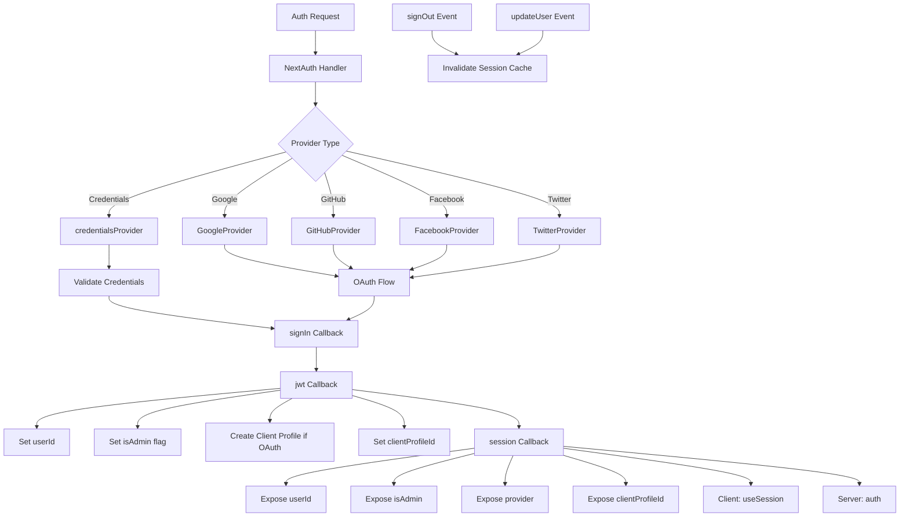

# NextAuth Configuration

## Overview

The Ever Works Template configures NextAuth.js (Auth.js v5) with JWT-based sessions, a Drizzle ORM adapter, multiple OAuth providers (Google, GitHub, Facebook, Twitter), credentials-based authentication, and custom callbacks for admin/client role management. The system supports automatic client profile creation for OAuth users and session caching with cache invalidation.

## Architecture



## Source Files

| File | Purpose |
|------|---------|
| `template/lib/auth/index.ts` | Main NextAuth configuration and exports |
| `template/auth.config.ts` | Provider configuration (Edge-compatible) |
| `template/lib/auth/config.ts` | Auth provider type selection |
| `template/lib/auth/providers.ts` | OAuth provider factory functions |
| `template/lib/auth/credentials.ts` | Credentials provider implementation |
| `template/lib/auth/guards.ts` | Server-side auth guard utilities |
| `template/lib/auth/middleware.ts` | Validated action wrappers |
| `template/lib/auth/setup.ts` | Auth initialization helper |
| `template/lib/auth/cached-session.ts` | Session cache management |
| `template/lib/auth/session-cache.ts` | Session cache implementation |
| `template/lib/auth/admin-guard.ts` | Admin-specific guard logic |

## NextAuth Initialization

```typescript
// lib/auth/index.ts
export const { handlers, auth, signIn, signOut, unstable_update } = NextAuth({
    adapter: drizzle,
    session: {
        strategy: 'jwt',
        maxAge: 30 * 24 * 60 * 60,    // 30 days
        updateAge: 24 * 60 * 60        // Refresh every 24 hours
    },
    jwt: {
        maxAge: 30 * 24 * 60 * 60      // 30 days
    },
    callbacks: { authorized, redirect, signIn, jwt, session },
    events: { signOut, updateUser },
    pages: {
        signIn: '/auth/signin',
        signOut: '/auth/signout',
        error: '/auth/error',
        verifyRequest: '/auth/verify-request',
        newUser: '/auth/register'
    },
    ...authConfig  // Merges providers from auth.config.ts
});
```

### Session Strategy

The template uses **JWT sessions** (`strategy: 'jwt'`), not database sessions. This means:
- Sessions are stored in encrypted cookies, not in the database
- No database query is needed to validate a session
- Compatible with Edge Runtime (middleware)
- Session data is limited to what fits in a JWT token

## Database Adapter

```typescript
const isDatabaseAvailable = !!coreConfig.DATABASE_URL && typeof db !== 'undefined';

const drizzle = isDatabaseAvailable
    ? DrizzleAdapter(getDrizzleInstance(), {
        usersTable: users,
        accountsTable: accounts,
        sessionsTable: sessions,
        verificationTokensTable: verificationTokens
    })
    : undefined;
```

The adapter is conditionally created based on database availability. This allows the template to start even without a database (e.g., during initial setup), though authentication will be limited.

## Provider Configuration

### auth.config.ts (Edge-Compatible)

```typescript
// auth.config.ts
const configureProviders = () => {
    try {
        const oauthProviders = configureOAuthProviders();
        return createNextAuthProviders({
            google: oauthProviders.find((p) => p.id === 'google')
                ? { enabled: true, clientId: '...', clientSecret: '...' }
                : { enabled: false },
            github: { /* ... */ },
            facebook: { /* ... */ },
            twitter: { /* ... */ },
            credentials: { enabled: true },
        });
    } catch (error) {
        // Fallback to credentials only
        return createNextAuthProviders({
            credentials: { enabled: true },
            google: { enabled: false },
            github: { enabled: false },
            facebook: { enabled: false },
            twitter: { enabled: false },
        });
    }
};

export default {
    trustHost: true,
    providers: configureProviders(),
} satisfies NextAuthConfig;
```

### Provider Factory

```typescript
// lib/auth/providers.ts
export function createNextAuthProviders(config: OAuthProvidersConfig) {
    const providers = [];

    if (config.google?.enabled && config.google.clientId && config.google.clientSecret) {
        providers.push(GoogleProvider({
            clientId: config.google.clientId,
            clientSecret: config.google.clientSecret,
            ...config.google.options,
        }));
    }
    // GitHub, Facebook, Twitter follow the same pattern...

    if (config.credentials?.enabled) {
        providers.push(credentialsProvider);
    }

    return providers;
}
```

Providers are only added when they have valid credentials, preventing configuration errors at startup.

## Callbacks

### signIn Callback

```typescript
signIn: async ({ user, account, profile }) => {
    const isCredentials = account?.provider === 'credentials';

    if (!user?.email) {
        return !isCredentials; // Allow OAuth without email
    }

    if (!isDatabaseAvailable) {
        return !isCredentials; // Skip DB validation if no DB
    }

    // For OAuth providers, allow account linking
    if (!isCredentials && account?.provider) {
        return true;
    }

    return true;
}
```

### jwt Callback

The JWT callback is the core of the authentication pipeline. It runs on every request and manages:

```typescript
jwt: async ({ token, user, account }) => {
    // 1. Set userId from user object or token.sub
    if (user?.id) token.userId = user.id;
    if (!token.userId && token.sub) token.userId = token.sub;

    // 2. Set clientProfileId
    if (user?.clientProfileId) token.clientProfileId = user.clientProfileId;

    // 3. Record provider
    if (account?.provider) token.provider = account.provider;

    // 4. Auto-create client profile for OAuth users
    if (isOAuthProvider && !token.clientProfileId && token.userId) {
        let clientProfile = await getClientProfileByUserId(token.userId);
        if (!clientProfile) {
            clientProfile = await createClientProfile({
                userId: token.userId,
                email: token.email,
                name: token.name || token.email?.split('@')[0],
            });
        }
        token.clientProfileId = clientProfile?.id;
    }

    // 5. Set isAdmin flag
    if (user?.isClient !== undefined) {
        token.isAdmin = !user.isClient;
    } else if (user?.isAdmin !== undefined) {
        token.isAdmin = user.isAdmin;
    } else if (token.isAdmin === undefined) {
        token.isAdmin = false; // Default: non-admin
    }

    return token;
}
```

### session Callback

Maps JWT token fields to the session object exposed to client components:

```typescript
session: async ({ session, token }) => {
    if (token && session.user) {
        session.user.id = token.userId;
        session.user.clientProfileId = token.clientProfileId;
        session.user.provider = token.provider || 'credentials';
        session.user.isAdmin = token.isAdmin;
    }
    return session;
}
```

## Events

### Session Cache Invalidation

```typescript
events: {
    signOut: async (event) => {
        const token = 'token' in event ? event.token : undefined;
        if (token?.userId) {
            await invalidateSessionCache(undefined, token.userId);
        }
    },
    updateUser: async ({ user }) => {
        if (user?.id) {
            await invalidateSessionCache(undefined, user.id);
        }
    }
}
```

Both `signOut` and `updateUser` events trigger session cache invalidation, ensuring stale session data is not served after auth state changes.

## Server-Side Guards

### requireAuth

```typescript
export async function requireAuth() {
    const session = await auth();
    if (!session?.user) {
        redirect('/auth/signin');
    }
    return session;
}
```

### requireAdmin

```typescript
export async function requireAdmin() {
    const session = await auth();
    if (!session?.user) {
        redirect('/admin/auth/signin');
    }
    if (!session.user.isAdmin) {
        redirect('/unauthorized');
    }
    return session;
}
```

### Utility Guards

```typescript
// Check without redirecting
export async function getSession() {
    return await auth();
}

export async function checkIsAdmin() {
    const session = await auth();
    return session?.user?.isAdmin === true;
}
```

## Custom Pages

| Page | Path | Purpose |
|------|------|---------|
| Sign In | `/auth/signin` | Login form |
| Sign Out | `/auth/signout` | Logout confirmation |
| Error | `/auth/error` | Auth error display |
| Verify Request | `/auth/verify-request` | Email verification prompt |
| Register | `/auth/register` | New user registration |

## Environment Variables

| Variable | Required | Purpose |
|----------|----------|---------|
| `AUTH_SECRET` | Yes | JWT encryption secret |
| `AUTH_GOOGLE_ID` | No | Google OAuth client ID |
| `AUTH_GOOGLE_SECRET` | No | Google OAuth client secret |
| `AUTH_GITHUB_ID` | No | GitHub OAuth client ID |
| `AUTH_GITHUB_SECRET` | No | GitHub OAuth client secret |
| `AUTH_FACEBOOK_ID` | No | Facebook OAuth client ID |
| `AUTH_FACEBOOK_SECRET` | No | Facebook OAuth client secret |
| `AUTH_TWITTER_ID` | No | Twitter/X OAuth client ID |
| `AUTH_TWITTER_SECRET` | No | Twitter/X OAuth client secret |
| `DATABASE_URL` | For adapter | Database connection string |

## Best Practices

1. **Use JWT strategy** for Edge Runtime compatibility in middleware
2. **Auto-create client profiles** for OAuth users in the JWT callback
3. **Graceful degradation** -- if OAuth config fails, fall back to credentials only
4. **Invalidate cache on auth events** -- sign-out and user update both clear cached sessions
5. **Conditional adapter** -- allow startup without a database for initial configuration
6. **Guard functions** -- use `requireAuth()` / `requireAdmin()` in server components, not manual session checks
7. **Custom pages** -- override default NextAuth pages for consistent UI with the template design
