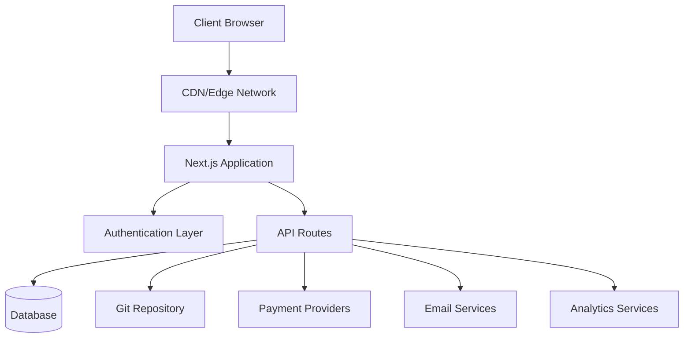
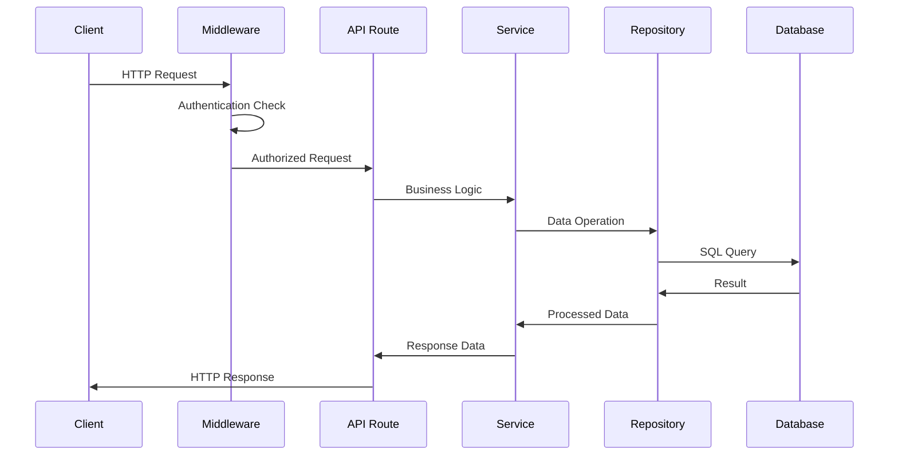
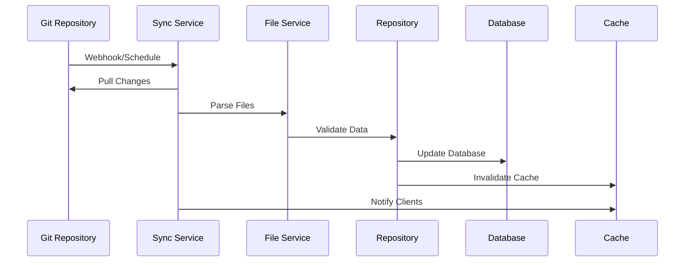
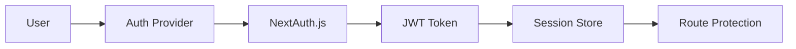

# Architecture Overview

The Ever Works follows a modern, scalable architecture designed for performance, maintainability, and developer experience.

## High-Level Architecture



## Core Principles

### 1. Separation of Concerns
- **Presentation Layer**: React components and UI logic
- **Business Layer**: Services and repositories
- **Data Layer**: Database and external APIs

### 2. Modular Design
- Feature-based organization
- Reusable components
- Plugin-like integrations

### 3. Type Safety
- TypeScript throughout
- Strict type checking
- Runtime validation with Zod

### 4. Performance First
- Server-side rendering
- Static generation where possible
- Optimized caching strategies

## Application Layers

### Frontend Layer

**Technology**: React 19 + Next.js 15
**Responsibilities**:
- User interface rendering
- Client-side state management
- User interactions
- Route handling

**Key Components**:
- Page components (`app/[locale]/`)
- Reusable UI components (`components/`)
- Custom hooks (`hooks/`)
- Context providers (`components/providers/`)

### API Layer

**Technology**: Next.js API Routes
**Responsibilities**:
- Business logic execution
- Data validation
- External service integration
- Authentication handling

**Structure**:
```
app/api/
├── auth/           # Authentication endpoints
├── admin/          # Admin-only endpoints
├── items/          # Item management
└── webhooks/       # External service webhooks
```

### Data Layer

**Technologies**: Drizzle ORM + PostgreSQL
**Responsibilities**:
- Data persistence
- Query optimization
- Transaction management
- Schema migrations

**Components**:
- Database schema (`lib/db/schema.ts`)
- Repositories (`lib/repositories/`)
- Migration files (`lib/db/migrations/`)

### Content Layer

**Technology**: Git-based CMS
**Responsibilities**:
- Content synchronization
- Version control
- Collaborative editing
- Content validation

**Structure**:
```
.content/
├── config.yml      # Site configuration
├── items/          # Item definitions
├── categories/     # Category definitions
└── tags/           # Tag definitions
```

## Design Patterns

### 1. Repository Pattern

Abstracts data access logic:

```typescript
interface ItemRepository {
  findById(id: string): Promise<Item | null>;
  findBySlug(slug: string): Promise<Item | null>;
  findWithFilters(filters: ItemFilters): Promise<Item[]>;
  create(item: CreateItemRequest): Promise<Item>;
  update(id: string, updates: UpdateItemRequest): Promise<Item>;
  delete(id: string): Promise<void>;
}
```

### 2. Service Layer Pattern

Encapsulates business logic:

```typescript
class ItemService {
  constructor(
    private itemRepository: ItemRepository,
    private gitService: GitService,
    private notificationService: NotificationService
  ) {}

  async submitItem(data: SubmitItemRequest): Promise<SubmissionResult> {
    // Business logic here
  }
}
```

### 3. Factory Pattern

Creates service instances:

```typescript
class PaymentProviderFactory {
  static create(provider: PaymentProvider): PaymentService {
    switch (provider) {
      case 'stripe':
        return new StripePaymentService();
      case 'lemonsqueezy':
        return new LemonSqueezyPaymentService();
      default:
        throw new Error(`Unsupported provider: ${provider}`);
    }
  }
}
```

### 4. Observer Pattern

Event-driven updates:

```typescript
class ContentSyncService {
  private observers: ContentObserver[] = [];

  addObserver(observer: ContentObserver): void {
    this.observers.push(observer);
  }

  notifyObservers(event: ContentEvent): void {
    this.observers.forEach(observer => observer.update(event));
  }
}
```

## Data Flow

### 1. Request Flow



### 2. Content Sync Flow



## Security Architecture

### 1. Authentication Flow



### 2. Authorization Layers

- **Route-level**: Middleware protection
- **API-level**: Endpoint guards
- **Data-level**: Row-level security
- **UI-level**: Component-based access control

### 3. Security Measures

- **Input Validation**: Zod schemas
- **SQL Injection**: Parameterized queries
- **XSS Protection**: Content sanitization
- **CSRF Protection**: Token validation
- **Rate Limiting**: Request throttling

## Caching Strategy

### 1. Application Cache

- **React Query**: Client-side data cache
- **Next.js Cache**: Page and API route cache
- **Static Generation**: Pre-built pages

### 2. Database Cache

- **Connection Pooling**: Efficient DB connections
- **Query Optimization**: Indexed queries
- **Read Replicas**: Distributed read operations

### 3. CDN Cache

- **Static Assets**: Images, CSS, JS
- **API Responses**: Cacheable endpoints
- **Edge Locations**: Global distribution

## Scalability Considerations

### 1. Horizontal Scaling

- **Stateless Design**: No server-side sessions
- **Database Scaling**: Read replicas and sharding
- **CDN Distribution**: Global edge caching

### 2. Performance Optimization

- **Code Splitting**: Dynamic imports
- **Image Optimization**: Next.js Image component
- **Bundle Optimization**: Tree shaking and minification

### 3. Monitoring & Observability

- **Error Tracking**: Sentry integration
- **Performance Monitoring**: Core Web Vitals
- **Analytics**: PostHog integration
- **Logging**: Structured logging

## Technology Decisions

### Why Next.js?
- **Full-stack framework**: API routes + frontend
- **Performance**: SSR, SSG, and ISR
- **Developer experience**: Hot reloading, TypeScript support
- **Ecosystem**: Rich plugin ecosystem

### Why Drizzle ORM?
- **Type safety**: Full TypeScript support
- **Performance**: Minimal overhead
- **Flexibility**: Raw SQL when needed
- **Migration system**: Version-controlled schema changes

### Why Git-based CMS?
- **Version control**: Full history tracking
- **Collaboration**: Pull request workflow
- **Backup**: Distributed by nature
- **Flexibility**: Any Git provider

### Why React Query?
- **Caching**: Intelligent cache management
- **Synchronization**: Background updates
- **Optimistic updates**: Better UX
- **Error handling**: Retry logic

## Extension Points

The architecture provides several extension points:

### 1. Custom Authentication Providers
```typescript
// lib/auth/providers/custom-provider.ts
export function CustomProvider(options: CustomProviderOptions) {
  return {
    id: "custom",
    name: "Custom Provider",
    type: "oauth",
    // Implementation
  }
}
```

### 3. Content Source Integration
```typescript
// lib/content/sources/custom-source.ts
export class CustomContentSource implements ContentSource {
  async sync(): Promise<SyncResult> {
    // Implementation
  }
}
```

## Next Steps

- [Explore the tech stack](./tech-stack) in detail
