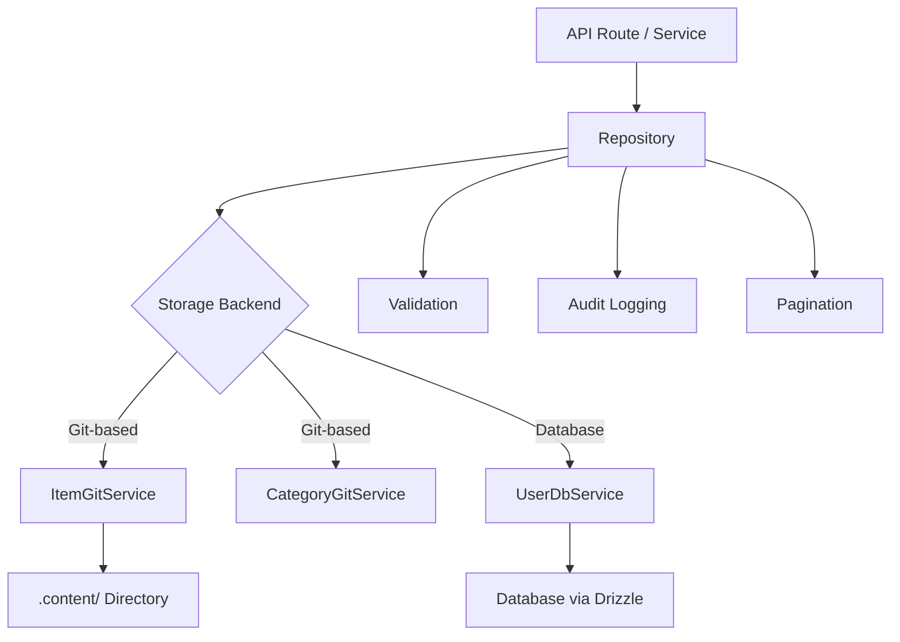

# Repository Patterns

The template implements the Repository pattern to provide a clean data access layer between business logic and data storage. Repositories encapsulate query building, validation, pagination, and audit logging while delegating actual storage to underlying services (Git-based or database-backed).

## Architecture Overview



## Source Files

| File | Purpose |
|------|---------|
| `lib/repositories/item.repository.ts` | Item CRUD with Git storage, filtering, audit |
| `lib/repositories/category.repository.ts` | Category management with Git storage |
| `lib/repositories/user.repository.ts` | User operations with database storage |
| `lib/repositories/tag.repository.ts` | Tag management |
| `lib/repositories/role.repository.ts` | Role management |
| `lib/repositories/collection.repository.ts` | Collection management |
| `lib/repositories/sponsor-ad.repository.ts` | Sponsor ad management |
| `lib/repositories/client-item.repository.ts` | Client-facing item operations |
| `lib/repositories/client-dashboard.repository.ts` | Client dashboard data |
| `lib/repositories/admin-stats.repository.ts` | Admin statistics |
| `lib/repositories/admin-analytics-optimized.repository.ts` | Optimized analytics queries |
| `lib/repositories/integration-mapping.repository.ts` | External integration mappings |
| `lib/repositories/twenty-crm-config.repository.ts` | Twenty CRM configuration |

## Common Repository Methods

All repositories follow a consistent API surface:

| Method | Description |
|--------|-------------|
| `findAll(options?)` | Retrieve all records with optional filtering |
| `findAllPaginated(page, limit, options?)` | Paginated retrieval |
| `findById(id)` | Find a single record by ID |
| `findBySlug(slug)` | Find a single record by slug |
| `create(data)` | Create a new record with validation |
| `update(id, data)` | Update an existing record with validation |
| `delete(id)` | Hard delete a record |
| `getStats()` | Get aggregate statistics |

## ItemRepository

The most comprehensive repository, demonstrating all key patterns.

### Lazy Service Initialization

The Git service is initialized lazily on first use:

```typescript
export class ItemRepository {
  private gitService: ItemGitService | null = null;

  private async getGitService(): Promise<ItemGitService> {
    if (!this.gitService) {
      const dataRepo = coreConfig.content.dataRepository;
      const token = coreConfig.content.ghToken;
      // Parse GitHub URL, create service config
      this.gitService = await createItemGitService(config);
    }
    return this.gitService;
  }
}
```

### Filtering

The `findAll` method supports multi-criteria filtering with OR logic for arrays:

```typescript
async findAll(options: ItemListOptions = {}): Promise<ItemData[]> {
  const items = await gitService.readItems(options.includeDeleted ?? false);
  let filteredItems = items;

  if (options.status)
    filteredItems = filteredItems.filter(item => item.status === options.status);

  if (options.categories?.length > 0)
    filteredItems = filteredItems.filter(item => {
      const itemCategories = Array.isArray(item.category) ? item.category : [item.category];
      return options.categories!.some(cat => itemCategories.includes(cat));
    });

  if (options.tags?.length > 0)
    filteredItems = filteredItems.filter(item =>
      options.tags!.some(tag => item.tags.includes(tag))
    );

  if (options.search) {
    const searchLower = options.search.toLowerCase();
    filteredItems = filteredItems.filter(item =>
      item.name.toLowerCase().includes(searchLower) ||
      item.description.toLowerCase().includes(searchLower)
    );
  }

  return filteredItems;
}
```

### Pagination

```typescript
async findAllPaginated(page = 1, limit = 10, options = {}): Promise<{
  items: ItemData[];
  total: number;
  page: number;
  limit: number;
  totalPages: number;
}> {
  return await gitService.getItemsPaginated(page, limit, options);
}
```

### Audit Logging

All mutating operations log to an audit trail (best-effort, non-blocking):

```typescript
async create(data: CreateItemRequest, auditUser?: AuditUser): Promise<ItemData> {
  this.validateCreateData(data);
  const item = await gitService.createItem(data);

  try {
    await itemAuditService.logCreation(item, auditUser);
  } catch (err) {
    console.warn('Audit logCreation failed:', err);
  }

  return item;
}
```

Audit events captured:

| Operation | Audit Method | Data Captured |
|-----------|-------------|---------------|
| Create | `logCreation` | New item, user |
| Update | `logUpdate` | Previous state, new state, user |
| Review | `logReview` | Item, previous status, notes, user |
| Delete | `logDeletion` | Item, user, soft/hard flag |
| Restore | `logRestoration` | Item, user |

### Batch Operations

The `batchUpdate` method optimizes multiple updates with a single Git commit:

```typescript
async batchUpdate(updates: Array<{ id: string; data: UpdateItemRequest }>): Promise<ItemData[]> {
  // Pre-validate ALL updates before writing
  for (const { id, data } of updates) {
    this.validateUpdateData(id, data);
  }

  // Write each update without committing
  for (const { id, data } of updates) {
    await gitService.updateItemWithoutCommit(id, data);
  }

  // Single commit for all changes
  await gitService.commitAndPushBatch(`Batch update ${updates.length} items`);

  // Audit logging after successful commit
  for (const entry of auditEntries) {
    await itemAuditService.logUpdate(entry.previous, entry.updated, auditUser);
  }
}
```

### Validation

Repositories perform input validation before storage operations:

```typescript
private validateCreateData(data: CreateItemRequest): void {
  if (!data.id?.trim())          throw new Error('Item ID is required');
  if (!data.name?.trim())        throw new Error('Item name is required');
  if (!data.slug?.trim())        throw new Error('Item slug is required');
  if (!data.description?.trim()) throw new Error('Item description is required');
  if (!data.source_url?.trim())  throw new Error('Item source URL is required');

  if (!/^[a-z0-9-]+$/.test(data.slug))
    throw new Error('Slug must contain only lowercase letters, numbers, and hyphens');

  try { new URL(data.source_url); }
  catch { throw new Error('Invalid source URL format'); }
}
```

### Soft Delete and Restore

```typescript
async softDelete(id: string): Promise<ItemData> {
  return await gitService.softDeleteItem(id);
}

async restore(id: string): Promise<ItemData> {
  return await gitService.restoreItem(id);
}
```

## CategoryRepository

Demonstrates singleton pattern and duplicate checking:

```typescript
export class CategoryRepository {
  // Duplicate name checking (case-insensitive, excludes self for updates)
  private async checkDuplicateName(name: string, excludeId?: string): Promise<void> {
    const categories = await gitService.readCategories();
    const duplicate = categories.find(cat =>
      cat.name.toLowerCase() === name.toLowerCase() && cat.id !== excludeId
    );
    if (duplicate) throw new Error(`Category with name "${name}" already exists`);
  }

  // Sorting
  private sortCategories(categories, options): CategoryData[] {
    return categories.sort((a, b) => {
      const comparison = a.name.localeCompare(b.name);
      return options.sortOrder === 'desc' ? -comparison : comparison;
    });
  }
}

// Singleton export
export const categoryRepository = new CategoryRepository();
```

## UserRepository

Uses database-backed storage via `UserDbService` with Zod validation:

```typescript
export class UserRepository {
  private userDbService: UserDbService;

  async create(data: CreateUserRequest): Promise<AuthUserData> {
    // Zod schema validation
    const validatedData = userValidationSchema
      .pick({ email: true, password: true })
      .parse(data);

    // Uniqueness check
    const exists = await this.userDbService.emailExists(validatedData.email);
    if (exists) throw new Error('Email already in use');

    return await this.userDbService.createUser(validatedData);
  }
}
```

## Error Handling Strategy

Repositories follow a consistent error handling pattern:

1. Re-throw known business errors (e.g., "Email already in use")
2. Log and wrap unknown errors with generic messages
3. Audit logging failures are caught and warned, never blocking the operation
