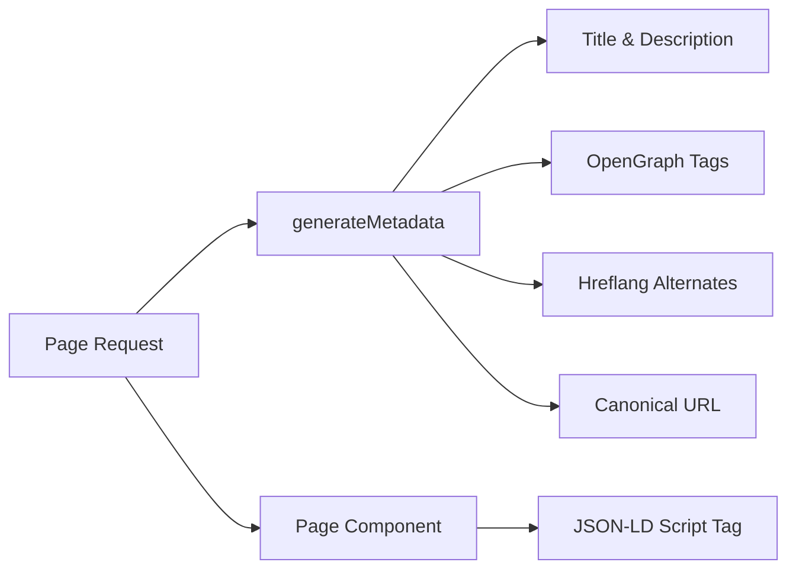

# SEO System

The Ever Works Template includes a comprehensive SEO system that generates structured data (JSON-LD), hreflang tags, OpenGraph metadata, and dynamic sitemaps. All SEO utilities live under `lib/seo/` and integrate with the Next.js Metadata API.

## Architecture Overview



### Source Files

| File | Purpose |
|---|---|
| `lib/seo/schema.ts` | JSON-LD structured data generators |
| `lib/seo/hreflang.ts` | Language alternate URL generators |
| `lib/seo/listing-metadata.ts` | Listing page metadata factory |

## JSON-LD Structured Data

The `lib/seo/schema.ts` module generates Schema.org structured data for search engine rich results.

### Product Schema

For item detail pages, generates a `Product` schema:

```typescript
import { generateProductSchema } from '@/lib/seo/schema';

const schema = generateProductSchema({
  name: 'My App',
  description: 'A productivity tool',
  image: 'https://example.com/icon.png',
  url: 'https://example.com/items/my-app',
  category: 'Productivity',
  sourceUrl: 'https://myapp.com',
  brandName: 'MyApp Inc.',
});
```

Generated output:

```json
{
  "@context": "https://schema.org",
  "@type": "Product",
  "name": "My App",
  "description": "A productivity tool",
  "image": "https://example.com/icon.png",
  "url": "https://example.com/items/my-app",
  "category": "Productivity",
  "brand": {
    "@type": "Brand",
    "name": "MyApp Inc."
  },
  "offers": {
    "@type": "Offer",
    "url": "https://myapp.com",
    "availability": "https://schema.org/InStock"
  }
}
```

### Organization Schema

Generates a site-wide `Organization` schema for Knowledge Panel visibility:

```typescript
import { generateOrganizationSchema } from '@/lib/seo/schema';

const schema = generateOrganizationSchema();
```

This schema includes:
- Brand name, URL, and logo
- Social profile links (`sameAs` array) from `siteConfig.social`
- Contact point with email (when configured)

### WebSite Schema with SearchAction

Enables the Google Sitelinks Search Box:

```typescript
import { generateWebSiteSchema } from '@/lib/seo/schema';

const schema = generateWebSiteSchema('en');
// Includes potentialAction with SearchAction targeting /?q={search_term_string}
```

The schema respects locale prefixes:
- Default locale: `https://example.com`
- Other locales: `https://example.com/fr`

### Breadcrumb Schema

Generates `BreadcrumbList` for navigation-aware search results:

```typescript
import { generateBreadcrumbSchema } from '@/lib/seo/schema';

const schema = generateBreadcrumbSchema([
  { name: 'Home', url: 'https://example.com' },
  { name: 'Productivity', url: 'https://example.com/categories/productivity' },
  { name: 'My App', url: 'https://example.com/items/my-app' },
]);
```

### Embedding in Pages

JSON-LD is embedded using a `<script>` tag in the page component:

```tsx
export default function ItemDetailPage({ item }) {
  const schema = generateProductSchema({ ... });

  return (
    <>
      <script
        type="application/ld+json"
        dangerouslySetInnerHTML={{ __html: JSON.stringify(schema) }}
      />
      <ItemDetail item={item} />
    </>
  );
}
```

## Hreflang Tags

The `lib/seo/hreflang.ts` module generates language alternate URLs for multi-locale SEO.

### URL Pattern

The template uses the "as-needed" locale prefix pattern:

| Locale | URL Pattern |
|---|---|
| `en` (default) | `https://example.com/items/my-app` |
| `fr` | `https://example.com/fr/items/my-app` |
| `es` | `https://example.com/es/items/my-app` |
| `x-default` | Same as `en` (default locale) |

### Generating Alternates

```typescript
import { generateHreflangAlternates } from '@/lib/seo/hreflang';

// For any page path
const alternates = generateHreflangAlternates('/about');
// Returns: { en: 'https://example.com/about', fr: 'https://example.com/fr/about', ... }

// Convenience functions for common page types
import { generateItemHreflangAlternates } from '@/lib/seo/hreflang';
const itemAlternates = generateItemHreflangAlternates('my-app');

import { generatePageHreflangAlternates } from '@/lib/seo/hreflang';
const pageAlternates = generatePageHreflangAlternates('about');
```

### Integration with Next.js Metadata

```typescript
export async function generateMetadata({ params }) {
  const { locale, slug } = await params;
  return {
    alternates: {
      canonical: `https://example.com/${locale}/items/${slug}`,
      languages: generateItemHreflangAlternates(slug),
    },
  };
}
```

### Supported Locale Mappings

All 20+ locales are mapped in `LOCALE_TO_HREFLANG`:

```
en -> en, fr -> fr, es -> es, de -> de, zh -> zh,
ar -> ar, he -> he, ru -> ru, uk -> uk, pt -> pt,
it -> it, ja -> ja, ko -> ko, nl -> nl, pl -> pl,
tr -> tr, vi -> vi, th -> th, hi -> hi, id -> id, bg -> bg
```

## Listing Page Metadata

The `lib/seo/listing-metadata.ts` module generates complete `Metadata` objects for listing and category pages.

### Usage

```typescript
import { generateListingMetadata } from '@/lib/seo/listing-metadata';

export async function generateMetadata({ params }) {
  const { locale } = await params;
  return generateListingMetadata({
    title: 'Time Tracking Tools',
    description: 'Browse the best time tracking tools',
    path: '/categories/time-tracking',
    locale,
    itemCount: 42,
    keywords: ['time tracking', 'productivity', 'tools'],
    imageUrl: 'https://example.com/og/time-tracking.png',
  });
}
```

### Generated Metadata Structure

The function produces a complete Next.js `Metadata` object:

| Field | Source |
|---|---|
| `title` | `{title} \| {siteName}` |
| `description` | Custom or auto-generated from title + item count |
| `keywords` | Joined keyword array |
| `openGraph.type` | `'website'` |
| `openGraph.siteName` | From `siteConfig.name` |
| `openGraph.url` | Canonical URL with locale |
| `openGraph.images` | Optional image URL |
| `twitter.card` | `'summary_large_image'` |
| `alternates.canonical` | Full canonical URL |
| `alternates.languages` | Hreflang alternates for all locales |

## OpenGraph Image Generation

Dynamic OG images are generated using Next.js `ImageResponse` at two levels:

| File | Route | Purpose |
|---|---|---|
| `app/opengraph-image.tsx` | `/opengraph-image` | Site-wide default OG image |
| `app/[locale]/items/[slug]/opengraph-image.tsx` | `/items/{slug}/opengraph-image` | Per-item dynamic OG image |

These files use the `next/og` module to render React components as images at request time, allowing dynamic text, logos, and branding.

## SEO Checklist

When adding a new page type, ensure the following SEO elements are in place:

| Element | Implementation |
|---|---|
| Page title | `generateMetadata` with descriptive title |
| Meta description | Custom description or auto-generated |
| Canonical URL | Set in `alternates.canonical` |
| Hreflang tags | Use `generateHreflangAlternates` |
| OpenGraph tags | Included via `generateListingMetadata` or manually |
| Twitter card | Set `twitter.card` to `summary_large_image` |
| JSON-LD | Add schema via `<script type="application/ld+json">` |
| Breadcrumbs | Use `generateBreadcrumbSchema` for nested pages |

## Best Practices

1. **Always set canonical URLs** -- prevents duplicate content issues across locales.
2. **Include hreflang for all locales** -- even if content is not yet translated, the URL structure helps search engines.
3. **Use descriptive, unique titles** -- avoid generic titles like "Home" without the site name.
4. **Keep descriptions under 160 characters** -- longer descriptions get truncated in search results.
5. **Test structured data** with the Google Rich Results Test tool before deploying.
6. **Generate OG images dynamically** -- static fallback images miss item-specific branding opportunities.
