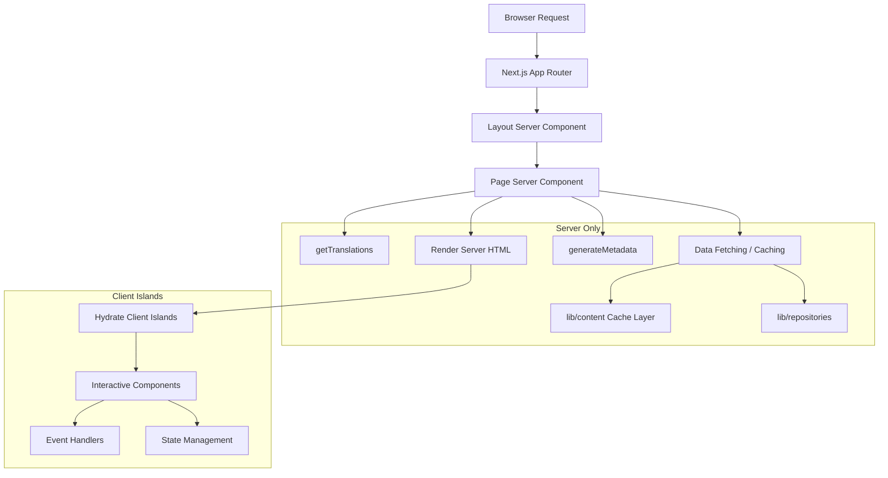

# Server Components Patterns

## Overview

The Ever Works Template leverages React Server Components (RSC) as the default rendering strategy throughout the Next.js App Router. Server components handle data fetching, translation loading, metadata generation, and layout composition on the server, sending only the rendered HTML to the client.

## Architecture



## Source Files

| File | Pattern Demonstrated |
|------|---------------------|
| `template/app/[locale]/about/page.tsx` | Data fetching, i18n, metadata, MDX rendering |
| `template/app/[locale]/layout.tsx` | Root layout with locale provider |
| `template/app/layout.tsx` | Global layout, fonts, providers |
| `template/app/sitemap.ts` | Server-only route generation |
| `template/app/robots.ts` | Server-only configuration |

## Core Patterns

### Pattern 1: Async Page Components with i18n

Every localized page follows this pattern:

```typescript
// Server Component -- no "use client" directive
export const revalidate = 3600; // ISR: revalidate every hour

interface PageProps {
    params: Promise<{ locale: string }>;
}

export async function generateMetadata({ params }: PageProps): Promise<Metadata> {
    const { locale } = await params;
    const t = await getTranslations({ locale, namespace: 'footer' });
    return {
        title: t('ABOUT_US'),
        description: t('ABOUT_PAGE_META_DESCRIPTION'),
        alternates: {
            languages: generateHreflangAlternates('/about')
        }
    };
}

export default async function AboutPage({ params }: PageProps) {
    const { locale } = await params;
    const pageData = await getCachedPageContent('about', locale);
    const tCommon = await getTranslations({ locale, namespace: 'common' });

    return (
        <PageContainer>
            <MDX source={pageData?.content || DEFAULT_CONTENT} />
        </PageContainer>
    );
}
```

Key characteristics:
- `params` is a `Promise` (Next.js 15+ App Router convention)
- Multiple `getTranslations()` calls for different namespaces
- Cached content fetching via `getCachedPageContent()`
- Static revalidation interval with `export const revalidate`

### Pattern 2: Metadata Generation

Server components generate SEO metadata at the route level:

```typescript
export async function generateMetadata({ params }: PageProps): Promise<Metadata> {
    const { locale } = await params;
    const t = await getTranslations({ locale, namespace: 'pages' });

    return {
        metadataBase: new URL(appUrl),
        title: t('PAGE_TITLE'),
        description: t('PAGE_DESCRIPTION'),
        alternates: {
            languages: generateHreflangAlternates('/path')
        }
    };
}
```

The `generateHreflangAlternates()` utility from `lib/seo/hreflang.ts` automatically generates alternate language links for all supported locales.

### Pattern 3: ISR with Content Caching

```typescript
export const revalidate = 3600; // Revalidate every hour

export default async function Page({ params }: PageProps) {
    const data = await getCachedPageContent('page-name', locale);
    // Render with cached data...
}
```

The `getCachedPageContent()` function provides a server-side cache layer over the Git-based CMS content in `.content/`. Combined with `revalidate`, this creates an ISR (Incremental Static Regeneration) pattern where pages are statically generated and refreshed periodically.

### Pattern 4: Server-Side Auth Checks

Protected pages use server-side guards from `lib/auth/guards.ts`:

```typescript
import { requireAuth, requireAdmin } from '@/lib/auth/guards';

export default async function ProtectedPage() {
    const session = await requireAuth();
    // session.user is guaranteed to exist here
    return <div>Welcome {session.user.email}</div>;
}

export default async function AdminPage() {
    const session = await requireAdmin();
    // session.user.isAdmin is guaranteed true here
    return <AdminDashboard />;
}
```

These guards call `auth()` internally and use `redirect()` from `next/navigation` to send unauthenticated users to the sign-in page. The redirect happens server-side, so no client JavaScript is needed.

### Pattern 5: Composing Server and Client Components

Server components delegate interactivity to client component "islands":

```typescript
// Server Component (page.tsx)
export default async function Page({ params }: PageProps) {
    const { locale } = await params;
    const data = await fetchData();
    const t = await getTranslations({ locale, namespace: 'page' });

    return (
        <div>
            <h1>{t('TITLE')}</h1>
            {/* Server-rendered static content */}
            <StaticContent data={data} />
            {/* Client island for interactivity */}
            <InteractiveFilter initialData={data} />
        </div>
    );
}
```

Data flows down from server to client as serializable props. Client components receive pre-fetched data and handle user interactions.

## Data Fetching Strategies

### Direct Repository Access

Server components can import and call repository functions directly:

```typescript
import { getItemBySlug } from '@/lib/repositories/item-repository';

export default async function ItemPage({ params }) {
    const item = await getItemBySlug(params.slug);
    // ...
}
```

### Cached Content Layer

For Git-based CMS content:

```typescript
import { getCachedPageContent } from '@/lib/content';

const pageData = await getCachedPageContent('about', locale);
```

### External API Calls

Service functions in `lib/services/` encapsulate external API interactions:

```typescript
import { triggerManualSync } from '@/lib/services/sync-service';
```

## Streaming and Suspense

Server components support streaming via React Suspense boundaries. Large pages can show loading states for individual sections:

```typescript
import { Suspense } from 'react';

export default async function Page() {
    return (
        <div>
            <Header /> {/* Renders immediately */}
            <Suspense fallback={<LoadingSkeleton />}>
                <SlowDataSection /> {/* Streams when ready */}
            </Suspense>
        </div>
    );
}
```

## Best Practices in the Template

1. **No `"use client"` unless needed** -- components are server components by default
2. **Translations loaded server-side** -- `getTranslations()` runs only on the server
3. **Metadata co-located with pages** -- `generateMetadata` is exported from the same file
4. **Revalidation at the route level** -- `export const revalidate` controls ISR timing
5. **Guard functions for auth** -- server-side redirects without client bundle cost
6. **Props down, events up** -- server components pass data to client islands as props
