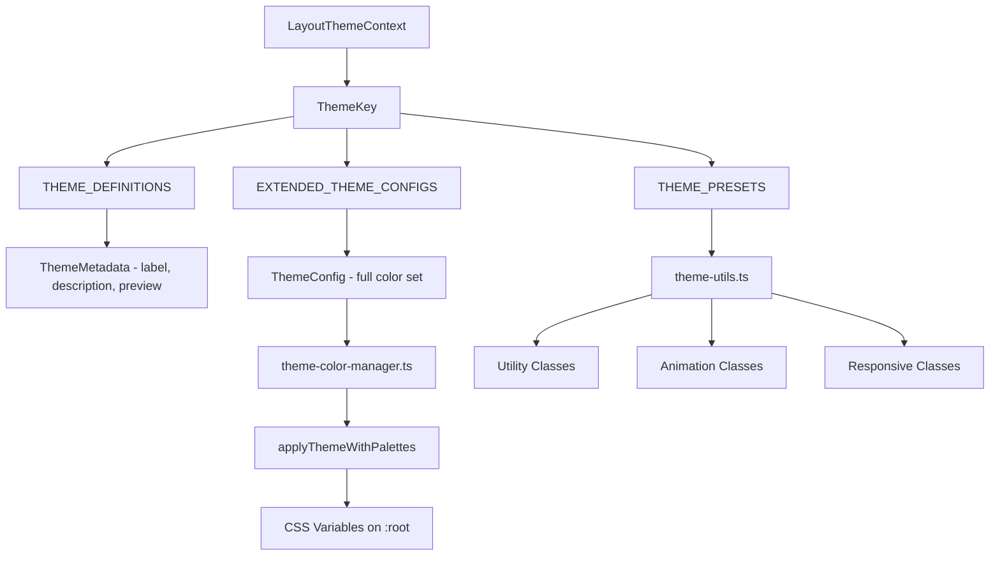
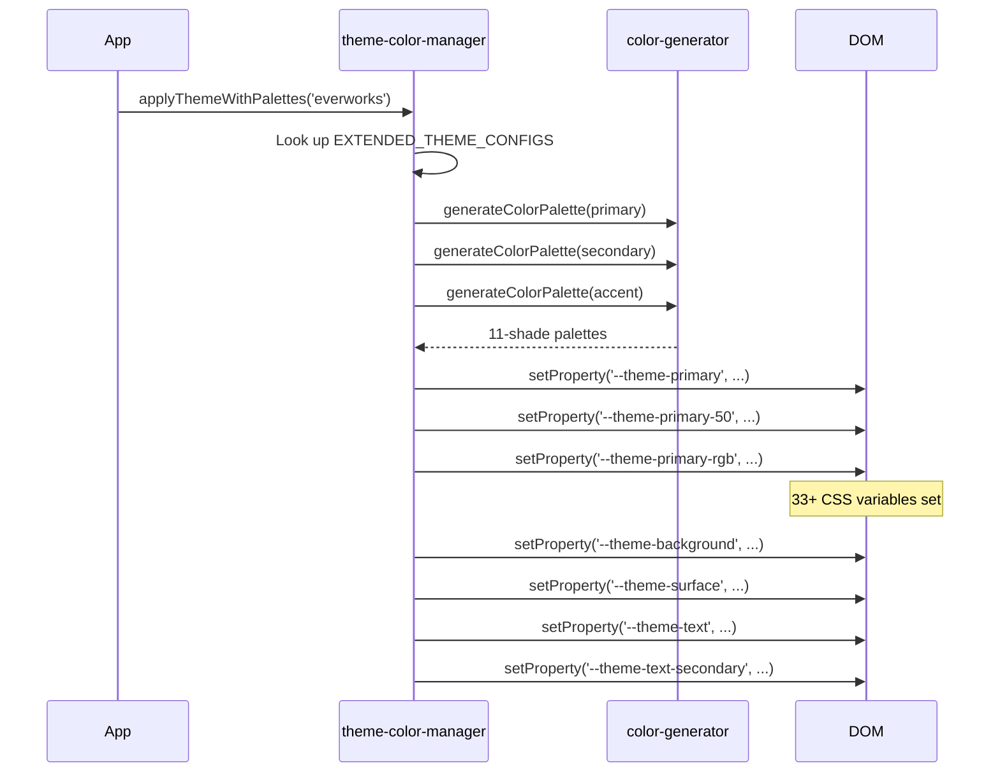

# Theme System

The template provides a multi-theme system with four built-in themes. Themes control colors, CSS variables, Tailwind utilities, and include preview components and metadata for theme selection UIs.

## Architecture Overview



## Source Files

| File | Purpose |
|------|---------|
| `lib/themes.tsx` | Theme definitions, metadata, and preview components |
| `lib/theme-color-manager.ts` | Extended configs, DOM application, CSS generation |
| `lib/theme-utils.ts` | Tailwind class utilities, presets, helper functions |
| `components/context/LayoutThemeContext` | React context for theme state (referenced) |

## Available Themes

| Theme Key | Label | Primary | Secondary | Description |
|-----------|-------|---------|-----------|-------------|
| `everworks` | Default | `#3d70ef` | `#00c853` | Modern and professional with blue and green |
| `corporate` | Corporate | `#00c853` | `#e74c3c` | Professional business with green and red |
| `material` | Material | `#673ab7` | `#ff9800` | Google Material Design with purple and orange |
| `funny` | Funny | `#ff4081` | `#ffeb3b` | Playful and vibrant with pink and yellow |

## Theme Configuration

Each theme defines seven color slots:

```typescript
export interface ThemeConfig {
  primary: string;
  secondary: string;
  accent: string;
  background: string;
  surface: string;
  text: string;
  textSecondary: string;
}
```

### Extended Theme Configs

The `EXTENDED_THEME_CONFIGS` in `theme-color-manager.ts` provides the full color definitions:

```typescript
export const EXTENDED_THEME_CONFIGS: Record<ThemeKey, ThemeConfig> = {
  everworks: {
    primary: "#3d70ef",
    secondary: "#00c853",
    accent: "#0056b3",
    background: "#ffffff",
    surface: "#f8f9fa",
    text: "#1a1a1a",
    textSecondary: "#6c757d",
  },
  // ... other themes
};
```

## Theme Metadata

The `themes.tsx` module provides display metadata and preview components:

```typescript
export interface ThemeMetadata {
  readonly key: ThemeKey;
  readonly label: string;
  readonly description: string;
  readonly preview: React.ReactNode;
  readonly config: ThemeConfig;
}
```

### Theme Definitions

```typescript
export const THEME_DEFINITIONS: Record<ThemeKey, Omit<ThemeMetadata, 'config'>> = {
  everworks: {
    key: "everworks",
    label: "Default",
    description: "Modern and professional theme with blue and green accents",
    preview: ThemePreviews.everworks,
  },
  // ... other themes
};
```

### Preview Components

Each theme has a small visual preview rendered as a styled `div`:

```typescript
export const ThemePreviews: Record<ThemeKey, React.ReactNode> = {
  everworks: (
    <div className="w-12 h-8 bg-[#3d70ef] rounded-sm overflow-hidden relative">
      <div className="absolute inset-0 bg-linear-to-br from-white/10 to-black/10" />
      <div className="absolute bottom-1 left-1 w-2 h-1 bg-white/80 rounded-xs" />
      <div className="absolute top-1 right-1 w-1 h-1 bg-white/60 rounded-full" />
    </div>
  ),
  // ... other previews
};
```

### Metadata Query Functions

```typescript
// Get metadata for a single theme
export const getThemeMetadata = (themeKey: ThemeKey, config: ThemeConfig): ThemeMetadata;

// Get metadata for all themes
export const getAllThemeMetadata = (configs: Record<ThemeKey, ThemeConfig>): ThemeMetadata[];
```

## CSS Variable Application

When a theme is applied, the color manager sets CSS custom properties on `document.documentElement`:



### Generated CSS Variables

For each theme, the following CSS variables are created:

| Variable Pattern | Count | Example |
|-----------------|-------|---------|
| `--theme-primary-{50-950}` | 11 | `--theme-primary-500: #3d70ef` |
| `--theme-primary-rgb` | 1 | `--theme-primary-rgb: 61, 112, 239` |
| `--theme-secondary-{50-950}` | 11 | `--theme-secondary-500: #00c853` |
| `--theme-accent-{50-950}` | 11 | `--theme-accent-500: #0056b3` |
| `--theme-background` | 1 | `--theme-background: #ffffff` |
| `--theme-surface` | 1 | `--theme-surface: #f8f9fa` |
| `--theme-text` | 1 | `--theme-text: #1a1a1a` |
| `--theme-text-secondary` | 1 | `--theme-text-secondary: #6c757d` |

## Tailwind Utility Classes

Pre-built class combinations for consistent theme usage:

### Button Variants

```typescript
themeClasses.button.primary   // "bg-theme-primary hover:bg-theme-accent text-white"
themeClasses.button.secondary // "bg-theme-secondary hover:bg-theme-secondary/80 text-white"
themeClasses.button.outline   // "border-2 border-theme-primary text-theme-primary ..."
themeClasses.button.ghost     // "text-theme-primary hover:bg-theme-primary/10"
```

### Animation Classes

```typescript
export const animationClasses = {
  fadeIn: "animate-in fade-in duration-200",
  slideIn: "animate-in slide-in-from-top-2 duration-200",
  scaleIn: "animate-in zoom-in-95 duration-200",
  hover: "transition-all duration-200 hover:scale-105",
  press: "transition-all duration-100 active:scale-95",
};
```

### Responsive Layout Classes

```typescript
export const responsiveClasses = {
  container: "container max-w-7xl px-4 sm:px-6 lg:px-8",
  grid: {
    responsive: "grid grid-cols-1 md:grid-cols-2 lg:grid-cols-3 gap-4",
    auto: "grid grid-cols-[repeat(auto-fit,minmax(300px,1fr))] gap-4",
  },
  flex: {
    center: "flex items-center justify-center",
    between: "flex items-center justify-between",
    start: "flex items-center justify-start",
  },
};
```

## Theme-Aware Class Building

The `buildThemeClasses` function combines base, theme, and conditional classes:

```typescript
import { buildThemeClasses } from '@/lib/theme-utils';

const className = buildThemeClasses(
  'px-4 py-2 rounded',           // Base classes
  'bg-theme-primary text-white',  // Theme classes
  {
    'opacity-50 cursor-not-allowed': isDisabled,
    'ring-2 ring-theme-accent': isFocused,
  }
);
```

## Theme Color Presets

Quick access to theme primary/secondary colors:

```typescript
export const THEME_PRESETS = {
  everworks: { primary: "#3d70ef", secondary: "#00c853" },
  corporate: { primary: "#2c3e50", secondary: "#e74c3c" },
  material: { primary: "#673ab7", secondary: "#ff9800" },
  funny: { primary: "#ff4081", secondary: "#ffeb3b" },
} as const;

// Query function
export const getThemeColor = (
  themeKey: ThemeKey,
  colorType: "primary" | "secondary"
) => colorMap[themeKey][colorType];
```

## Tailwind Color Reference

The `theme-utils.ts` module also exports the complete set of Tailwind CSS color values as a `tailwindColors` object covering all 22 color families (slate through rose) with shades 50-950, plus an `opacities` map from 5% to 95%.
