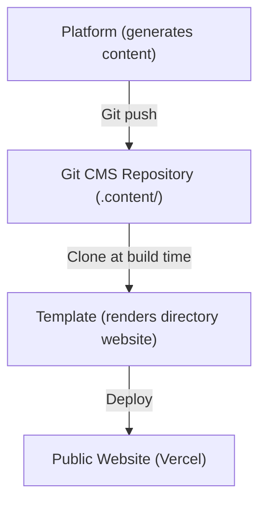
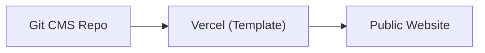
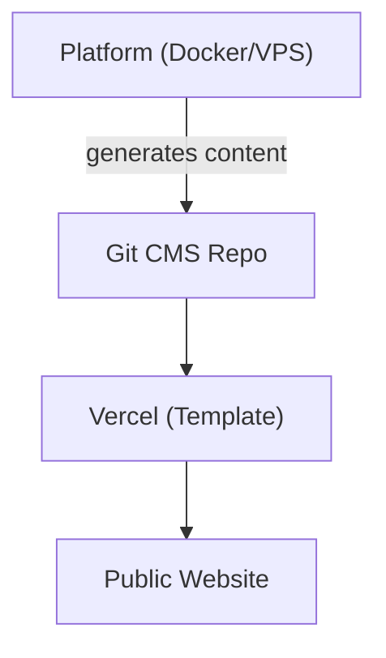
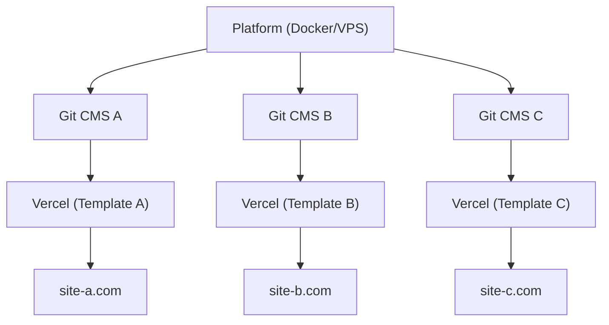

# Platform vs Template

Ever Works consists of two main products that serve different purposes but work together as a unified ecosystem. This page explains the difference and when to use which.

## Ever Works Platform

The **Ever Works Platform** is the backend infrastructure for building and managing directory websites at scale. It provides a REST API, AI-powered content generation pipelines, a plugin system, and deployment orchestration.

For full Platform documentation, visit [docs.ever.works](https://docs.ever.works).

## Directory Web Template

The **Directory Web Template** (this project) is a production-ready, full-stack directory website that you can clone, customize, and deploy as a standalone application.

### What It Does

- Provides a complete **directory website** with item listings, search, filtering, categories, tags, and collections
- Includes **authentication** via NextAuth.js v5 with OAuth providers (Google, GitHub, Facebook, Twitter, Microsoft) and Supabase Auth
- Supports **payments** through Stripe, LemonSqueezy, and Polar with subscription management
- Features **internationalization** with multiple languages and RTL support via next-intl
- Uses a **Git-based CMS** to synchronize directory content from Git repositories
- Includes a **theming system** with built-in themes and dynamic color generation
- Provides **analytics and monitoring** through PostHog and Sentry
- Ships with **SEO optimization**, sitemap generation, and structured data (JSON-LD)
- Includes an **admin dashboard** with content management, user management, and analytics

### Tech Stack

- **Framework:** Next.js 15, React 19
- **Language:** TypeScript 5
- **ORM:** Drizzle ORM (PostgreSQL)
- **UI:** Tailwind CSS 4, HeroUI React, Radix UI
- **Auth:** NextAuth.js v5, Supabase Auth
- **Payments:** Stripe, LemonSqueezy, Polar
- **Testing:** Playwright (E2E)
- **Deployment:** Vercel (primary), Docker (alternative)

## Side-by-Side Comparison

| Aspect             | Platform                               | Template                             |
| ------------------ | -------------------------------------- | ------------------------------------ |
| **Purpose**        | Backend infrastructure and AI pipeline | Frontend directory website           |
| **Architecture**   | Monorepo (Turborepo + pnpm)            | Standalone Next.js application       |
| **Backend**        | NestJS 11 API                          | Next.js API routes                   |
| **Database ORM**   | TypeORM                                | Drizzle ORM                          |
| **Authentication** | JWT + OAuth (NestJS Guards)            | NextAuth.js v5 + Supabase Auth       |
| **Payments**       | Not included                           | Stripe, LemonSqueezy, Polar          |
| **AI Features**    | LangChain agents, 7 LLM providers      | None (consumes AI-generated content) |
| **Content**        | Generates content via AI pipelines     | Reads content from Git-based CMS     |
| **Deployment**     | Docker on any VPS                      | Vercel (or Docker)                   |
| **Testing**        | Jest + Vitest                          | Playwright                           |
| **Audience**       | Platform operators, AI developers      | Website builders, directory creators |

## How They Connect

The Platform and Template work together through the **Git-based CMS** pattern:

### Independent Operation

- **Template without Platform:** Manually maintain directory content by editing YAML and Markdown files in the Git CMS repository. The Template works as a fully functional directory website without AI generation.
- **Platform without Template:** Use the Platform API to generate directory data and export it to any frontend.

## When to Use Which

### Use the Template When...

- You want to launch a directory website quickly with minimal backend setup
- Your directory content is manually curated or comes from a static data source
- You need a production-ready website with authentication, payments, and SEO out of the box
- You prefer deploying to Vercel with zero server management

### Use the Platform When...

- You need AI-powered content generation for large directories
- You want automated pipelines that discover, enrich, and update directory items
- You need to manage multiple directories from a single backend
- You want to use the plugin system for custom integrations

### Use Both When...

- You want AI-generated content flowing into a production website
- You are building a SaaS product on top of Ever Works
- You need automated content generation AND a polished frontend

## Deployment Architectures

### Template Only (Simplest)

Manual content management via Git. Single Vercel deployment.

### Platform + Template (Full Stack)

Automated content generation via Platform. Connected through Git.

### Platform + Multiple Templates

Single Platform instance managing multiple directory websites.
