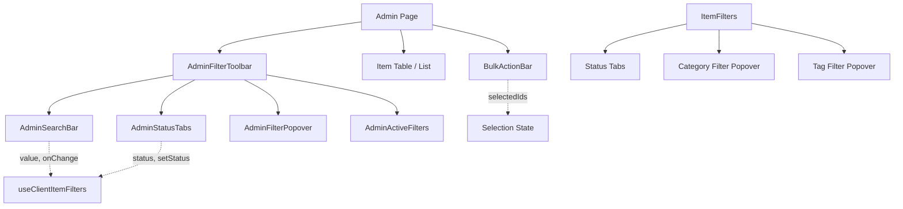

# Admin Table Components

The Ever Works Template provides a set of composable admin components for building data management interfaces. These components handle search, status filtering, category/tag filtering, and bulk actions for directory items. They are designed to work together through consistent prop interfaces and shared styling patterns.

## Architecture Overview



### Source Files

| File | Purpose |
|---|---|
| `components/admin/shared/admin-search-bar.tsx` | Reusable search input with loading and clear |
| `components/admin/shared/admin-filter-toolbar.tsx` | Composition component combining search, tabs, and filters |
| `components/admin/shared/admin-status-tabs.tsx` | Inline tab-style status filter |
| `components/admin/items/bulk-action-bar.tsx` | Fixed bottom bar for bulk approve/reject/delete |
| `components/admin/items/item-filters.tsx` | Combined status + category + tag filter panel |

## AdminSearchBar

A search input with built-in loading spinner, clear button, and size variants. This is a **presentational component** -- it does not implement debouncing. Debouncing is handled by the hook layer (`useClientItemFilters` or `useAdminFilters`).

```typescript
interface AdminSearchBarProps {
  value: string;
  onChange: (value: string) => void;
  isSearching?: boolean;
  placeholder?: string;
  ariaLabel?: string;
  className?: string;
  showClearButton?: boolean;
  size?: 'sm' | 'md' | 'lg';
}
```

**Size variants:**

| Size | Input Padding | Icon Size | Use Case |
|---|---|---|---|
| `sm` | `pl-9 pr-8 py-2` | `h-3.5 w-3.5` | Compact toolbars |
| `md` | `pl-12 pr-10 py-3` | `h-4 w-4` | Default admin pages |
| `lg` | `pl-14 pr-12 py-4` | `h-5 w-5` | Standalone search pages |

**Visual states:**

| State | Right-side Element |
|---|---|
| Searching (`isSearching=true`) | `LoadingSpinner` with gray color |
| Has text, not searching | Clear button (`X` icon) |
| Empty, not searching | Nothing |

**Accessibility:**

- Uses `next-intl` translations for placeholder and clear button labels.
- The clear button has a `focus-visible` ring for keyboard navigation.
- An `ariaLabel` prop allows overriding the default accessible name.

## AdminStatusTabs

An inline tab-style filter for status values. Supports generic status types, optional counts, icons, keyboard navigation, and size variants.

```typescript
interface AdminStatusTabsProps<T extends string = string> {
  options: StatusTabOption<T>[];
  value: T | '';
  onChange: (status: T | '') => void;
  className?: string;
  size?: 'sm' | 'md';
  showCounts?: boolean;
}

interface StatusTabOption<T extends string = string> {
  value: T | '';
  label: string;
  count?: number;
  icon?: ReactNode;
}
```

**Keyboard navigation:**

| Key | Action |
|---|---|
| `ArrowLeft` | Select previous tab |
| `ArrowRight` | Select next tab |

Uses ARIA `role="tablist"` and `role="tab"` with `aria-selected` for screen reader support. Only the active tab is in the tab order (`tabIndex=0`); inactive tabs use `tabIndex=-1`.

**Styling:**

| State | Background | Text |
|---|---|---|
| Active | `bg-white dark:bg-gray-700` | `text-gray-900 dark:text-white` with shadow |
| Inactive | Transparent | `text-gray-500 dark:text-gray-400` |

## AdminFilterToolbar

A composition component that assembles search, status tabs, filter popover, and active filter chips into a single toolbar. All sub-components except the search bar are optional.

The props are organized into groups: search (required), status tabs (optional), filter popover (optional), active filters (optional), and layout options.

**Layout modes:**

| Mode | Behavior |
|---|---|
| `inline` (default) | Search and controls on the same row, flex-wrapped |
| `stacked` | Search and controls stacked vertically |

The toolbar renders sub-components conditionally: status tabs appear only when `statusOptions` is provided, the filter popover appears only when `filterSections` is provided, and active filter chips appear only when `activeFilters` has entries.

## ItemFilters

A domain-specific filter component for the admin items page. Combines hardcoded status tabs (All, Approved, Pending, Draft, Rejected) with a Radix UI popover for category and tag multi-select filtering.

```typescript
interface ItemFiltersProps {
  statusFilter: string;
  categoriesFilter: string[];
  tagsFilter: string[];
  onStatusChange: (status: string) => void;
  onCategoriesChange: (categories: string[]) => void;
  onTagsChange: (tags: string[]) => void;
  onClearAll: () => void;
  categories: Array<{ id: string; name: string }>;
  tags: Array<{ id: string; name: string }>;
  itemCounts: { draft: number; pending: number; approved: number; rejected: number };
  activeFilterCount: number;
}
```

### Filter Popover

The popover is built with Radix UI `Popover` and contains two scrollable sections:

| Section | Features |
|---|---|
| **Categories** | Checkbox multi-select, search input, scrollable list (max-h-36) |
| **Tags** | Checkbox multi-select, search input, scrollable list (max-h-44) |

Both sections support local search to narrow down options. The search is performed client-side with case-insensitive `includes` matching.

**Badge indicator:** When categories or tags are selected, the filter button shows a count badge with the total number of active advanced filters.

**Clear button:** A "Clear All" button appears at the bottom of the popover when any advanced filters are active. It clears both category and tag selections and resets the internal search inputs.

## BulkActionBar

A fixed-position bottom bar that appears when items are selected in the admin items list. Provides approve, reject, delete, and deselect-all actions.

```typescript
interface BulkActionBarProps {
  selectedIds: Set<string>;
  items: ItemData[];
  onApprove: () => void;
  onReject: () => void;
  onDelete: () => void;
  onClear: () => void;
  isProcessing: boolean;
  processingAction: 'approve' | 'reject' | 'delete' | null;
}
```

**Visual behavior:**

| State | Appearance |
|---|---|
| No selection | Hidden (opacity-0, pointer-events-none, translated down) |
| Items selected | Visible with slide-up animation |
| Processing | Active action button shows spinner, others disabled |

**Action availability:**

The approve and reject buttons are only enabled when the selection includes items with `status === "pending"`. The hook computes `pendingCount` using `useMemo` to avoid recalculating on every render.

| Action | Button Color | Condition |
|---|---|---|
| Approve | `success` (green) | Selection includes pending items |
| Reject | `warning` (yellow) | Selection includes pending items |
| Delete | `danger` (red) | Any items selected |
| Deselect All | `light` (neutral) | Any items selected |

**Positioning:**

The bar is fixed at `bottom-6` and horizontally centered with `left-1/2 -translate-x-1/2`. It uses `z-50` to float above page content.

**Dependencies:**

- `@heroui/react` for `Button` components
- `lucide-react` for icons (`CheckCircle`, `XCircle`, `Trash2`, `X`, `Loader2`)
- `next-intl` for translated button labels

## Component Composition

A typical admin items page wires these components together: `useClientItemFilters` manages filter state and produces a `params` object, `useClientItems(params)` fetches the filtered list, the filter UI reads and writes the filter state, a `Set<string>` tracks selected IDs, and `BulkActionBar` triggers bulk mutations.

## Internationalization

All admin components use `next-intl`. Translation keys are namespaced under `admin.SHARED` (shared components) and `admin.ADMIN_ITEMS_PAGE` (items-specific components).

## Further Reading

- [Home Page Components](./home-page-components.md) -- public-facing listing and hero components
- [Search Hooks](../hooks/search-hooks.md) -- debounce and filter state hooks
- [Filter Hooks](../hooks/filter-hooks.md) -- public filter system with URL sync
