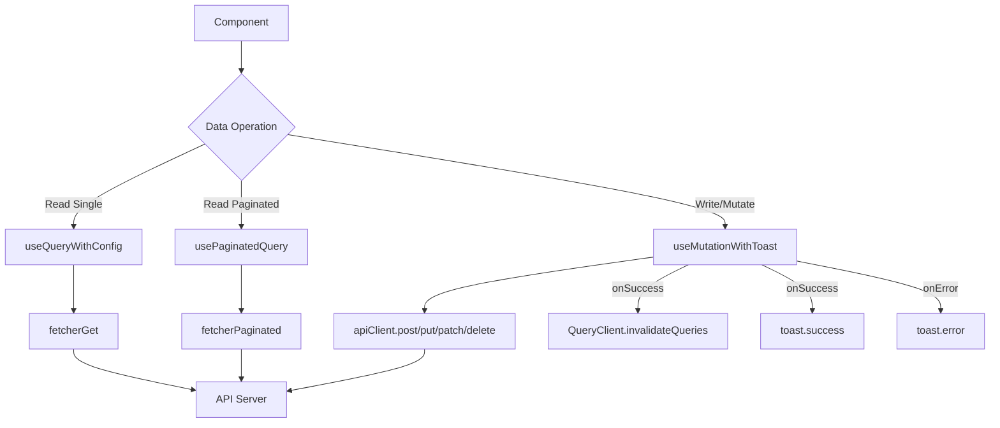

# API Client Components

The `template/components/api/` module provides custom React hooks that wrap TanStack React Query for data fetching, pagination, and mutations with built-in toast notifications. These hooks serve as the standard data-fetching layer for all template components.

## Architecture Overview



## Source Files

| File | Description |
|------|-------------|
| `index.ts` | Barrel exports with JSDoc usage examples |
| `use-query-with-config.ts` | Simple query wrapper with default config |
| `use-query-with-pagination.ts` | Infinite scroll pagination wrapper |
| `use-mutation-with-toast.ts` | Mutation with toast + cache invalidation |

All hooks wrap TanStack React Query primitives (`useQuery`, `useInfiniteQuery`, `useMutation`) and call internal API routes at `/api/*`. They use `fetch` under the hood and expect JSON responses.

## useQueryWithConfig

A wrapper around `useQuery` that applies default query configuration from `QUERY_CONFIG` and simplifies the API by accepting an endpoint string and optional query params.

### Type Definition

```typescript
interface UseQueryWithConfigOptions<T> extends Omit<
  UseQueryOptions<T, Error, T, [string, QueryParams | undefined]>,
  'queryKey' | 'queryFn'
> {
  endpoint: string;
  params?: QueryParams;
  enabled?: boolean;
}

function useQueryWithConfig<T>(options: UseQueryWithConfigOptions<T>): UseQueryResult<T, Error>
```

### Props

| Prop | Type | Default | Description |
|------|------|---------|-------------|
| `endpoint` | `string` | **required** | API endpoint path (e.g., `/api/users`) |
| `params` | `QueryParams` | `undefined` | Query parameters to append |
| `enabled` | `boolean` | `true` | Whether the query should execute |
| `...options` | `UseQueryOptions` | - | Any additional React Query options |

### Usage

```tsx
import { useQueryWithConfig } from '@/components/api';

function UserList() {
  const { data, isLoading, error } = useQueryWithConfig<User[]>({
    endpoint: '/api/users',
    params: { role: 'admin' },
  });

  if (isLoading) return <Spinner />;
  if (error) return <ErrorMessage error={error} />;

  return (
    <ul>
      {data?.map(user => <li key={user.id}>{user.name}</li>)}
    </ul>
  );
}
```

### Query Key Structure

The query key is automatically built as `[endpoint, params]`, enabling automatic cache invalidation when endpoint or params change.

## usePaginatedQuery

A wrapper around `useInfiniteQuery` for paginated data with automatic page management, sort, and filter support.

### Type Definition

```typescript
interface UsePaginatedQueryOptions<T> extends Omit<
  UseInfiniteQueryOptions<PaginatedResponse<T>, Error, ...>,
  'queryKey' | 'queryFn' | 'initialPageParam' | 'getNextPageParam'
> {
  endpoint: string;
  limit?: number;
  sort?: string;
  order?: 'asc' | 'desc';
  filters?: QueryParams;
  enabled?: boolean;
}

function usePaginatedQuery<T>(options: UsePaginatedQueryOptions<T>): UseInfiniteQueryResult
```

### Props

| Prop | Type | Default | Description |
|------|------|---------|-------------|
| `endpoint` | `string` | **required** | API endpoint path |
| `limit` | `number` | `10` | Items per page |
| `sort` | `string` | `undefined` | Sort field name |
| `order` | `'asc' \| 'desc'` | `undefined` | Sort direction |
| `filters` | `QueryParams` | `{}` | Additional filter parameters |
| `enabled` | `boolean` | `true` | Whether the query should execute |

### Usage

```tsx
import { usePaginatedQuery, extractAllItems, getTotalItems } from '@/components/api';

function PostFeed() {
  const {
    data,
    fetchNextPage,
    hasNextPage,
    isFetchingNextPage,
  } = usePaginatedQuery<Post>({
    endpoint: '/api/posts',
    limit: 20,
    sort: 'createdAt',
    order: 'desc',
  });

  const allPosts = extractAllItems(data?.pages);
  const total = getTotalItems(data?.pages);

  return (
    <div>
      <p>Showing {allPosts.length} of {total} posts</p>
      {allPosts.map(post => <PostCard key={post.id} post={post} />)}
      {hasNextPage && (
        <button onClick={() => fetchNextPage()} disabled={isFetchingNextPage}>
          {isFetchingNextPage ? 'Loading...' : 'Load More'}
        </button>
      )}
    </div>
  );
}
```

### Helper Functions

#### `extractAllItems<T>(pages)`

Flattens all pages of data into a single array, handling unsuccessful responses gracefully.

```typescript
function extractAllItems<T>(pages?: PaginatedResponse<T>[]): T[]
```

#### `getTotalItems<T>(pages)`

Returns the total count from the first page's metadata.

```typescript
function getTotalItems<T>(pages?: PaginatedResponse<T>[]): number
```

### Pagination Logic

The hook automatically manages page progression:
- Starts at page 1 (`initialPageParam: 1`)
- Determines next page from `lastPage.meta.page + 1`
- Stops when `nextPage > lastPage.meta.totalPages`

## useMutationWithToast

A mutation hook that wraps `useMutation` with automatic toast notifications and query cache invalidation.

### Type Definition

```typescript
interface MutationConfig<TData, TVariables extends RequestBody> extends Omit<
  UseMutationOptions<TData, ApiError, TVariables, unknown>,
  'mutationFn' | 'onSuccess' | 'onError'
> {
  endpoint: string;
  method: 'post' | 'put' | 'patch' | 'delete';
  successMessage?: string;
  invalidateQueries?: string[];
  onSuccess?: (data: TData, variables: TVariables, context: unknown) => void | Promise<void>;
  onError?: (error: ApiError, variables: TVariables, context: unknown) => void | Promise<void>;
}

function useMutationWithToast<TData, TVariables extends RequestBody>(
  config: MutationConfig<TData, TVariables>
): UseMutationResult
```

### Props

| Prop | Type | Default | Description |
|------|------|---------|-------------|
| `endpoint` | `string` | **required** | API endpoint path |
| `method` | `'post' \| 'put' \| 'patch' \| 'delete'` | **required** | HTTP method |
| `successMessage` | `string` | `undefined` | Toast message on success |
| `invalidateQueries` | `string[]` | `[]` | Query keys to invalidate on success |
| `onSuccess` | `function` | `undefined` | Additional success callback |
| `onError` | `function` | `undefined` | Additional error callback |

### Usage

```tsx
import { useMutationWithToast } from '@/components/api';

function CreateUserForm() {
  const { mutate, isPending } = useMutationWithToast<User, CreateUserPayload>({
    endpoint: '/api/users',
    method: 'post',
    successMessage: 'User created successfully',
    invalidateQueries: ['users'],
    onSuccess: (newUser) => {
      router.push(`/users/${newUser.id}`);
    },
  });

  const handleSubmit = (data: CreateUserPayload) => {
    mutate(data);
  };

  return <form onSubmit={handleSubmit}>...</form>;
}
```

### Behavior Details

1. **Mutation routing**: Automatically routes to the correct `apiClient` method based on `method` prop
2. **Cache invalidation**: On success, invalidates all specified query keys via `queryClient.invalidateQueries`
3. **Toast notifications**: Shows `toast.success()` with `successMessage` on success; shows `toast.error()` with the error message on failure
4. **Callback chaining**: Custom `onSuccess`/`onError` callbacks run after built-in behavior

## Dependencies

- `@tanstack/react-query` -- Query and mutation primitives
- `@/lib/api/api-client` -- Low-level HTTP client (`apiClient`, `fetcherGet`, `fetcherPaginated`)
- `@/lib/api/constants` -- Default `QUERY_CONFIG` (stale time, cache time, etc.)
- `sonner` -- Toast notification library

## Related Documentation

- [Context Providers](./context-providers.md) -- QueryClientProvider setup
- [Provider Components](./providers-components.md) -- Application provider hierarchy
- [Filter System](./filter-system.md) -- Filter state that drives query parameters
- [API Data Hooks (Advanced)](./api-data-hooks-components.md) -- Advanced data fetching patterns
