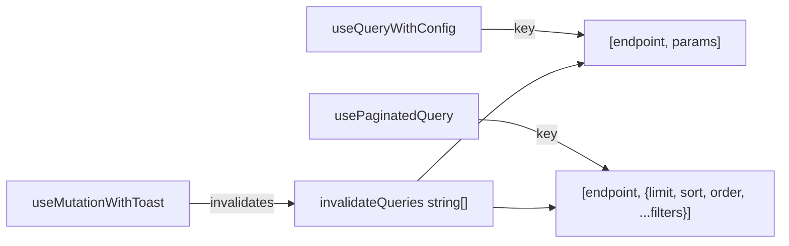
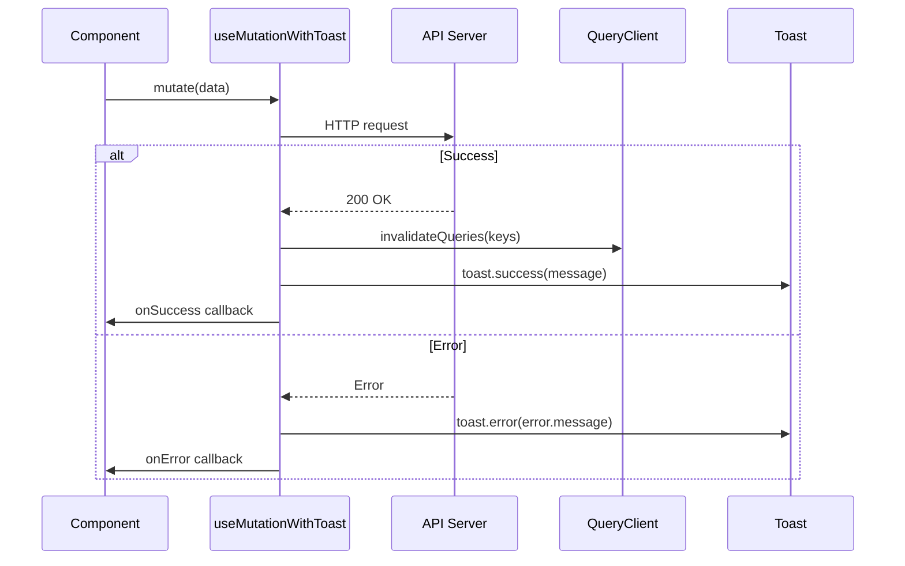

# API Data Hooks (Advanced)

This page covers advanced data fetching patterns, cache management strategies, and integration techniques used by the `template/components/api/` hooks. For basic hook API reference, see [API Client Components](./api-components.md).

## Query Key Architecture

All API hooks build query keys automatically from their parameters, enabling fine-grained cache control.

### Key Structure



| Hook | Query Key Pattern | Example |
|------|-------------------|---------|
| `useQueryWithConfig` | `[endpoint, params]` | `['/api/users', { role: 'admin' }]` |
| `usePaginatedQuery` | `[endpoint, mergedParams]` | `['/api/posts', { limit: 20, sort: 'createdAt', order: 'desc' }]` |

### Automatic Cache Invalidation

When a mutation succeeds, `useMutationWithToast` invalidates specified query keys:

```typescript
const { mutate } = useMutationWithToast({
  endpoint: '/api/posts',
  method: 'post',
  invalidateQueries: ['/api/posts'],
  // This invalidates ALL queries whose key starts with '/api/posts'
});
```

The invalidation uses `queryClient.invalidateQueries({ queryKey: [key] })` which matches any query whose key array starts with the provided string. This means invalidating `'/api/posts'` also invalidates `['/api/posts', { status: 'draft' }]`.

## Paginated Query Patterns

### Infinite Scroll Integration

The `usePaginatedQuery` hook wraps `useInfiniteQuery` and manages page progression automatically.

```tsx
import { usePaginatedQuery, extractAllItems, getTotalItems } from '@/components/api';

function InfiniteItemList() {
  const {
    data,
    fetchNextPage,
    hasNextPage,
    isFetchingNextPage,
    isLoading,
    isError,
  } = usePaginatedQuery<Item>({
    endpoint: '/api/items',
    limit: 20,
    sort: 'createdAt',
    order: 'desc',
    filters: { status: 'published' },
  });

  const allItems = extractAllItems(data?.pages);
  const total = getTotalItems(data?.pages);

  return (
    <div>
      <p>Showing {allItems.length} of {total}</p>
      {allItems.map(item => (
        <ItemCard key={item.id} item={item} />
      ))}
      {hasNextPage && (
        <button
          onClick={() => fetchNextPage()}
          disabled={isFetchingNextPage}
        >
          Load More
        </button>
      )}
    </div>
  );
}
```

### Page Progression Logic

```typescript
// Internal page management
initialPageParam: 1,
getNextPageParam: (lastPage) => {
  const nextPage = lastPage.meta.page + 1;
  return nextPage > lastPage.meta.totalPages ? undefined : nextPage;
}
```

The hook stops fetching when:
- `nextPage` exceeds `totalPages` from the server response
- `hasNextPage` becomes `false`

### Expected Server Response

The paginated endpoint must return data in this shape:

```typescript
interface PaginatedResponse<T> {
  success: boolean;
  data: T[];
  meta: {
    page: number;
    totalPages: number;
    totalItems: number;
    limit: number;
  };
}
```

### Helper Functions

#### `extractAllItems<T>(pages)`

Flattens all pages into a single array. Handles cases where individual pages may have `success: false` by skipping them.

```typescript
const allItems = extractAllItems(data?.pages);
// Equivalent to: pages.flatMap(p => p.success ? p.data : [])
```

#### `getTotalItems<T>(pages)`

Returns the total count from the first page's metadata:

```typescript
const total = getTotalItems(data?.pages);
// Equivalent to: pages?.[0]?.meta?.totalItems ?? 0
```

## Mutation Patterns

### Optimistic Updates with Cache Invalidation

Combine `useMutationWithToast` with manual optimistic updates for immediate UI feedback:

```tsx
function ToggleFavorite({ itemId, isFavorited }) {
  const queryClient = useQueryClient();

  const { mutate } = useMutationWithToast({
    endpoint: `/api/items/${itemId}/favorite`,
    method: isFavorited ? 'delete' : 'post',
    invalidateQueries: ['/api/items', '/api/favorites'],
    onSuccess: () => {
      // Cache is automatically invalidated by invalidateQueries
    },
    onError: () => {
      // Revert optimistic update on error
      queryClient.invalidateQueries({ queryKey: ['/api/items'] });
    },
  });

  return <button onClick={() => mutate({})}>Toggle</button>;
}
```

### Mutation Method Routing

The hook automatically routes to the correct HTTP method:

```typescript
// Internal routing logic
switch (method) {
  case 'post':   return apiClient.post(endpoint, variables);
  case 'put':    return apiClient.put(endpoint, variables);
  case 'patch':  return apiClient.patch(endpoint, variables);
  case 'delete': return apiClient.delete(endpoint, variables);
}
```

### Toast Notification Flow



## Query Configuration Defaults

All hooks apply defaults from `QUERY_CONFIG` (defined in `@/lib/api/constants`):

```typescript
// Typical default configuration
const QUERY_CONFIG = {
  staleTime: 5 * 60 * 1000,    // 5 minutes
  cacheTime: 10 * 60 * 1000,   // 10 minutes (gcTime in v5)
  refetchOnWindowFocus: false,
  retry: 1,
};
```

These defaults can be overridden per-hook by passing additional options:

```tsx
const { data } = useQueryWithConfig({
  endpoint: '/api/settings',
  staleTime: Infinity,  // Never refetch automatically
  cacheTime: Infinity,  // Keep in cache forever
});
```

## Combining Filters with Paginated Queries

The filter system integrates with `usePaginatedQuery` through the `filters` parameter:

```tsx
function FilteredItemList() {
  const { searchTerm, selectedTags, selectedCategories, sortBy } = useFilters();

  const { data, fetchNextPage, hasNextPage } = usePaginatedQuery<Item>({
    endpoint: '/api/items',
    limit: 20,
    sort: sortBy === 'name-asc' || sortBy === 'name-desc' ? 'name' : 'popularity',
    order: sortBy.endsWith('-desc') ? 'desc' : 'asc',
    filters: {
      search: searchTerm || undefined,
      tags: selectedTags.length > 0 ? selectedTags.join(',') : undefined,
      categories: selectedCategories.length > 0 ? selectedCategories.join(',') : undefined,
    },
  });

  // The query key changes when filters change, triggering a refetch
  const allItems = extractAllItems(data?.pages);
  // ...
}
```

### Filter Change Behavior

When filter parameters change:
1. The query key changes (because `filters` is part of the key)
2. React Query treats it as a new query
3. Fresh data is fetched from page 1
4. Previous pages are discarded
5. The component re-renders with new results

## Error Handling Patterns

### Query Error States

```tsx
function DataComponent() {
  const { data, isLoading, isError, error, refetch } = useQueryWithConfig({
    endpoint: '/api/data',
  });

  if (isLoading) return <Skeleton />;
  if (isError) {
    return (
      <ErrorMessage
        message={error.message}
        onRetry={() => refetch()}
      />
    );
  }

  return <DataDisplay data={data} />;
}
```

### Mutation Error Handling

The `useMutationWithToast` hook automatically shows error toasts, but you can add custom error handling:

```tsx
const { mutate } = useMutationWithToast({
  endpoint: '/api/action',
  method: 'post',
  onError: (error, variables) => {
    // Custom error handling (runs after toast.error)
    if (error.status === 409) {
      showConflictResolution(variables);
    }
  },
});
```

## Underlying HTTP Client

All hooks use `apiClient` from `@/lib/api/api-client` which provides:

- `fetcherGet(endpoint, params)` -- GET requests with query parameter serialization
- `fetcherPaginated(endpoint, params)` -- GET requests expecting paginated responses
- `apiClient.post/put/patch/delete(endpoint, body)` -- Mutation requests with JSON body serialization

All methods use the `fetch` API and expect JSON responses from internal API routes at `/api/*`.

## Dependencies

- `@tanstack/react-query` -- `useQuery`, `useInfiniteQuery`, `useMutation`, `useQueryClient`
- `@/lib/api/api-client` -- Low-level HTTP client
- `@/lib/api/constants` -- Default query configuration
- `sonner` -- Toast notifications

## Related Documentation

- [API Client Components](./api-components.md) -- Basic hook API reference
- [Filter UI Components](./filters-components.md) -- Filter state that drives query parameters
- [Advanced Filter Configuration](./filters-advanced-components.md) -- Filter state management
- [Provider Components](./providers-components.md) -- QueryClientProvider setup
